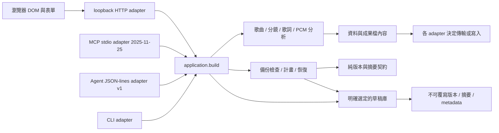

# 分層與版本契約

## v0.153.0 原文差異前後文

成果、專案草稿與接受條件核對失敗時，並列目前原文與選定檔案的第一個差異附近片段，顯示精確 byte 範圍、EOF、UTF-8跳脫文字與原始十六進位。純 text-byte-context共用完整bytes比較與有界視窗 → 原text-verification新增internal opt-in inspectWithContext → 注入current controller只保留隔離有界DTO → literal DOM與三個可選區塊。原七欄report1／callback保持，完整來源只編碼／複製／掃描一次；片段不是完整檔案或保存證明。每側16bytes，UTF-8邊界最多延伸3bytes，各最多39bytes；無效UTF-8不修補，BOM／換行／NUL／HTML／不可見字元以明示原值與hex辨認。備份仍沿SHA-only proof，不臆造原ZIP內容。

755 Python（1既有Windows symlink skip、0expected failures）、1892 JS（新增23）、152syntax／四Skills、集中148JS通過。460歷史ZIP／manifest與29組input/output schemas、原整份／原列比较保持；原v152 exact-source ZIP 2954468bytes／SHA b0c22af54f9ed3acea5b738b9789cca92f638b17b2b150a90df01133eabbfd5a，以原launcher／120秒deadline順序還原755 Python／1869 JS，提取暫存移除。

原生Chrome共13次File選取（before1／after12），三入口同大小emoji差異、無效UTF-8、空檔EOF、匹配重試、取消、來源revision改變與QA注入read錯誤均核對；12/12 reads、gates0、後續編修保留。正式三區塊／固定asset一次及pre-wrap／anywhere、console0核對；未驗證真慢磁碟／I/O失敗、已保存下載、窄尺寸完整視覺或screen reader。兩自有server原handle正常EOF0、兩測試頁關閉；未設viewport／未嵌入媒體。

產品153／唯一policy38–153共116、未知154拒絕；22基本／29啟庫、Agent1／draft3與舊schemas保持。只新增一固定GET，無新operation／POST／依賴／auth／路徑／產品外網能力。六法律／平台文件原bytes、PolyForm Noncommercial、public及ZOE. G／djguan-jpg保持。本輪唯讀確認Zoe／音樂公會長與四公開投稿頁，仍原作者自行聲明、尚未核實創始；不重送。restore tag、codex分支、exact-source封裝與rolling goal active保持。

見[契約](TEXT-VERIFICATION-CONTEXT.md)。以下保留歷史迭代。

## v0.152.0 選檔核對的狀態焦點

原生 Chrome 在成果、草稿、接受條件與備份四個入口均重現：選定真 File後，核對進行中及完成時焦點落回BODY，結果本身正確。共用純 verification-focus新增明確selected動作 → 兩個注入DOM adapter在實際選檔當下、停用picker前聚焦對應status note。只接受有效來源／available／非pending，空選取與legacy可選cancel入口保持。這個動作不建立非同步焦點意圖；後續成功、差異或錯誤只更新原狀態，晚回覆不搶其他編修焦點。取消的兩slot／同來源note接續及proof callback保持。

755 Python（1既有Windows symlink skip、0expected failures）、1869 JS（新增19）、151syntax／四Skills與集中126 JS通過。456歷史ZIP／manifest逐bytes、29組input/output schemas、原整份／原列比較保持；原v151 exact-source ZIP 2935279bytes／SHA 2ddb54bdd5da74d53b646b8423ccf5269b021026ac6111629c523522b991fe03，以原launcher／120秒deadline順序還原755 Python／1850 JS，暫存移除。

原生共23次File選取（before4／after19），四入口的匹配與同大小差異、兩個QA注入read錯誤及重試、Tab離開、Shift+Tab／Enter取消、後續編修與來源變更均核對。after19/19 reads、4/4真正SHA、gates0，最終四匹配true及編修保留，console0。正式四note／aria、共享asset一次與2px green focus outline以DOM／computed style核對；不是已保存下載、真慢磁碟／I/O錯誤或完整視覺／screen reader接受。兩自有server原handle正常EOF0、兩QA頁關閉，未設viewport／未嵌入媒體。

產品152／唯一policy38–152共115、未知153拒絕；22基本／29啟庫、Agent1／draft3與原schemas保持。無新增operation／asset／backend／依賴／auth／path／產品外網權限；原32MiB備份及兩工作slot保持。六法律／平台文件原bytes、PolyForm Noncommercial、public、ZOE. G／djguan-jpg保持；本輪未讀寫FreeTWAI，既有四submitted_unverified紀錄不重送。restore tag、codex分支、exact-source封裝與rolling goal active保持。

見[契約](VERIFICATION-SELECTION.md)。以下保留歷史迭代。

## v0.151.0 備份讀取與雜湊名額

修正備份核對連續取消仍累积未完成 read／hash 的可重現問題。原生 Chrome 以還原 tag 的原 adapter 重現三份未完成 SHA 與取消後 BODY 焦點；新 controller 每個核對器最多兩個未完成的完整 read→hash 工作，取消／來源改變不提早釋放，只有該工作 finally 才歸還名額。滿額不啟動第三份、不取代目前 proof；舊完成只刷新目前有限 view，不提交舊 report／error。單檔32MiB保持，這不是整個工作台或實際記憶體用量保證。

新 verification-focus 純注入政策由三個原文核對及備份共用，僅保留來源 epoch 的有限取消焦點意圖。名額有空即回 picker；滿額先聚焦 status note，只有來源相同且仍停在原提示才接續。blur、新檔、來源變更、pagehide／dispose清除，晚完成不搶後續編修焦點。四 note／aria／scoped outline、固定 self asset 與 server 白名單分層；沒有新 operation、Agent／路徑權限、依賴或產品外網能力。

755 Python（1既有 Windows symlink skip、0 expected failures）、1850 JS（新增20）、151 syntax／四 Skills與集中105 JS通過。452歷史 ZIP／manifest bytes、29組 input/output schemas及原整份／原列比較保持。原 v150 ZIP 2910329 bytes、SHA 0028a2664dfa977217f7b5ed95bf1fa29657829315099ec3263ae58e9a488b90，以未改 launcher／120秒 deadline順序還原755 Python／1830 JS，暫存已移除。

原生14次 File選取（備份10／文字4），真正 arrayBuffer及WebCrypto SHA經QA完成閘門核對read取消／hash滿額／相同檔／同大小有效ZIP差異／重試、Tab離開提示及來源變更；全部10read／9hash／4text完成、gates0、console0。正式四note與共享asset只載入一次、2px green outline經DOM／computed style核對；不是慢磁碟、hash性能、RAM、已保存下載或完整視覺／screen reader接受。兩個自有 server原handle正常EOF0、兩QA頁及一投稿查驗臨時頁已關閉，未設viewport。

產品151／唯一policy38–151共114、未知152拒絕；22基本／29啟庫、Agent1／draft3及原schemas保持。六法律／平台文件原bytes、PolyForm Noncommercial、public與ZOE. G／djguan-jpg保持。本輪唯讀確認Zoe／音樂公會長及四公開申請，仍作者自行聲明／創始未核實，禁止商用文字保持，無重送或平台mutation。還原tag／codex分支／exact-source封裝與rolling goal active保持。

見[契約](BACKUP-VERIFICATION-CAPACITY.md)。以下保留歷史迭代。

## v0.150.0 取消核對後的鍵盤焦點

原生 Chrome 重現：按取消後 picker 已可用，但 disabled 取消按鈕使焦點落回 BODY。共用純 controller 以完整 scope／revision／原檔名／原文派生暫態 contextRevision → 注入 DOM adapter 的明確取消焦點意圖 → 三個可程式聚焦的 status note 與 scoped focus 樣式。取消後有名額即回 picker；兩個實際 read 未結束時先聚焦提示，僅仍停在原提示、來源未變且 picker 可用才接回。blur、新選檔、來源改變、pagehide／dispose 清除意圖；一般成功／錯誤不移動焦點。原文／成果／草稿保存 proof／條件／媒體與兩個 read 上限保持，epoch 不進 wire 或 draft3。

755 Python（1 既有 Windows symlink 權限 skip、0 expected failures）、1830 JS（新增9）、150 syntax／四 Skills 通過，集中68項取消／焦點／保存 callback 測試。448歷史 ZIP／manifest bytes、29組 input/output schemas 及原整份／原列比較保持。原 v149 ZIP 2888434 bytes、SHA 744321ee85f8fbe1c74a3d92ce8ae8337c306603e9b4dfe675d30afcb2d4f18e 還原755 Python／1821 JS；首次並行稽核觸及原120秒 deadline，保留失敗與原 worker stopped 證據，使用未改 launcher／deadline 的順序重驗通過。

原生 Chrome 10次 File chooser，QA 閘門延後真正原生 arrayBuffer 的完成；實際 Enter 取消、Tab 離開提示、後續編修、來源 revision 改變與成功重試均核對焦點及原文 proof，全部 read settle。正式工作台三個 note 的 tabindex=-1／status／polite／aria 關聯保持，產品 focus outline 2px solid green 經 computed style 核對，console0。QA inline script 初次被既有 CSP 拒絕，改為固定 self-served QA script；QA 起初漏 stylesheet 後補上 link，產品 CSP 未放寬。這不是實際慢磁碟、已保存下載、完整視覺或 screen reader 接受。

產品150／唯一 policy38–150共113，未知151拒絕；22基本／29啟庫、Agent1／draft3及既有 schemas 保持，無新增 operation／asset／依賴／auth／path／產品網路權限。PolyForm Noncommercial、public、ZOE. G／djguan-jpg及六法律／平台文件原 bytes 保留。本轮唯讀確認 Zoe 登入、無待送技能草稿與四公開頁；仍作者自行聲明／創始未核實，禁止商用文字保持，無重複投稿或平台 mutation。三個自有 QA server 原 handle 正常 EOF0、三個 QA 頁及單一投稿查驗臨時頁已關閉，未設 viewport；還原 tag／codex 分支／exact-source 封裝與 rolling goal active 保持。

見[契約](TEXT-VERIFICATION-FOCUS.md)。以下保留歷史迭代。

## v0.149.0 原文核對取消與有界讀取

補上成果、專案草稿與接受條件三個原文核對入口的明確取消按鈕。原有共用純controller的latest generation取消 → 注入reader的兩個實際讀取slot → DOM按鈕／狀態呈現 → app與接受條件adapter。每個核對器最多兩個未結束read，取消不假裝中止native File.arrayBuffer；slot只在實際settle後釋放，已滿時先等待，舊成功／錯誤不提交。取消與晚回應不確認草稿／條件已保存，不改原文／成果／後續編修／媒體；取消按鈕僅pending可用，dispose移除自有handler。

755 Python（1既有Windows symlink權限skip、0expected failures）、1821 JS（新增10）、150 syntax／四Skills通過。59相關測試涵蓋30次快速取消仍最多2個reader、失敗與metadata前檢不漏slot、來源變更／pagehide／dispose、legacy無cancel adapter保持，以及兩種保存確認仍需明確成功proof。原v148 exact-source ZIP 2867895bytes、SHA e0f388b928440a29a2f41ca18b8df710cd56283bff6885841b3906e02cd5d9f7還原755 Python／1811 JS；444歷史ZIP／manifest與29原schemas保持，整份／原列比較檔不變。

原生Chrome三次native File選回本輪合成candidate，驗證完整一致、同大小尾端byte2058差異、重試一致；四份wire檔與data保持，47controls前後相同，後續歌名編修清除proof／停picker與下載，console0。三個取消控制存在、aria關聯與idle disabled核對。pending取消／慢reader由注入DOM與保存callback整合測試驗證；未宣稱實際native慢檔取消或完整視覺／screen reader接受。IAB／Chrome兩次download send未取得完成event，candidate不是saved download；下載紀錄頁被瀏覽器安全規則禁止，沒有繞過，磁碟保存仍未驗證。

產品149／唯一policy38–149共112，未知150拒絕；22基本／29啟庫、Agent1／draft3與其他schemas維持，沒有新operation／asset／依賴／auth／path／產品網路權限。PolyForm Noncommercial、public、ZOE. G／djguan-jpg與六法律／平台原bytes保持；本輪未讀／寫FreeTWAI，既有四投稿仍submitted_unverified。前後測兩個自有server由原handle正常EOF0、两個測試頁關閉、未設viewport。還原tag／codex分支與exact-source封裝保持，rolling goal active。

見[契約](TEXT-VERIFICATION-CANCEL.md)。以下保留歷史迭代。

## v0.148.0 規劃 Markdown 原文字面顯示

修正歌曲 task.md／music-plan.md 與分鏡 prompts.md／continuity.md 的標題、記憶點、交付項、畫面欄位、母題與審查說明含換行或 Markdown／HTML 標點時，形成額外標題、連結或格式的可重現問題。純 markdown_text.inline → 相容的 markdown_table.cell／creative／design → 共用 application → CLI／Agent／MCP／HTTP → 既有 browser source guard；所有現有顯示欄位共用字面呈現。ASCII 標點轉十進位 numeric references，CRLF／CR／LF 只在顯示轉固定 br；JSON、CSV、順序、時間與原創文字保持。來源 JSON 才是原文依據，顯示不是空白／排版 bytes 保存或 AI prompt 安全承諾。

755 Python（新增10、1既有Windows symlink權限skip、0expected failures）、1811 JS、150 syntax／四Skills通過。GitHub實際GFM對四份合成文件修改前後共8次轉譯，固定標題／段落結構與所有顯示原文核對；data及五份非Markdown檔逐bytes不變。原41表格樣本與歌曲表格body原bytes保持。440歷史producer ZIP／manifest與29 input/output schemas保持，舊整份／原列比較檔不變。原v147 exact-source ZIP 2848621 bytes、SHA 349be2e842bdb40f4b9ee72b4c0a137efd4ea30a7f15977c69e817ec7bc05165 還原745 Python／1811 JS成功。

原生工作台核對九份完整wire檔、八份UI全文及一份CSV textarea換行正規化顯示；47歌曲＋63分鏡controls保持，後續分鏡片名編修保留上一份且停用下載，console0。本輪沒有下載click、完整視覺／screen reader／媒體同步／Host安裝或創始身分接受。產品148／唯一policy38–148共111，未知149拒絕；22基本／29啟庫、Agent1／draft3與其餘schemas保持，沒有新operation／依賴／auth／path／產品外網能力。

PolyForm Noncommercial、public、ZOE. G／djguan-jpg與六法律／平台文件原bytes保持。使用者已登入的Chrome唯讀確認Zoe及音樂公會長，沒有重新投稿／平台mutation，四新專案既有提交紀錄仍原作者自行聲明、創始未核實。本輪自有QA server原handle正常EOF0、一頁關閉；還原tag、codex分支與exact-source封裝保持。rolling goal active。

見[契約](PLANNING-MARKDOWN.md)。以下保留歷史迭代。

## v0.147.0 歌曲交付表格原文顯示

修正歌曲設計包的段落名稱、敘事任務與聲音配置含換行或管線符號時，Markdown 表格拆列／錯欄的可重現問題。純 markdown_table.cell → design 的三個文字欄 → 既有 application／CLI／Agent／MCP／HTTP 分層。ASCII 標點使用 numeric character references 保持字面，不形成 Markdown／HTML 欄位語法；CRLF／CR／LF 只在顯示表格轉為固定 br。原 JSON 文字、順序、時間與創作內容不變；不把顯示檔當作原文 bytes 保存。其他 Markdown 段落不在本次格式保護範圍。

745 Python（新增9、1既有Windows symlink權限skip、0expected failures）、1811 JS、150 syntax／四Skills通過；Agent／MCP／HTTP與CLI完整四檔一致，CLI仍預設拒覆寫。GitHub官方GFM實際轉譯同一合成來源，修正前七列錯位、修正後六列各六欄，三個文字欄逐列字面核對。此遠端轉譯只在忽略QA，產品與正常測試不新增網路或依賴。原生工作台完整四檔核對及49controls保持，後續歌名編修保留／旧下載停用，console0。沒有本輪瀏覽器下載或完整視覺接受驗證。

436 歷史producer ZIP／manifest逐bytes保持，29組input/output schemas與原整份／原列比較檔保持；原v146精確ZIP2829240bytes、SHA763310a94131f711b0a554b9421db4428bcb283f2c809c3d7ff9acda7492ebcc還原736 Python／1811 JS通過。22基本／29啟庫、Agent1／draft3與其他schemas保持，產品147／唯一policy38–147共110，未知148拒絕。沒有新operation／GET／POST／auth／path／外網產品權限。

PolyForm Noncommercial、public、ZOE. G／djguan-jpg與六法律／平台文件原bytes保持。唯讀確認使用者Chrome Zoe已登入、GitHub連結與四社群技能存在，仍原作者自行聲明／創始未核實，無重送或平台mutation；原頁返回guilds。自有單QA server以原handle正常EOF0、自建一頁關閉、未設viewport。還原tag／codex分支與exact-source封裝保持；rolling goal active，後續依真使用流程繼續改善。

見[契約](MUSIC-MARKDOWN.md)。以下保留歷史迭代。

## v0.146.0 前後變動原列導覽

草稿檔及保存版本的指定原列新增「上一個變動原列／下一個變動原列」。純 navigation 先完整驗證兩份 draft3、各 1 MiB canonical 來源與 selection，再扫描六集合的全部原位置，逐欄精確比較原字串並略過未變更列。最多 10000 句，超過整份報告前 200 筆仍可導覽；新增／移除及空字串保持，不推定列移動。只回傳位置／總數／變動數／序號及前後候選，沒有原文快取或 wire 變更。

原 current controller 的 checked readPayload → 純模型 → literal DOM 分層；每次完成及明確移動前重查來源，移動後重新比較原列。只改暫態原列選擇，完整原文模式回到摘錄；busy／stale／cancel／clear／dispose 清除並停用。明確鍵盤意圖成功後回到原列欄位，晚回覆不覆蓋重試或搶後續焦點。21 原欄、六集合、1000 stable IDs 及既有成果保留。

736 Python（1 既有 Windows symlink 權限 skip、0 expected failures）、1811 JS（新增23）、150 syntax／四 Skills 通過，集中143 JS。432 歷史 producer ZIP／manifest bytes 及29組 input/output schemas、原整份／原列 JSON／Markdown bytes 保持。22基本／29啟庫、Agent1／draft3／comparison1／row-comparison1保持；無 backend／HTTP／shared controller diff、依賴或權限擴張。產品146／唯一 policy38–146共109，未知147拒絕。

兩原生入口共12集合完整字面核對、24快照、三尺寸各兩入口真 Tab／Enter、console0及無頁面水平溢出；後續歌名編修保留，舊導覽清除。選定 brief.json 原內容與四個檔名保持，其他三檔全文本輪未獨立核對。六PNG只保存在忽略QA，完整視覺／screen reader及browser實際保存檔案未驗證。下載已送出但觀察逾時，原click未重送。自建合成庫兩JSON hash保持；一QA server原handle正常EOF0、兩自建查驗頁關閉及viewport reset，使用者Chrome分頁保留。

原v145精確ZIP2809765bytes、SHA 1f47b5a17150a9ec67e058a09a0833008cf43053bd140670089d8da9f7174845，以原launcher還原736 Python／1789 JS後移除自有暫存。PolyForm Noncommercial、public、ZOE. G／djguan-jpg與六法律／平台文件原bytes保持。依使用者已登入指示，唯讀確認Chrome Zoe／GitHub連結及四公開投稿；仍原作者自行聲明、尚未核實，無额外創始認證按鈕，沒有重送或平台mutation。還原tag、codex分支、CHANGELOG／HANDOFF及exact-source封裝可逆；rolling goal active。

見[契約](DRAFT-COMPARISON-NAVIGATION.md)。以下保留歷史迭代。

## v0.145.0 指定原列完整原文

草稿檔與保存版本的原列比較新增「閱讀這一列完整原文／回到原文摘錄」。修正兩側前128 bytes相同但末尾不同時無法審閱的缺口；六集合、全部欄位、未變更／空字串／缺列保持。每次明確閱讀以共享controller的readPayload取得同一次完整驗證與current proof核對後的隔離來源，再由純fullValues選取原列，literal DOM顯示全部原字串；不從摘錄拼接、不改或套用草稿。全文只留在暫態DOM；新比較、取消、失效及clear／dispose清除，切換閱讀模式保留按鈕焦點。

共享controller亦修正新run在capture／prepare／gate前置失敗時舊report仍ready的可重現錯誤；有舊報告即發布stale，停舊下載／全文，再允許明確有效重試。原late／ownership隔離保持。29組input/output schemas、原整份及原列JSON／Markdown bytes、22基本／29啟庫、Agent1／draft3／comparison1／row-comparison1保持；本輪backend及HTTP路由沒有diff。產品145／唯一policy38–145共108，未知146拒絕。

736 Python methods（1既有Windows symlink權限skip、0expected failures）、1789 JS、150 syntax及四Skills通過；新增20 JS，集中121 JS。428歷史producer ZIP／manifest byte cases及29 schemas保持。兩個原生入口各六集合完整before／after字面文字逐字核對，22快照保留21原欄、六列集合、1000句的stable IDs與四完整成果；最後明確改歌名，後續編修保留、舊全文清除及停用。三種viewports各两入口真Tab／Enter、無頁面水平溢出、console0；六PNG僅保存忽略QA，完整視覺／screen reader及browser實際保存檔案未驗證。

v144指定原ZIP2790931bytes／SHA b4d0dabbf0e8e09472b5238cab86810dbc25c51b5266adf58c07ccb7b6311266以原launcher還原736 Python／1769 JS，暫存移除。只使用自建合成草稿庫，兩JSON原hash保持；一個QA server正常shutdown／context close／deadline thread join且原exec EOF0，自建一頁關閉、viewport reset。只唯讀盤點本outputs與explicit typed jobs，嚴格七天及最新三版保護保持，草稿／素材／未知程序不清除。

PolyForm Noncommercial1.0.0、public、創辦ZOE. G／GitHub djguan-jpg及四份submitted_unverified保持，六個法律／平台文件原bytes不變，本輪沒有平台提交或mutation。還原tag、codex分支、CHANGELOG／HANDOFF及指定source ZIP／SHA提供可逆交付；rolling goal active。

見[契約](DRAFT-COMPARISON-FULL.md)。以下保留歷史迭代。

## v0.144.0 查看指定原列

草稿檔及保存版本預覽新增「查看指定原列」：整份比較只保留前200筆時，仍能查看原第501／10000句。六個歌曲、分鏡與歌詞集合按原位置1起比對，包含未變更欄位，空字串與缺列分開；不猜移動或改內容。新Python／JS純row model重用完整draft3來源、canonical SHA與128 UTF-8 bytes摘錄，共享注入comparison controller及literal DOM分層。selection也參與current proof；無效來源發布stale，取消late／retry不覆蓋新工作。

新增唯讀draft_compare_row，经共用application至CLI／Agent／MCP／HTTP；獨立row-comparison1、64 KiB報告。22基本／29明確啟庫，需重新discovery；原28組schemas及整份比較JSON／Markdown bytes保持，Agent1／draft3／comparison1保持。只有兩個固定GET與一個唯讀POST；沒有新依賴、模型、媒體、外網、JSON路徑、auth或session能力。產品144／唯一交付38–144共107，未知145拒絕。

736 Python methods（1既有Windows symlink權限skip、0expected failures）、1769 JS、150 syntax及四Skills通過；新15 Python／20 JS覆蓋完整來源／六集合、字面原文、隔離／晚回應和五adapter回覆。19跨語言cases包含原第10000句；424歷史producer ZIP／manifest原bytes相同。兩原生入口25份DOM快照，1000句／21欄／六列根原值保持，四成果原文跨保存版本流程相同；三種viewports各兩入口Tab／Enter、無頁面水平溢出、console0。後續刻意改歌名保留，舊比較清除及停用。六JPEG僅留忽略QA，完整視覺／screen reader及browser實際保存檔案未驗證；本輪未獨立記錄DOM row IDs。

v143精確ZIP2754220bytes／SHA cb67e613ae60cbf4bfbf96bf656deafa9b15acecd0d4c733355383f45955acbc，以原launcher實際還原721 Python／1749 JS後移除暫存。五adapter舊比較／備份及10個保存版本原record／draft bytes保持，82合成JSON雜湊保持。有界QA server正常shutdown／context close／deadline thread join及原exec EOF0，自建兩分頁關閉、viewport reset。只唯讀盤點本專案metadata，沒有超七天清除候選；素材、草稿與未知程序保持。

創辦ZOE. G／GitHub djguan-jpg、public及PolyForm Noncommercial1.0.0保持。六個法律／平台文件原bytes保持；已唯讀確認登入音樂公會長及四份公開投稿，仍作者自行聲明／尚未核實，未重送。restore tag、codex分支、CHANGELOG／HANDOFF及指定source封裝可逆；rolling goal active。

見[契約](DRAFT-COMPARISON-ROW.md)。以下保留歷史迭代。

## v0.143.0 草稿比較變動類型

草稿檔及保存版本的比較新增「變動類型」：全部、變更、新增、移除，與工作台範圍共同篩選。純draft-compare-view只保存最多200筆scope／status與原明細序號，返回隔離的保留明細計數與每頁10筆位置；DOM先重查完整current來源再換篩選。換類型／範圍回第一頁，跨頁展開位置保留；新比較／取消／來源失效清除。兩個原生select可換行，標籤／aria關聯及空清單保持可操作。比較report1、完整JSON／Markdown下載、原工作台／草稿／媒體不因篩選修改。

721 Python執行（1既有Windows權限skip、0expected failure）、1749 JS全部通過；新增15 JS覆蓋交集／隔離／未知與getter拒絕、原序號跨類型展開、兩DOM來源失效／空清單／全份下载不變。148 syntax／四Skills／155 commands通過。兩原生入口50份DOM快照，21原欄位／六列根含ID與四成果原文保持；1280×720、390×844、1280×360各兩入口實際Home／End／Tab／Enter，焦點可達、頁面無水平溢出，console0。六張JPEG只保存於忽略QA，不嵌入對話；完整視覺與browser落盤仍未驗證。

來源38–143共106版、未知144拒絕；420歷史ZIP／manifest原bytes與28組tool schemas保持，五adapter比較／backup與10版原record／draft匯出、82合成JSONhash保持。v142指定ZIP以原launcher還原721／1734後正常移除暫存。21／28工具、Agent1／draft3／comparison1保持；沒有backend／adapter／controller／download模型變更、依賴、auth或權限擴張。一個有界QA server正常shutdown／context close／deadline thread join且原exec EOF0，自建QA與平台查閱頁已關閉、viewport reset。

ZOE. G／djguan-jpg、public與PolyForm Noncommercial1.0.0保持。此次登入唯讀確認音樂公會長及四個公開投稿，仍是作者自行聲明／尚未核實；沒有重送或平台mutation。restore tag、codex分支、CHANGELOG／HANDOFF、精確source ZIP／SHA可逆；最新三版與嚴格七天／Git重建規則保持，rolling goal active。

見[契約](DRAFT-COMPARISON-KIND.md)。以下保留歷史迭代。

## v0.142.0 完整測試與 worker 完成證據

修正成功測試隱藏skip及封裝只有passed字樣的證據缺口。test_run_summary純有界frame／source／counts／original-handle核對 → 原兩worker runner自我登記及communicate → --report-json／預設文字 → packager二次驗證並把獨立schema1摘要保存於manifest.checks.python_run。721 Python執行、1權限skip、0expected failure，1734 JS／148語法／四Skills通過；新增17 Python，原handle成功及deadline失敗實測，損壞摘要即使exit0也不能發manifest。

來源38–142共105版、未知143拒絕；416歷史ZIP／manifest bytes及28 tool schemas保持，五adapter比較／backup與10版原record／draft匯出、82合成JSONhash保持。v141指定ZIP實際還原704／1734，原launcher不改。21／28工具、Agent1／draft3／run1及release manifest1 root保持，無新Agent／HTTP操作、依賴、frontend差異或持久服务。兩worker／120秒cap及outer150秒不變；只控制自有Popen handles，不全域列舉或signal外部程序。

PolyForm Noncommercial1.0.0、public、ZOE. G／djguan-jpg與四份submitted_unverified保持。還原tag、codex分支、CHANGELOG／HANDOFF、指定source ZIP／SHA可逆；最新三版與嚴格七天／Git重建規則保持，rolling goal active。

見[契約](PYTHON-TEST-RUN.md)。以下保留歷史迭代。

## v0.141.0 草稿比較閱讀進度

草稿檔與保存庫的差異比較，在換頁、篩選後保留展開位置，新增「展開本頁差異／收合本頁差異」。draft-compare-view 純有界序號模型 → 原 current source controller → DOM listener／焦點 adapter；最多200保留明細、每頁10筆，新比較／busy／stale／clear／dispose 清除暫態。舊 detached toggle callback 拒絕，原文、草稿、媒體與成果保持，展開不代表審閱接受。

704 Python／1734 JS、148語法、四Skills通過；新增26 JS、集中66 JS／4 Python。兩個原生入口、28 snapshots 原21欄／六列集合含ID及四份完整成果保持；三尺寸共六次鍵盤觀察，無頁面橫溢且收合焦點可達。下載click有觸發，但5秒observer未取得保存檔；完整視覺與實際落地檔仍未驗證。自有server正常返回、兩個查驗tab關閉、viewport復原。

412歷史ZIP／manifest bytes、28 input-output schemas、五adapter比較／備份與10版record／draft匯出保持，82合成JSONhash相同；指定v140 ZIP實際還原704／1708。產品141／來源38–141共104版、未知142拒絕，21基本／啟庫28工具及Agent1／draft3／comparison1保持。PolyForm Noncommercial1.0.0、public與四份submitted_unverified保持；本次live登入與四投稿已核對，平台明示作者未核實。還原tag、codex分支、CHANGELOG／HANDOFF及exact-source ZIP／SHA可逆，rolling goal active。

封裝補充：首份指定source的外層與Python runner同為120秒，外層timeout後Windows暫存目錄仍被使用，未發成功manifest。保留失敗ZIP與receipt；只移除核對的自有空暫存目錄，未signal外部程序。外層封裝改150秒，runner仍120秒／兩worker，留出正常收集與清理時間；重新從新提交封裝並核對，原失敗不宣稱成功。

見[契約](DRAFT-COMPARISON-VIEW.md)。以下保留歷史迭代。

## v0.140.0 明確維護動作與空值

修正空expected-token被忽略及空record-self意外落到一般audit。maintenance_cli純presence／互斥／token／job／批次identity判斷 → argparse保留原path字面、拒絕空path → 原filesystem／process adapter；在workspace／catalog／PID查詢或receipt寫入前拒絕無效控制。validate_job與原run1共用1–80字元grammar，未提供None與已提供空值分開。正常五動作、exact token／default不覆寫／tag重建／latest3／same-host身份保持，沒有新增維護權限。

704 Python／1708 JS、147語法、四Skills通過；新增16 Python全部通過，集中82含原space／prune／restore／catalog回歸。兩個真Windows junction證明descendant跳過、root拒絕及receipt不能穿出root，synthetic target SHA／mtime保持，僅os.rmdir移除核對的自有link。既有真symlink測試仍因權限1314 skip，不把junction當成symlink全覆蓋或atomic sandbox。v139指定ZIP實際CLI兩個空值原exit0，新exit1且無receipt；三empty path exit2；default audit回覆完整相同，正常record-self實際EOF。

408歷史ZIP／manifest bytes、28 input-output schemas、五adapter比較／備份與10版原record／draft匯出保持，82合成JSONhash相同。v139指定ZIP實際還原688／1708且暫存移除。產品140／來源38–140共103版，未知141拒絕；21基本／啟庫28工具、Agent1／draft3／audit1／run1／recovery1／space1保持。本輪web不變，沒有新browser或持久workbench；PolyForm Noncommercial1.0.0、public、ZOE. G／djguan-jpg與四份submitted_unverified保持。還原tag、codex分支、CHANGELOG／HANDOFF與exact-source ZIP／SHA可逆，rolling goal active。

見[契約](MAINTENANCE-CLI.md)。以下保留歷史迭代。

## v0.139.0 唯讀輸出空間報告

維護 CLI 新增 `--space-report`：固定分類封裝區、標準 vN-qa 區與其他區，列出邏輯 bytes、檔案數、嚴格超七天統計及最大的20個 QA 目錄。純 metadata policy → bounded filesystem reader → 既有 CLI／exclusive receipt；報告 space1 獨立，不改 audit1／run1／recovery1。分類及年齡不是刪除資格，既有 tag／Git archive／最新三版／typed job 核對保持；不開 outputs 檔案內容、不輸出未知名稱或私人路徑、不跟隨 link／reparse point。

688 Python／1708 JS、147語法與四Skills通過；新增24 Python中23通過、1真 symlink 因Windows權限1314跳過，另有注入reparse／特殊entry測試。CLI實際報告與獨立metadata總和一致，receipt拒覆寫，82合成庫原JSONhash保持。404歷史ZIP bytes、28工具schemas、五adapter比較／備份與10版匯出保持；v138指定ZIP實際還原664／1708且暫存移除。

產品139／唯一交付來源38–139共102版，未知140拒絕；21基本／啟庫28工具、Agent1／draft3不變。沒有新增Agent／HTTP維護操作、依賴、模型或持久服務；本輪web未變，不宣稱新增原生視覺驗收。還原tag、codex分支、CHANGELOG／HANDOFF及指定source ZIP／SHA保留可逆交付。PolyForm Noncommercial1.0.0、ZOE. G／djguan-jpg、public與四份submitted_unverified保持；rolling goal active。

見[契約](OUTPUTS-SPACE.md)。以下保留歷史迭代。

## v0.138.0 比較取消與重試隔離

修正取消／清除／失效後舊比較回覆使新報告過期的可重現錯誤。無論舊成功或錯誤在新版等待中或完成後抵達，只要已不擁有目前job，就不讀來源、不改狀態、不呼叫完成／錯誤callback。完成報告仍按原stamp與完整來源核對，不依賴已清空的job。現代草稿檔與保存版本的新比較成功後清除上一份下載提示與error樣式；refresh保留同份提示，明確clear也清除。

純controller把job ownership與report current分開 → literal DOM提示生命週期 → 原完整producer／shared downloader分層。664Python／1708JS（新增9）、147語法及四Skills通過；集中4Python＋40JS。測試包含cancel／clear／invalidate、兩種晚回覆與兩種新版狀態、多代不同順序、無額外capture／gate／publish及兩個DOM入口。原完整來源、gate／File身份、失敗重試、busy／dispose與明確Apply／undo保持。

12份落檔原生快照逐一核對全21欄、六集合與stable IDs，兩個入口重新比較後下載提示清空，四份成果全文與82合成庫JSONhash保持。1280×720／390×844／1280×360實際Tab可達JSON→Markdown、Enter重新比較，沒有頁面水平溢出。兩次observer逾時後只重設觀察器並重綁同頁；原server／頁面未重啟，預覽已完成就不重送。舊觀察器未落檔的host資料不當作完整快照證據，重做並逐份落檔。1自有頁關閉／viewport reset，1自有server正常shutdown／deadline join及原handle EOF。

指定v137 ZIP實際還原664／1699且暫存移除；400歷史ZIP／manifest原bytes、28組input-output schemas及21基本／啟庫28工具保持。五adapter比較、備份inspection及10版匯出原record／draft bytes核對。產品138／唯一交付來源38–138共101版，未知139拒絕；Agent1／draft3／backup1及comparison1保持。沒有新增asset、backend operation、依賴、模型或路徑／網路／写檔權限。

還原tag、codex分支、指定source封裝／SHA、CHANGELOG／HANDOFF、PR merge及實際remote assets提供可逆交付。PolyForm Noncommercial1.0.0、ZOE. G／djguan-jpg、public與四份submitted_unverified保持，本輪不修改或重送平台投稿。只盤點本outputs及typed同host jobs，最新三版保護；strict>7days且exact tag／現場Git archive可重建才可列清除候選。草稿／媒體、未知／failed QA、v77 alternate及partial36／53保留。瀏覽器保存檔、完整視覺／screen reader、實聽／同步、Host安裝與平台正式founder仍未驗證，rolling goal active。

見[契約](DRAFT-COMPARISON-LIFECYCLE.md)。以下保留歷史迭代。

## v0.137.0 下載目前草稿比較報告

現代草稿檔與保存版本的比較預覽新增「下載比較 JSON」與「下載摘要 Markdown」。下載目前完整的有界報告，不因畫面篩選或每頁10筆而截斷；JSON含原值摘錄、完整欄位SHA與全部計數，Markdown含位置與計數。下載不另存工作台草稿；「已送出」仍須核對瀏覽器實際保存檔案。

draft-compare-download 純固定格式選取 → injected controller.read 完整來源／gate重查 → 既有 text-download 原生UTF8 bytes sender → DOM字面提示分層。只取本controller擁有且由既有producer建立的報告，不是外部任意report importer或完整語義驗證器；strict Unicode／exact envelope／JSON＋Markdown256KiB保持。編修、頁籤、原生File身份、busy或預覽改變拒絕舊下載；原明確Apply／undo、shared兩pending與1秒URL回收保持。pagehide清除全部自有listener，後續dispose無害。

664 Python／1699 JS（新增10）、147語法及四Skills通過；集中4Python＋31JS核對整份JSON／Markdown的Python-JS逐UTF8 bytes一致、全部計數、容量、來源拒絕、傳送失敗重試與listener回收。17原生快照均全21欄與六集合，比較／篩選／下載保持stable IDs和四份成果全文；後續編修僅改title，取消保留。1280×720／390×844／1280×360實際Tab鍵可達兩下載鈕且頁面無水平溢出。前兩尺寸Enter成功送出，第三次快速下載受shared兩pending限制；之後明確重比仍可送出。這輪未重做Apply或真媒體切換，既有契約測試保持。

實際v136 ZIP還原664／1689且暫存移除；396歷史交付ZIP／manifest原bytes、28組input-output schemas與21／28工具保持。五adapter比較／備份inspection及10版原record／draft匯出核對，82合成庫JSONhash保持。產品137／唯一交付來源38–137共100版，未知138拒絕；Agent1／draft3／backup1保持。只新增一個固定JS asset，無新backend operation、模型、依賴或路徑／網路／寫檔權限。

兩個workbench頁及一個空白診斷頁已關閉、viewport reset，一個自有server原handle正常EOF。瀏覽器已送出狀態可見，但IAB與Chrome下載事件未取得落盤檔；自動審核拒絕開啟Chrome下載紀錄頁，理由是工具只允許HTTP／HTTPS網址，沒有繞過或掃描未知下載位置。实际保存檔仍未驗證；完整視覺／screen reader、實聽音畫同步、Host安裝與正式founder仍未驗證。

restore tag、codex分支、CHANGELOG／HANDOFF、指定source ZIP／SHA、PR與實際remote assets提供可逆交付。PolyForm Noncommercial1.0.0、ZOE. G／djguan-jpg、public與四份submitted_unverified保持。本輪恢復既有自由工坊會員登入並唯讀核對四個公開投稿仍含禁止商用與作者未核實，沒有重送申請。只盤點本outputs及typed same-host jobs，最新三版保護，strict>7days且exact tag／Git archive可重建才列候選；草稿／媒體／failed QA／v77 alternate及partial36／53保持。rolling goal保持active。

見[契約](DRAFT-COMPARISON-DOWNLOAD.md)。以下保留歷史迭代。

## v0.136.0 載入前比較完整草稿

工作台的現代草稿檔與保存版本預覽新增「比較目前與預覽」。先看四台作品及 metadata 差異，再明確載入或取消；比較不修改表單、成果、媒體或保存版本。明細可依台篩選、每頁10筆與鍵盤翻頁；每欄保留原字串的128 UTF8 bytes 摘錄，完整計數與完整 SHA 另列。插入或換序按原位置比較，不猜列移動。

draft-compare 純完整來源／canonical SHA／comparison1 → 注入 controller 的 click-time 完整核對與輕量 refresh → literal DOM → app 原預覽／Apply／undo 分層。Python 與原生 JS 的完整 report／Markdown 跨語言逐值一致；每份完整 draft3 canonical1MiB、前200明細／128KiB明細預算、JSON＋Markdown256KiB。WebCrypto 失敗可重試，來源不剪短。legacy 不自動遷移或比較。

編修、頁籤、原生 File 身份、預覽或保存版本改變使報告失效；晚到成功／錯誤與取消不能覆蓋後續內容。baseline 即時擷取的新 saved_at 排除於 current key，候選 saved_at 仍完整核對與列為 metadata。refresh 不重新擷取全部10000句；比較完成及閱讀報告仍完整重查。頁籤切換立即標示過期，未觀察到的 gate 改變也能結束等待。原明確 Apply 與限定撤回保持。

664 Python（新增4）／1689 JS（新增21）、146語法與四 Skills 通過；25新增測試涵蓋四台原值、完整計數／容量、控制文字／Unicode、Python-JS完整回應、晚回應／身份／取消與鍵盤焦點。原生29快照中28份含全21欄、最後來源25份；比較期間原stable IDs保持，載入後重比作品0、撤回保留先前編修，保存版本比較保留四份成果全文。1280×720／390×844／1280×360以實際鍵盤分頁、字面HTML／CRLF及emoji呈現核對，無頁面水平溢出。兩個自有頁及兩個受控server正常關閉。

實際 v135 指定 ZIP 還原660／1668並移除暫存；392歷史交付ZIP／manifest原bytes、28組input-output schemas及21／28工具保持。五adapter草稿比較／備份inspection及10版原record／draft匯出核對，82合成庫JSONhash保持；備份收據舊版本標籤以獨立更正收據說明。產品136／唯一交付來源38–136共99版，未知137拒絕；Agent1／draft3／backup1保持。只新增三固定JS assets，無新backend operation、依賴、模型或路徑／網路／寫檔權限。

restore tag、codex分支、CHANGELOG／HANDOFF、指定source ZIP／SHA、PR與實際remote assets提供可逆交付。PolyForm Noncommercial1.0.0、ZOE. G／djguan-jpg、public與四份submitted_unverified保持。只盤點本outputs及typed same-host jobs；最新三版保護，strict>7days且exact tag／Git archive可重建才可列清除候選，草稿／媒體／failed QA／v77 alternate及partial36／53保持。完整視覺／screen reader、瀏覽器下載落盤、真媒體身份／實聽同步、Host安裝與正式founder仍未驗證；rolling goal保持active。

見[契約](DRAFT-COMPARISON-UI.md)。以下保留歷史迭代。

## v0.135.0 完整草稿原值比較

新增唯讀 draft_compare，比較兩份明確完整 draft3；四台全部欄位與六種集合按原位置逐項比較，metadata 的 tool_version／saved_at／tab 另列。保留空白、換行、Unicode與數字原字串；集合插入、刪除或換序不猜移動及stable IDs。原欄位、新增／移除列與缺值／空字串分開，完整計數不受明細容量影響。

draft_compare 純來源／canonical SHA、原值比較、摘要與有界摘錄 → 共用 application → CLI／Agent／MCP／loopback HTTP。每份canonical草稿1MiB；comparison1獨立，最多前200原位置明細與128KiB明細預算，每側原欄128UTF8 bytes不拆字元，JSON＋Markdown合計256KiB。明細含完整欄位SHA／byte長度，metadata不是作品變化；草稿canonical SHA不是原檔排版bytes、作者或創始認證。沒有合併、Apply、自動保存、來源路徑、外網、模型或依賴。

CLI draft-compare明確--baseline／--current與--out，strict UTF8／重複鍵／schema3／容量完整核對；原檔保持，報告預設拒覆寫，--overwrite只替換指定報告。0為相同、2為有差異但比較完成、1為輸入或I/O錯誤。Agent新唯讀operation與MCP tool需重新discovery；21基本／明確啟庫28工具，舊27組input／output schemas保持。HTTP只新增/api/draft-compare，既有auth／session及草稿保存邊界保持；工作台UI沒有新增自動比較或載入行為。

660 Python（105.563秒，新增15）、1668 JS、143語法與四Skills通過。集中15涵蓋全部四台／原集合、metadata、插入與重複、10000句完整計數、有界control文字／UTF8摘錄、來源損壞與capacity、exclusive CLI輸出、真Agent-MCP good／bad／good及短命HTTP200／400／200。既有兩份合成保存版本由draft_read核對後，五adapter完整data／files／meta一致，原82JSONhash保持。這輪沒有新原生UI操作驗收。

指定v134 ZIP實際還原645／1668，暫存移除；388歷史交付ZIP／manifest原bytes及27schemas保持。原備份完整五adapterinspection、10版export的record／draft原bytes保持，建立時間依實際匯出各自不同。產品135／唯一來源38–135共98版，未知136拒絕；Agent1／draft3／backup1及maintenance schemas保持。PolyForm Noncommercial1.0.0、ZOE. G／djguan-jpg、public與四份submitted_unverified保持。

第一份QA Agent fixture誤用numeric id，修正為既有protocol要求的字串；第一全套有一處舊len(listed)==20漏更新，修正discovery oracle後全套通過。runtime helper輸入檔名與既有基準收據重名，exclusive create拒絕後以新helper／新檔名完成；失敗腳本與紀錄保持，沒有變更產品validator或覆寫原檔。所有本輪managed helper及test child沿原handle／EOF結束，短命HTTP正常shutdown／context close／deadline join；無新增常駐server或browser。

restore tag、codex分支、指定source ZIP／SHA、PR及實際remote assets提供可逆交付。只盤點本workspace outputs、完整direct封裝及明確typed same-host程序；最新三版與strict>7days且exact tag／Git archive可重建政策保持，無合格候選不刪，保留草稿／媒體、failed QA、v77 alternate及partial36／53。完整視覺／screen reader、瀏覽器保存落盤、media實聽／同步、Host安裝與平台正式founder仍未驗證，rolling goal保持active。

見[契約](DRAFT-COMPARISON.md)。以下保留歷史迭代。

## v0.134.0 撤回最近複製

段落、鏡頭及歌詞各自新增「撤回最近複製」。只移除最近成功複製且原值未再修改的一列；其他原列後續編修保持。三台各存一筆，下一次成功複製替換該台紀錄，撤回消耗紀錄；載入新內容只清除該台。列數、顺序或stable IDs變更、複製列已填新時間／文字時整份拒絕；修回精確原值可重試。沒有更早一步或重做，鏡頭展開狀態不當作創作變更。

editor-copy 純 checkpoint／undoProposal及注入controller → editor-copy-dom字面提示／原生button → app局部writeEntries／dirty及原列焦點。私有紀錄只留目前after IDs、source／copy ID及一份複製值，不保留其他原列全文；三份紀錄沿40段／1000鏡／10000句上限。refresh不capture全部欄位；click-time完整來源、gate與實際after重查。busy／hidden／disposed拒絕，已達copy容量仍可undo，pagehide釋放紀錄；I/O或callback失敗不自動覆蓋後續編修。

645 Python（104.422秒）、1668 JS（新增21）、143語法及四Skills通過；集中36。33完整native快照核對四台全部欄位、完成歌詞匯入後21個原stable IDs；三種複製／撤回、原列編修保留、複製句新創作拒絕／修回重試、三台獨立紀錄及局部載入清除通過。四份歌曲成果前後逐一讀全文相同，dirty下載及未另存提醒保持。1280×720／390×844／1280×360均以Shift+Tab→Tab進入undo、Enter撤回5→4句，焦點回原句且頁面沒有水平溢出。

實際v133指定ZIP還原645／1647；384歷史交付ZIP／manifest原bytes及27組schemas保持。application／CLI／Agent／MCP／短命HTTP完整備份inspection一致，good-bad-good／200400200；10版export保留完整record／draft原bytes，原合成庫hash保持。產品134／唯一來源38–134共97版，未知135拒絕；20／27工具、Agent1／draft3／backup1及maintenance schemas保持。沒有新增backend operation、路徑／網路／寫檔權限、依賴或模型呼叫。

一個受控QA server依原PID／creation identity正常shutdown、context close與deadline thread join，實際exec EOF；一個IAB頁關閉、viewport reset，console warn/error0。三PNG留忽略outputs/v134-qa，依使用者要求未嵌入；完整視覺／screen reader、瀏覽器落盤、media身份／實聽／同步、Host安裝與平台正式founder仍未驗證。PolyForm Noncommercial1.0.0、ZOE. G／djguan-jpg與四份submitted_unverified投稿保持。

還原tag、codex分支、指定source封裝／SHA、PR與實際remote asset收據提供可逆交付。每輪只盤點本workspace outputs及typed same-host程序；無strict>7days且可重建候選不刪，保留草稿／媒體、failed QA、v77 alternate與partial36／53。rolling goal保持active。

見[契約](EDITOR-COPY-UNDO.md)。以下保留歷史迭代。

## v0.133.0 明確分批維護

開發維護 CLI 新增可重複的 `--package-directory`，由完整候選明確選取1–128份預覽及清理。預設完整 audit1／prune 行為保持；超過128候選仍拒絕整批清理，不自動截取或連續清理。新 batch1 封套內含完整 audit1、選取身份、整份候選 token 與獨立批次 token；未選候選變更也使初次批次 token 失效。每批須重新預覽，再帶相同選取及 exact token。

maintenance 純選取／身份及確定性 token → maintenance_fs 完整來源盤點、即時條件與 recovery1 → iteration_audit CLI。最新三版、嚴格超七天、exact tag／现场 Git archive bytes、same-root 精確移動及 unlink、running／unverified 明確程序拒絕保持。復原日誌仍最多128份／2MiB，restore 拒絕覆寫；I/O 可有部分結果，保留 journal／隔離檔，不能宣稱原子交易。沒有新增 Agent／HTTP／瀏覽器維護權限。

645 Python（107.344秒，新增17）、1647 JS、143語法及四Skills通過；集中17。真132份合成Git／tag／ZIP封裝產生129候選，明確只清理2份，127未選候選、最新三版、未知partial及合成草稿保持；實際v132指定來源工具讀取新recovery1，全部264檔原bytes與mtime復原。第一份QA helper誤讀不存在的package_count欄位，預覽後、清理前失敗並正常結束；保留原腳本，修正的新helper完成全流程，未改產品來配合helper。

原v132指定ZIP還原628／1647，暫存移除。380份歷史交付ZIP／manifest原bytes及27組operation schemas保持；application／CLI／Agent／MCP／短命HTTP完整備份檢查一致，good-bad-good／200400200，明確10版輸出保留完整record／draft原bytes，原合成草稿庫hash保持。產品133／唯一來源38–133共96版，未知134拒絕；20／27工具、Agent1／draft3／backup1、audit1／recovery1／run1保持。本輪無UI改動或新原生瀏覽器操作；既有完整視覺、瀏覽器落盤、媒體實聽／同步、Host及平台創始核實限制保持。

PolyForm Noncommercial1.0.0、ZOE. G／djguan-jpg及四份submitted_unverified投稿保持。以還原tag、codex分支、指定source ZIP／SHA、PR／Release實際遠端asset及final same-host程序收據交付。只盤點本workspace outputs；無實際老舊合格候選不刪，保留草稿、媒體、failed QA、v77 alternate及partial36／53。rolling goal仍active。

見[契約](MAINTENANCE-BATCH.md)。以下保留歷史迭代。

## v0.132.0 備份選取撤回

「分批備份選取清單」新增撤回最近一次成功的加入、整批加入、移出、整批移出或清空。清空後鍵盤焦點移到撤回；按鈕明示上次操作與可還原的版數。搜尋或讀取更多不清除紀錄；撤回後沒有更早一步或重做，下一次成功變更替換紀錄，無效／失敗操作保留紀錄。只改本頁選取，保存版本與已送出的備份來源保持。

backup-selection 純原值與完整 before／after metadata Map、順序及目前 capture 核對 → 注入控制器 → backup-selection-dom 字面提示／原生操作／焦點。每份最多1000版，私有最近一筆；完整核對來源、重複與已知版本矛盾後才還原，錯誤可修正重試。busy／disabled／disposed拒絕；pagehide釋放紀錄。只核對已捕捉metadata，不宣稱未載入資料的新鮮度或外部原子快照。

628 Python（75.438秒）、1647 JS（新增20）、143語法與四Skills通過；集中63。43完整DOM快照核對四台全部欄位、21列ID、目前成果全文與下載旗標、未保存提醒；另逐一切換四份成果，前後全文相同。41版清空→搜尋無結果→還原41、單版及整批移出撤回、下載後還原21而來源仍為10版、取消保留來源，以及單版／整批加入撤回通過。三尺寸1280×720／390×844／1280×360的Tab／Enter清空10→0→撤回10與焦點可達，頁面與提示沒有水平溢出。

82份合成草稿JSON hash保持。三份QA來源ZIP完整核對41／10／取消10版，原生選回舊41版不符、目前10版相符；這不是瀏覽器落盤下載檔。application／CLI／Agent／MCP／短命HTTP完整inspection一致，good-bad-good及200／400／200保持；選10版的record／draft原bytes相同，各次建立時間不同。原v131指定ZIP實際還原628／1627、376歷史交付原bytes及27組schemas保持。

產品132／唯一來源38–132共95版，未知133拒絕；20基本／啟庫27工具、Agent1／draft3／backup1與維護schema保持。app.js、下載器、Python domain與HTTP／CLI／Agent權限沒有變更。更正v131十二份概覽的focused51為實際43；已公開v131 tag／ZIP保持原樣。PolyForm Noncommercial1.0.0、ZOE. G／djguan-jpg及四份submitted_unverified投稿保持。

一個受控QA server按原PID／creation identity正常shutdown、context close及deadline thread join，實際exec EOF；一個IAB頁已關閉、viewport reset，console warn/error0。六張PNG留忽略outputs/v132-qa，不嵌入對話。完整視覺／screen reader、瀏覽器保存檔、媒體身份／實聽／同步、Host安裝與平台正式創始核實仍未驗證。

見[契約](BACKUP-SELECTION-UNDO.md)。以下保留歷史迭代。

## v0.131.0 移出目前顯示版本

備份清單新增「移出目前顯示版本」，按鈕顯示目前已載入版本與清單的交集版數。搜尋31版但只載入20版時，只移出這20版；尚未載入與其他已选版本保留。讀取更多後可再移出剩餘11版。空搜尋或無交集停用，保存版本原檔不刪除；需要補回時仍可使用「加入目前顯示版本」。

backup-selection純metadata核對／共用完整batch提案 → 注入capture controller → backup-selection-dom字面提示／原生按鈕／焦點。remove先核對整份displayed、retained與同批duplicate一致後才delete交集；late conflict、unselected duplicate conflict、getter／sparse／額外欄位全部拒絕且保持原清單。已滿1000版且顯示其他新版本時，加入可因上限拒絕，但合法移出仍可用；add與remove proposal分別派生。舊三欄caller缺displayed不能推定整庫，沒有新fetch、分頁、保存／恢復、Agent operation或持久欄位。

忙碌停用編選；成功移出後若原按鈕持有焦點且停用，回到可用的整批加入，再按Enter可補回。下載沿既有固定ID／完整串流與SHA；取消仍保留上一份來源。app.js沿v130既有libraryRecords注入，無diff；後端、domain、CLI／Agent／MCP及HTTP權限保持。

628 Python（75.422秒）、1627 JS、143 syntax與四Skills通過；新增16 JS，focused43。29完整DOM快照核對四台全部原值、21個stable IDs（歌曲6結構＋6段落／分鏡1母題＋4鏡／歌詞4句）、四份成果全文／下載旗標及dirty=true提醒保持。三尺寸1280×720、390×844、1280×360的Tab／Enter移出10→0→補回10及焦點通過，頁面／提示／清單無水平溢出。41合成版本82 JSON hash保持；三個canonical來源ZIP完整核對，舊41版檔不符目前10版、當前10版相符。

application／CLI／Agent／MCP／短命HTTP inspection完整回覆相同，good-bad-good與200／400／200；10版export完整record／draft bytes保持，各次實際建立時間不同，不宣稱整包bytes相同。第一次inspection輔助脚本廣泛字串替換將HTTP200誤改100，保留失敗helper並以新helper只修正oracle後通過；產品沒有因該錯誤變更。原v130指定ZIP2448724 bytes／SHA fd4299bf1f69491699d1e24c71629c48128e76d5b955798b77641b70baf855e5實際還原628／1611；372歷史交付ZIP／manifest bytes及27組schemas保持。

產品131／唯一來源38–131共94版，未知132拒絕；20基本／啟庫27工具、Agent1／draft3／backup1與維護schemas保持。ZOE. G／djguan-jpg、PolyForm Noncommercial1.0.0、本次既有公開授權與四份平台submitted_unverified保持；不重複投稿或宣稱官方核實創始人。

瀏覽器download event未提供保存path；本輪選回的是QA server同份合成來源ZIP，實際瀏覽器落盤仍未驗證。完整視覺／screen reader、媒體File身份、實聽／音畫同步、Host安裝與平台創始核實仍未驗證。六PNG只留忽略QA。兩個刻意按版本分開的有界server正常shutdown／context close／thread join且實際exec EOF；一個本輪IAB頁關閉並reset viewport。

見[契約](BACKUP-DISPLAYED-REMOVE.md)。以下保留歷史迭代。

## v0.130.0 加入目前顯示版本

分批備份新增「加入目前顯示版本」，一次加入保存版本選單已載入的版本。按鈕標示目前版數，旁邊提示尚未加入的數量；搜尋找到31版但只顯示20版時，只加入20版。需要其他版本時先手動讀取更多，再加入；搜尋無結果保留先前選取。相同ID不重複，資料矛盾或合計超1000版時整批拒絕並保留原清單。

backup-selection純原值metadata／dense array／全批提案 → 注入capture controller → backup-selection-dom字面文字、原生按鈕與焦點 → app只提供目前已載入libraryRecords。原三欄capture保持相容，沒有displayed的舊caller不能推定整庫。原selected的metadata ID getter會先執行問題已重現並修正；新增及原單版都先核對own data descriptors，再沿library-revision檢查，拒絕getter／未知欄位／sparse及custom hooks。這不是通用Proxy安全保證。

下載仍沿既有backup-download固定1–1000唯一排序ID及完整串流／SHA核對；沒有新增fetch、分頁、自動保存／恢復、草稿欄位、server operation或Agent權限。忙碌拒絕編選，取消保留上一份備份來源；原整庫／單版入口保持。Tab可達整批加入，Enter成功後新按鈕停用時焦點回到可用備份下載；搜尋／移出／清空只改本頁選取。

628 Python（76.921秒）、1611 JavaScript、143 syntax、四Skills通過；新增19 JS，focused35。26份完整DOM快照核對四台原值／歌曲六段ID、四份成果原文與下載旗標、草稿提醒保持；三種1280×720／390×844／1280×360尺寸的移出／重新加入和Tab／Enter通過，頁面與清單不水平溢出。41份合成保存版本82檔hash保持，三份canonical來源ZIP完整核對。CLI／Agent／MCP／HTTP inspect完整回覆相同，good-bad-good及200／400／200保持；20版export核對每版record／draft原bytes相同，建立時間為各次實際時間，不宣稱整包bytes相同。

原v129指定source ZIP2422138 bytes、SHA5ee78350428c823027fa41c36e341d3930390e03e3cd0a2a44fbad7376d35c4f實際還原628／1592；368份歷史交付ZIP／manifest bytes與27組schemas保持。產品130／唯一來源38–130共93版，未知131拒絕；20基本／啟庫27工具、Agent1／draft3／backup1及維護schemas保持。PolyForm Noncommercial1.0.0、ZOE. G／djguan-jpg、公開催權及四份投稿submitted_unverified保持，不重複提交。

瀏覽器下載事件未取得本機path；選回檔案為QA server額外保留的同份合成來源，明確不是瀏覽器落盤下載。完整視覺／screen reader、含非空分鏡／歌詞的本輪原生操作、媒體身份、實聽／同步、Host安裝與平台正式創始核實仍未驗證。六份響應截圖只留忽略QA目錄，未嵌入對話。兩個刻意分開的版本server phase按原handle正常shutdown、thread join與context close並觀察exec EOF；本輪IAB頁關閉、viewport reset。

見[契約](BACKUP-DISPLAYED.md)。以下保留歷史迭代。

## v0.129.0 封裝盤點與復原容量

封裝目錄超過128時，原本的標準唯讀稽核會拒絕整輪盤點。現在將目錄上限與復原日誌分開：先完整列舉最多1024個direct entries，再逐份核對；超限在開啟封裝前拒絕，不以部分清單判斷最新三版。每份完整manifest核對後只留下保留政策與identity所需metadata，釋放完整來源ledger。

maintenance純保留／身份政策 → maintenance_fs明確本機root、ZIP／Git核對與有界catalog → iteration_audit既有CLI與新receipt。復原仍最多128份／日誌2MiB，prune候選超128在來源重查、journal及move前拒絕；既有嚴格超七日、最新三版、exact tag／可重建bytes、未知與未核實資料保留，以及active／unverified程序拒絕清除的政策保持。

628 Python、1592 JavaScript、143 syntax與四Skills通過；新增6 Python。真129目錄CLI預覽／清除／復原及partial檔保持、1024／1025邊界、完整manifest釋放與128／129復原限制核對。原v128指定ZIP實際還原622／1592；364份歷史交付bytes與27組operation schemas相同。正式標準CLI已盤點本workspace129目錄，沒有清除候選；v77另一份source與正式tag不符，兩份partial36／53均保留。

產品129／唯一交付來源38–129共92版，未知130拒絕。20基本／啟庫27工具、27組schemas、Agent1／draft3／audit1／recovery1保持。工作台與創作application、HTTP／Agent／MCP執行能力沿原介面；本輪沒有新增瀏覽器操作驗收。PolyForm Noncommercial1.0.0、ZOE. G與public保持；平台仍submitted_unverified。已公開v128及其補查收據保留，新的restore／codex分支提供可逆差異。

見[契約](MAINTENANCE-CATALOG.md)。以下保留歷史迭代。

## v0.128.0 多版本分批備份

工作台新增「分批備份選取清單」：從已保存版本選單加入不同版本，跨搜尋或重新整理保留選取；清單明示名稱、保存時間與ID，可移出／清空後下載這一批。按下時固定1–1000唯一ID，整庫與單版入口保持。清空／移出只改本頁清單，不刪保存版本；重新開啟本頁需重新選取。備份只含已保存版本，未保存編修、音檔與成果另存。

backup-selection純metadata／注入capture controller → backup-selection-dom字面清單與焦點／變更及availability通知 → 原backup-download純request、同一下載controller及完整串流／SHA／sender。來源沿library-revision完整metadata檢查，view只含ID／名稱／保存時間，不持有草稿、File、ZIP或路徑；重複不倍增，矛盾metadata保留原清單。原始request副本與latest／cancel／dispose、32 MiB及URL cap保持。busy拒絕編選與下載，取消保留上一份成功備份。草稿與成果不確認為已保存，不自動恢復或載入。

加入／移出／清空與可下載狀態變更通知既有下載adapter，app.run開始／結束刷新選取狀態；避免最後一版移出後按鈕仍可按。移出後焦點到下一個可用按鈕；搜尋無結果且清空時回可聚焦清單。1000版有界局部捲動，窄視窗名稱／ID換行。新增兩個固定GET JS；backup1／draft3／Agent1、20基本／啟庫27工具及27組schemas保持，既有POST／Python備份domain／CLI／Agent／MCP無diff。產品128／唯一policy來源38–128共91，未知129拒絕。

見[契約](BACKUP-BATCH.md)。下方保留歷史迭代。

## v0.127.0 單版本備份

本機保存版本新增「下載選定版本備份」，可將選單中一個已保存版本另存ZIP。按下時固定ID，即使下載途中切換選單，也不改本次來源；成功提示明示該ID，整庫備份保持。空選擇／未啟庫／busy時停用；取消只中止自己請求、保留上一份成功備份來源。備份只含已保存版本，未保存編修、音檔與成果仍須另存。

backup-download純request嚴格核對ids、隔離／排序1–1000唯一ID；controller以click-time副本核對descriptor.selection及選定數量，沿原完整串流／SHA與latest／cancel／dispose。DOM共用同一sender、URL cap及verification來源，不增加第二個下載控制器或持久buffer。captureSelected只讀目前已展示records；library選擇事件刷新可用狀態，原预覽取消及後續編修保持。

既有POST /api/drafts/backup/prepare由{}整庫相容接續可選ids，沿共享Python selected_ids／export_library_backup；拒絕路徑、額外欄位、query、重複／空ID及跨Origin。ID不能選檔案路徑；沒有恢復或新增寫入權限。選定健康版本不讀未選定版本，整庫仍完整檢查。有效格式但不存在的ID維持既有HTTP500本機讀寫失敗，不自動重送。descriptor六欄、backup1／draft3／Agent1與27組operation schemas保持，20基本／啟庫27工具不變，沒有新asset、依賴、模型或外網。產品127／唯一policy明確來源38–127共90版，未知128拒絕。

見[契約](BACKUP-SELECTION.md)。下方保留歷史迭代。

## v0.126.0 備份下載檔案核對

草稿庫備份旁新增「核對下載的備份 ZIP」。成功送出後可選回本機檔案，先核對1 byte至32 MiB容量，再以完整檔案SHA-256及大小核對本輪備份。來源只保留bytes／摘要／版本數；不持有完整備份，不恢復、載入、保存版本或确认未保存編修。新的成功送出遞增revision，即使內容相同也使舊讀取失效；下載失敗保留上一份來源。舊ZIP不能確認新ZIP。

純backup-verification嚴格原值模型、注入controller、原生File DOM adapter與原有backup-download sender分層。讀取與hash後重查本輪source／revision／busy、完整ArrayBuffer大小與選檔metadata，latest／cancel／pagehide／dispose保護晚回覆。原始32 MiB可完整核對；超限在arrayBuffer前拒絕。同大小錯bytes、短讀及來源失效保留原工作台、成果、列ID及草稿庫；選檔標為verification view control，不誤觸編修。單獨純verificationAllowed避免availability refresh寫入library訊息。

只新增三個固定GET JS資產；原備份domain／CLI／Agent／MCP／HTTP POST權限及schemas不变。20基本／啟庫27工具、27組schema、Agent1／draft3與backup1保持。產品126與唯一policy明確來源38–126共89版，未知127拒絕。PolyForm Noncommercial 1.0.0、ZOE. G及公開授權保持；四份自由工坊投稿已送出，創始身分仍submitted_unverified。

見[契約](BACKUP-DOWNLOAD-VERIFICATION.md)。下方保留歷史迭代。

## v0.125.0 條件草稿下載核對

接受條件草稿下載旁新增「核對下載的條件草稿」。成功送出後可選回本次完整 JSON，以共享純 UTF-8 位元組核對確認該次保存快照；條件原值、工作台、列ID、媒體及既有報告保持。核對舊送出稿只確認它當時的條件，後來編修仍需另存；新的成功送出即使內容相同也使舊讀取失效。原本「已確認條件草稿檔案」按鈕保留。

既有純 audio-acceptance 保存模型不變；DOM adapter 只在 downloadText 成功後保留完整送出文字／遞增 revision，注入共享 text-verification controller／原生 File adapter，容量64 KiB在 arrayBuffer 前核對，沿 busy／visibility／latest／pagehide／dispose 保護。來源不取預覽或後來編修；失敗下載保留上一份有效來源。核對無需條件數值可解析，但分析仍完整驗證；BOM、重排、缺尾、同長錯文字、未知版本與額外欄位只要 bytes 不同就不確認。核對不是載入來源，不套用外部 JSON，也不改音檔。

原生測試重現核對選檔的 input 被通用 editor listener 視為編修，導致未改條件的報告過期。新 File 控制明確標示 data-view-control="verification"，重用既有唯讀排除；實際條件 input 仍照常標過期。沒有新增固定 asset、operation、POST、依賴、模型、外網或路徑權限。產品125／唯一policy來源38–125共88，未知126拒絕；20／27 tools、27組schemas、Agent1／draft3與獨立domain schemas保持。

見[契約](AUDIO-ACCEPTANCE-DOWNLOAD.md)。以下保留歷史迭代。

## v0.124.0 草稿變更工作台

專案草稿的保存提醒新增變更工作台清單。尚未確認任何保存版本時，比對起始範例；已確認載入檔案、本機保存版本或下載草稿後，比對最近一次完整確認的內容。四個名稱固定依歌曲設計、母題分鏡、波形校時、交付檢查排序。還原一台的原值，該台退出清單；精確符合任何仍保留的完整版本或起始範例時，整份草稿維持既有已確認判定。

draft-retention 既有 checkpoint／注入 guard只新增隔離的 difference DTO（reference＋panels）；獨立 draft-difference 純模型嚴格核對列舉、最多四台、唯一／完整資料屬性後產生固定文字，app只更新提示 textContent／hidden。待確認下載不能替換參考；確認舊送出快照後，後續編修仍dirty。拼接不同保存版本的工作台片段仍需整份另存。原稿、列ID、媒體、成果、下載／本機保存流程與 beforeunload 原判定保持；摘要不帶原文／fingerprint／File／路徑，不進 draft3／Agent wire。新增一個固定GET JS，不新增 operation、依賴、模型、外網、登入或寫檔權限。產品124／唯一policy來源38–124共87，未知125拒絕；20／27 tools、27組schemas與獨立domain schemas保持。另修正根目錄 HANDOFF.md 的過期首頁版號。

見[契約](DRAFT-DIFFERENCE.md)。以下保留歷史迭代。

## v0.123.0 草稿下載完整核對

草稿下載旁新增「核對下載草稿」。只有實際成功送出草稿後才可選檔；沿共享完整 UTF-8 原文位元組核對，比對本次送出的完整 JSON，而非預覽、檔名或 JSON 語義。相同檔案確認既有 click-time 保存快照；後續編修仍需另存，原工作台、時間、列 ID、音檔及成果保持。檔案可重新命名；BOM、重新排版、缺尾、舊送出稿或錯原文拒絕保存確認。原本明確「已確認草稿檔案」按鈕保留。

純 text-verification 模型 → 支援 draft scope／可選容量的注入 controller → 可選 IDs 的原生 File DOM adapter → app 的成功 onSent 與原 draft-retention guard。草稿容量1 MiB，在 arrayBuffer 前核對；既有成果預設8 MiB保持。最新 token、送出 revision、完整 source、busy、離頁及 dispose 防護保持；允許核對舊送出快照與後續 dirty 編修共存。送出時間只提供可見辨識，不是保存成功證據；File／檔案路徑、核對報告及暫態完整 source 不進持久草稿或 Agent wire。產品123／唯一 policy38–123共86，未知124拒絕；20／27 tools、27組 schemas、Agent1／draft3及領域契約保持，沒有新 operation、固定 asset、依賴、模型或外網能力。

見[契約](DRAFT-DOWNLOAD-VERIFICATION.md)。以下保留歷史迭代。

## v0.122.0 回到目前待辦

歌曲單段、分鏡單鏡與歌詞單句的工具列新增「回到目前待辦」。檢查並成功定位後，手動查看其他欄位可直接返回最後成功位置；只有一項待辦時，上一項／下一項停用，返回仍可用。共享純 issue-cursor 提供 canReturn／returnCurrent，重用原來源與 revision 核對、onLocate、頁面 reveal 及原欄位 focus；不前進 cursor、不改原文／時間／媒體。未定位、零待辦、來源失效、busy、隱藏或無選列停用；新 report revision 清除位置，精確回復來源可接續舊位置。歌詞手動換頁後返回原 global 明細所在頁，沿全部計數／前200保留明細。三個 DOM adapter 只綁定原生按鈕與狀態；沒有新 asset、operation、POST、模型或路徑權限。產品122／唯一交付 policy38–122共85，未知123拒絕；20／27 tools、原27組 schemas、Agent1／draft3及其他領域契約保持。

見[契約](ISSUE-RETURN.md)。以下保留歷史迭代。

## v0.121.0 目前待辦原因與位置

單鏡、單段與單句工具列現在顯示最後成功定位待辦的原位置、欄位、原因及關聯列，讓長表格編修時也能知道正在處理什麼。純 issue-summary 只格式化有界嚴格 JSON metadata；三個 DOM adapter 共用清單與工具列文字，在來源失效、busy、隱藏、無選列、未定位或新 revision 時清除說明。回復精確來源可恢復上一個成功位置；不因手動焦點改動重寫 cursor。說明換行後由 app 重新量測活動欄位，僅對已活動的原欄位調整捲動，不重新聚焦其他控制。實際窄畫面發現單鏡長待辦按鈕造成31px溢出，改為有界換行；空鏡頭選列也停用清單與 cursor。新增一個固定 GET asset，沒有新 operation。產品121／唯一交付policy38–121共84，未知122拒絕；20／27 tools、旧27組schemas、Agent1／draft3與其他domain保持。

見[契約](ISSUE-SUMMARY.md)。以下保留歷史迭代。

## v0.120.0 單句逐項導覽

選定歌詞新增「重查這一句／上一項單句待辦／下一項單句待辦」工具列，成功定位後同步目前明細頁；修正長表格需返回上方清單逐項處理的操作缺口。純 issue-cursor 明確 maxDetails 1–200，舊鏡頭／段落預設32保持；純 issue-page.reveal 核對 revision／可定位狀態及兩次metadata後，顯示選定保留項所在頁。單句沿原200明細／20頁內項與全部issue_count，頁面／cursor／焦點不改時間或進draft。可見黏附工具列與既有field-position共用幾何，global作品宣告忽略畫面外工具列；高度≤400px回普通流。產品120／唯一交付policy38–120共83，未知121拒絕；20／27 tools、舊27組schemas與Agent1／draft3保持。

見[契約](LYRICS-CUE-NAVIGATION.md)。以下保留歷史迭代。

## v0.119.0 選定歌詞校時待辦

選定歌詞待辦共用 lyrics_review 的完整來源與時間分析，先依原句／作品時長篩選再套200明細上限；全部原句仍參與重複開始與horizon重疊核對。新增獨立 lyrics_cue_review schema1、application／CLI／HTTP／Agent-MCP，20基本／27明確啟庫，舊26組schemas保持。單句report只帶選定cue與title／duration，不帶整份歌詞；source controller核對整份原值、stable IDs與選列，其他句子也可使舊位置失效。檢查／報告不改原文、時間、音檔或草稿；零待辦仍須完整歌詞包與實聽。產品119／唯一交付policy38–119共82，未知120拒絕；Agent1／draft3及其他schemas保持。

見[契約](LYRICS-CUE-REVIEW.md)。以下保留歷史迭代。

## v0.118.0 歌詞診斷完整核對

歌詞校時診斷先以共用strict JSON值核對來源，再讀取欄位與建立隔離副本；getter、稀疏陣列、隱藏／symbol／undefined／無效Unicode拒絕。完整回覆精確核對root data／files／meta、當前唯一產品版本、protocol1及needs_review=true，再核對完整report與JSON／Markdown，checkedResult交付自有data／files副本。舊inspect API保留。Controller將capture放在try內，失敗不送transport，當前pending才釋放；晚回應／錯誤／finally不覆蓋後續工作。原request可省略title／duration，僅report明示既有defaults；時間規則與診斷格式保持。19基本／26啟庫、原26組schemas及Agent1／draft3／review1保持，沒有新operation或GET。產品118／唯一policy38–118共81，未知119拒絕。

見[契約](LYRICS-REVIEW-GUARD.md)。以下保留歷史迭代。

## v0.117.0 單段逐項定位

歌曲單段待辦新增工具列「上一項／下一項／重查這一段」。共享 issue-cursor 只保留report revision／有界index，明確定位成功才前進；重查重設而不自動搶焦點，來源／stable IDs／選擇／busy／換台拒絕舊定位。共用純 editor-field-position 幾何與既有shot wrapper，明確focus原欄位後核對工具列遮擋；窄視窗維持表格內水平捲動，height≤400px改static流。單段DOM使用注入的literal段落訊息，既有單鏡預設文字與API保持。新增一個固定GET，沒有POST、Agent權限或schema變更；19基本／26啟庫、原26組工具schemas、Agent1／draft3／section-review1／shot-review1保持。產品117／唯一policy38–117共80，未知118拒絕。

見[契約](SECTION-ISSUE-NAVIGATION.md)。以下保留歷史迭代。

## v0.116.0 單段報告跨工具

新增「建立單段報告」與唯讀 music_section_review：共用 Python music_review 的 required／numeric 規則，獨立 section-review1 保留原段落1起、總段數與選定五欄原字串；JSON／Markdown 經完整 data／files／meta 核對才提交成果。共享注入 readiness-request 管理來源／晚回覆／取消／重試，既有單鏡 wrapper 沿相同 controller。CLI／Agent／MCP／HTTP 共用 application，19基本／明確啟庫26工具，需重新 discovery；原25組 input/output schemas 不變。產品116／唯一 policy38–116共79，未知117拒絕；Agent1／draft3保持。新增一個固定GET與一個唯讀POST，沒有新路徑、模型、外網或寫入權限。零待辦仍須整首歌曲、總長與實聽驗證。

見[契約](MUSIC-SECTION-REPORT.md)。以下保留歷史迭代。

## v0.115.0 選定歌曲段落待辦

歌曲工作台新增「檢查選定段落」：即使整份待辦200明細已滿，也能檢查原第40段的五個編曲欄位並定位。既有music-readiness共用規則 → 選定原列／stable IDs的純checkpoint controller → 字面DOM → app原欄位focus分層；不補寫、改原值或提交成果。選擇／順序／選定欄位改變停舊定位，精確復原可接續；其他段落與全域欄位的合法編修不影響這五欄的診斷。零待辦仍需整首歌曲、總長與實聽驗證。產品115／唯一policy38–115共78，未知116拒絕；18基本／25啟庫及原25組schemas、Agent1／draft3保持，新增兩個固定GET。

見[契約](MUSIC-SECTION-REVIEW.md)。以下保留歷史迭代。

## v0.114.0 單鏡待辦逐項定位

單鏡待辦新增固定工具列的上一項／下一項與重查入口；純issue-cursor管理report revision／index與邊界，DOM沿原來源核對定位原欄位。新報告不自動定位，來源／選擇／順序／busy與換台停舊位置。共享focusShot以純shot-field-position計算目前欄位與工具列遮擋後的捲動；短視窗工具列改static。既有25組工具schemas、18基本／25啟庫、Agent1／draft3／shot-review1及POST保持；新增兩個固定GET。產品114／唯一policy38–114共77，未知115拒絕。

見[契約](SHOT-ISSUE-NAVIGATION.md)。以下保留歷史迭代。

## v0.113.0 選定鏡頭回覆與請求分層

選定鏡頭報告先核對完整回覆的 JSON 值與來源，再交給獨立注入式 request controller 管理成功、錯誤、來源改變、取消及重試；DOM 僅提交已核對成果。舊請求不能結束新請求的 pending 狀態或覆蓋新成果。原 25 組工具 schemas、18 基本／25 啟庫工具、Agent1／draft3／shot-review1 保持；僅新增一個固定 GET 資產，既有 POST 與授權邊界保持。產品113／唯一 policy38–113共76，未知114拒絕。

見[契約](STORYBOARD-SHOT-REQUEST.md)。以下保留歷史迭代。

## v0.112.0 選定鏡頭待辦

新增選定原鏡號的必填欄位、方向與母題引用檢查，整份分鏡200明細上限保持。可定位後面的鏡頭，舊選擇／順序／來源與晚回覆不能替換新編修。Python／JS共用既有整份診斷規則，controller暫態與字面DOM分層；CLI／Agent／MCP／HTTP共用同一報告，18基本／25啟庫工具，原24組schemas保持。獨立shot-review1，Agent1／draft3保持；無新依賴／模型／媒體／外網或路徑權限。產品112／唯一policy38–112共75，未知113拒絕。

見[契約](STORYBOARD-SHOT-REVIEW.md)。以下保留歷史迭代。

## v0.111 待辦原列ID來源

三個純readiness模型 → 既有 `editor-focus.checkedSource` 的40段／1000鏡、own dense ID／64 UTF16 units／唯一性／固定initial length檢查 → 隔離ID副本與原panel精確列數檢查 → 原readiness-state來源fingerprint／report revision → 未改DOM橋接／原欄位定位。純共享呼叫提供固定visible=true／busy=false，只借用ID來源驗證，不改實際app的busy／visible門檻。來源的some／map／Symbol.iterator不呼叫，不把caller hooks搬入snapshot；沒有新增重複reader或新資產。

缺少自有index、空白ID、非字串、重複、超64units或與原panel列數不符時拒絕；讀取期間長度改變也拒絕。failed check保留上一份report及revision；refresh標stale，舊定位停用，精確恢復原欄值與ID順序後沿guard重新核對。成功重新檢查回第一頁，舊revision callback拒絕。未提供ID的歌曲／創作舊caller介面保持；時間原本要求ID仍保持。

產品0.111.0／唯一runtime policy38–111共74，未知112拒絕；17基本／24啟庫工具與24組既有input/output schemas、Agent1／draft3及領域schema保持。只改三個純JS控制器的ID來源，不改editor-focus本體、DOM／app／HTML／CSS、固定資產、Python domain／producer／application、server／CLI／Agent／MCP或程序政策。沒有新依賴、模型、路徑或網路能力。 見[契約](READINESS-IDS.md)。

## v0.110 歌曲與分鏡待辦分頁

沿既有 `issue-page.js` 純metadata模型／注入controller → `issue-page-dom.js` literal DOM → 新 `readiness-page-dom.js` 報告橋接 → app 的原欄位與stable row IDs。橋接只在DOM層讀已保留報告；純分頁層不持有作品、File、DOM或網路。`readiness-state.js` 每次成功check／clear增加暫態revision，failed check不改上一份；定位同時核對報告revision與實際來源，舊callback拒絕。歌曲與時間沿原ID來源，創作補入鏡頭ID。翻頁只改暫態頁碼，不改原文、時間、媒體、草稿、上一份成果或下載dirty規則。

busy或離開所屬工作台時停用操作；stale可唯讀翻頁但停定位。來源原值與ID順序精確恢復時沿既有guard重新判為current，不要求永久stale；成功重新檢查即使內容相同仍增加revision並回第一頁。零明細隱藏導航。首末頁Enter使原按鈕停用時，焦點回到另一個可用翻頁按鈕；不搶走其他焦點。

產品0.110.0／唯一runtime policy38–110共73，未知111拒絕；17基本／24啟庫工具與24組既有input/output schemas保持，Agent1／draft3及領域schema保持。只新增一個固定GET資產；HTTP POST、application、Python producer、CLI／Agent／MCP、程序政策與授權邊界不變。沒有新依賴、模型、媒體生成或外網能力。 見[契約](READINESS-PAGE.md)。

## v0.109 歌詞待辦分頁

`issue-page.js` 純 metadata 模型與注入 capture controller → `issue-page-dom.js` literal DOM／受控定位 → app 既有完整報告與 stable row IDs。純層只接受 detailCount／totalCount／revision／stale／busy／visible，不持有歌詞、File、DOM或網路；回調核對当前 revision及頁內原明細 index。忙碌或離開歌詞台時停用操作；編修後可唯讀翻閱上一份報告，定位必須重新檢查。翻頁不改原句、時間、音檔、草稿或上一份成果。首末頁按 Enter 後若原按鈕停用，焦點移到另一個可用翻頁按鈕；其他焦點不搶走。

產品0.109.0／唯一 policy38–109共72，未知110拒絕；17基本／24啟庫工具與24組既有 input/output schemas保持，Agent1／draft3及所有領域 schema保持。只新增兩個固定GET資產；HTTP POST、application、Python producer、CLI／Agent／MCP及程序政策沒有變更。沒有新依賴、模型、媒體生成或外網能力。 見[契約](ISSUE-PAGE.md)。

## v0.108 完整值比較

既有 `json-document.sameValue` 純層 → 七個來源／完整回覆核對模組 → 原 current revision／scope controller → 原 DOM 與成果提交。比較原型別、完整自有欄位與 dense 陣列，不轉成 JSON 再比較；字面 Unicode、空白、換行及物件鍵順序獨立保持。有限數字、64層容器與262144對節點上限；不呼叫自有 getter、toJSON 或 caller map。Python producer、application、HTTP／CLI／Agent／MCP、app／HTML與操作權限保持，無新 asset、依賴、模型、媒體生成或外網能力。

產品0.108.0／唯一 policy38–108共71，未知109拒絕；17基本／24啟庫工具與24組既有 input/output schemas保持，Agent1／draft3／所有領域 schema保持。

固定歌詞預覽沿 template1全外框與本安裝模組核對。更新共用模組後，舊v107 HTML所嵌模組不同，現版明確拒絕回讀；同完整package的現版HTML通過，舊檔SHA保持，臨時還原移除。保留舊HTML與完整lyrics.json，需要接續時載入完整JSON並重新建立現版預覽；schema沒有遷移。舊版離線HTML仍保留其原程式，本輪沒有重写或宣稱新修正適用於舊檔。 見[契約](JSON-VALUE.md)。

## v0.107 歌曲段落搜尋

music_search／原生 music-search 純三欄字面與UTF-8位置、schema1／來源SHA → 共用application → CLI／Agent／MCP／HTTP → 注入current source／query／ID／result revision controller → literal excerpt DOM／native field focus。重用現有嚴格JSON、搜尋請求ownership、摘錄、輸入法Enter政策及editor-focus自有dense IDs核對；新三個固定JS assets。新增唯讀 music_search，17基本／24啟庫工具，需重新discovery；原23組input/output schemas保持。Agent1／draft3／既有交付schemas不改，產品107／唯一policy38–107共70，unknown108拒絕。沒有依賴、模型、媒體生成、外網或auth／路徑權限擴張。 見[契約](MUSIC-SEARCH.md)。

v0.106 完整焦點來源：editor-focus.checkedSource 純有界 length／own-index／ID 字串及唯一性檢查 → 隔離 dense ID 副本 → 原 index／ID proposal 與兩capture controller → 未改 editor-focus-dom。editor-selection 共用同一來源再沿原三capture／actual-after與DOM；不呼叫 caller map／iterator。固定原 length 控制讀取次數，讀完長度改變拒絕，不因 getter 增長超出上限。產品0.106.0／唯一 policy38–106共69／unknown107拒絕；16基本／23啟庫工具、23既有 input/output schemas、Agent1／draft3保持。只改既有純焦點模型，app／HTML／DOM／domain/application/server/adapters與固定資產清單無diff，沒有新依賴、路徑、模型或網路權限。legal4保持 PolyForm Noncommercial 1.0.0／private；創辦 ZOE. G、GitHub djguan-jpg；FreeTWAI not_submitted。見[契約](EDITOR-FOCUS-IDS.md)。下方保留歷史迭代。

v0.105 歌曲段落定位：editor-focus 純 byId 完整來源驗證與目前 ID 提案 → injected request controller 兩次 metadata capture 核對列序／visible／busy → 原 editor-focus-dom 依 ID 查實際名稱欄並核對可聚焦狀態 → app 原生 type=button／aria-controls／點擊。新 focusId 與原 index focus 共用 controller，保留原空列 add 行為；ID 查找不回退到新增。沒有新 keyboard listener，Tab／Enter 使用原生按鈕。產品0.105.0／唯一 policy38–105共68／unknown106拒絕；16基本／23啟庫工具、23既有 input/output schemas、Agent1／draft3保持。只改既有純焦點模組及 app／HTML，沒有新增静態 asset、依賴、domain/application/server/adapter operation、路徑、模型或網路權限。legal4保持 PolyForm Noncommercial 1.0.0／private；創辦 ZOE. G、GitHub djguan-jpg；FreeTWAI not_submitted。見[契約](MUSIC-ROW-LOCATE.md)。下方保留歷史迭代。

v0.104 回呼隔離：editor-position 純五欄來源／排列提案 → injected controller 保留自有 expected → writer 專屬六欄 DTO（before 五欄及 ids、afterIds 另複製）→ 原 raw-source order controller → 原始 expected actual-after → 固定原始位置通知。button／Enter 共用 finish；允許回呼修改自己的副本，不以 freeze 改變回呼介面，保留讀取次數與原 current-before／after-consume／false writer 語義。拒絕不符時不覆蓋或回滾外部編修。產品0.104.0／唯一 policy38–104共67／unknown105拒絕；16基本／23啟庫工具、23既有 input/output schemas、Agent1／draft3保持。只改一個純控制器，沒有 DOM／app／server／adapter、固定資產清單、依賴、路徑或網路權限變動。legal4保持 PolyForm Noncommercial 1.0.0／private；創辦 ZOE. G、GitHub djguan-jpg；FreeTWAI not_submitted。見[契約](EDITOR-POSITION-CALLBACK.md)。下方保留歷史迭代。

v0.103 位置欄Enter：editor-position 純 strict gesture／none-hold-move intent → 原五欄metadata proposal／injected current-before-consume + current-after-consume + actual-after → editor-position-dom 自有可編輯INPUT keydown／preventDefault／focus → app 原完整raw-source order controllers。request button與enter共用finish，不新增history。只有自有當前位置input普通Enter消費default；IME／229、修飾鍵、其他鍵與已消費事件保持原生，repeat只消費不移動。純來源visible／busy也核對；失敗不回滾或宣稱成功。九原listeners加三keydown共十二，dispose只移除自身。產品0.103.0／唯一policy38–103共66／unknown104拒絕。16基本／23啟庫工具、23既有input/output schemas、Agent1／draft3保持；沒有新增assets、server／app diff、POST operation、依賴、路徑、模型或網路權限。legal4無diff：PolyForm Noncommercial 1.0.0／private；創辦ZOE. G、GitHub djguan-jpg；FreeTWAI not_submitted。見[契約](EDITOR-POSITION-ENTER.md)。下方保留歷史迭代。

v0.102 指定列移動：entry-order 純 arbitrary insertion／dense inverse → editor-position 純 metadata view／proposal／injected current + actual-after controller → editor-position-dom 自有九 listeners／literal ARIA／selected selector focus → app 原完整 raw-source order controllers。editor-order／music-arrangement 的 moveTo 共用原 history；歌曲移動及撤回增加完整來源的寫入前、實際 after 核對，拒絕 sparse sources／forged inverse。position 原字串是暫態 data-view-control，不修改 draft／revision；原操作仍完整驗證創作與時間。產品0.102.0／唯一 policy38–102共65／unknown103拒絕。16基本／23啟庫工具、23既有 input/output schemas、Agent1／draft3保持；只新增兩固定 GET assets，沒有新 POST operation、路徑、模型、依賴或網路權限。legal4無diff：PolyForm Noncommercial 1.0.0／private；創辦 ZOE. G、GitHub djguan-jpg；FreeTWAI not_submitted。見[契約](EDITOR-POSITION.md)。下方保留歷史迭代。

v0.101 摘要快捷移動：沿 editor-keys 純 gesture／ID 提案與 injected current／consume／writer／actual-after 核對 → editor-keys-dom 自有 native SUMMARY 暫態 target／open bookmark → app 原完整 raw-source order controller。文字欄仍走原 caret 分支；摘要只讀 details.open，不讀或寫 input value／selection、不強制展開。只有同 ID、同 open 狀態、当前自有焦點才恢復 summary focus；沒有新 history、依賴、固定 assets、server diff、schema 或 Agent operation。產品0.101.0／唯一 policy38–101共64／unknown102拒絕；16基本／23啟庫工具、23既有 input/output schemas、Agent1／draft3及 legal4保持。PolyForm Noncommercial 1.0.0／private；創辦 ZOE. G、GitHub djguan-jpg；FreeTWAI not_submitted。見[契約](EDITOR-SUMMARY-KEYS.md)。下方保留歷史迭代。

v0.100 欄位快捷移動：editor-keys 純 gesture／相鄰 ID 提案 → injected controller current metadata／consume／writer／actual-after 核對 → editor-keys-dom 三容器 delegated keydown 與暫態欄位／caret bookmark → app 共用原 music-arrangement／editor-order 完整 raw-source 移動與撤回。keyboard 才回同一欄位，原工具列保持按鈕焦點；沒有新 history、創作 schema 或 Agent operation。兩個固定 JS assets；无新依賴、模型、外網、timer、路徑、auth 或寫檔權限。產品0.100.0／唯一 policy38–100共63／unknown101拒絕；16基本／23啟庫工具、23既有 input/output schemas、Agent1／draft3及 legal4 保持。PolyForm Noncommercial 1.0.0／private，創辦 ZOE. G／GitHub djguan-jpg；FreeTWAI not_submitted。見[契約](EDITOR-KEYS.md)。下方保留歷史迭代。

v0.99 編修選列：editor-selection 純 metadata／ID 提案重用 editor-focus 與 entry-order → injected controller 三次 current IDs／visible／busy 核對 → 三容器 delegated focusin／refresh DOM → app 原 music selection 或 editor-order.select。只同步原生 selector／行標示／邊界按鈕，不呼叫 focus、讀創作來源、markDirty、改 revision 或建立 history；原動作保持移動按鈕焦點。busy 結束沿既有 collection refresh 核對當前原生焦點；隱藏、外部、已移除及 disabled target 拒絕。鏡頭 caption 使用 raw readValue 的目前 section／purpose，不依賴稍後才更新的 summary；穩定 IDs 時 select 不重建 options 或讀全文。兩個固定 JS assets，無新 operation／schema／依賴／timer／模型／網路／路徑／auth 權限。產品99／唯一 policy38–99共62／unknown100拒絕；16基本／23啟庫、Agent1／draft3、23 operation input/output schemas、legal4、PolyForm Noncommercial 1.0.0／private、ZOE. G／djguan-jpg及 FreeTWAI not_submitted保持。見[契約](EDITOR-SELECTION.md)。下方保留歷史迭代。

v0.98 列順序：entry-order 純 ID 相鄰排列與逆序核對，供原 music-arrangement 與新 editor-order 共用；editor-copy 原值 source guard → injected controller → editor-order-dom 原生選列／四按鈕 → app 原 readValue／writeEntries／markDirty／editor-focus。只保留最近 ID 順序與來源核對，metadata view 只有可撤回／stale／位置，不帶全文；busy／hidden 先拒絕讀取，提交前完整 source 與提交後隔離 expected 再查。DOM 只更新單列輸入標籤，未變順序不重建 options，原列 stable ID、raw 字串與 shot open 保持。三個固定 JS assets，沒有新依賴、operation、schema、Agent 路徑／寫檔／模型／網路／timer 或 auth。產品98／唯一 policy38–98共61／unknown99；16基本／23啟庫、Agent1／draft3、23 operation schemas、legal4、PolyForm Noncommercial 1.0.0／private、ZOE. G／djguan-jpg及 FreeTWAI not_submitted 保持。見[契約](EDITOR-ORDER.md)。下方保留歷史迭代。

v0.97 複製創作列：editor-copy 純原值／隔離提案／完整來源與 actual-after 核對 → injected controller → delegated editor-copy-dom → app 原 readValue／writeEntries／markDirty／editor-focus。draft3 契約提供三個列上限與欄位；40段／1000鏡／10000句，不猜時間、不合併同名、不改創作字串。鏡頭 open 僅頁面 metadata；新 row ID 使用同單調序列，完整替換舊列時保留原 IDs／open 狀態。busy／hidden／capacity 在 DOM gate 先拒絕，不讀原值、不分配 ID；full source 於 ID 前及寫入前重查，寫入後依隔離 expected 核對才通知焦點。render／busy／換台刷新按鈕只讀 count／visibility，不讀全部原文。複製只更新自己的 panel、dirty/checkpoint 与既有診斷，不增持久 copy 紀錄或 Agent operation。固定兩 JS assets；沒有新依賴、模型、網路、timer、路徑／寫檔能力或 auth。產品97／唯一 policy38–97共60／unknown98；16基本／23啟庫、Agent1／draft3／領域 schemas／legal4／private／FreeTWAI not_submitted保持。見[契約](EDITOR-COPY.md)。下方保留歷史迭代。

v0.96 原值非負時間：Python common 與原生 planning-values 的 pure 原符號判定／非負讀取 → complete storyboard 與 partial timing → application 原四 adapters；browser 原 timing／overview／source guard／add-shot adapter。只在既有 finite decimal 驗證後核對負號及非零 mantissa，exponent 不作非零來源。signed number 與歌詞位移保持；frame ties-to-even／seconds tolerance不变。duration controller沿同Timing診斷拒絕提案，原 revision／late／scope／undo保持。無新asset／operation／schema／依賴／timer／模型／權限。產品96／唯一policy38–96共59／unknown97，16基本／23啟庫、Agent1／draft3／legal4／private／FreeTWAI not_submitted保持。見[契約](NONNEGATIVE-PLANNING.md)。下方保留歷史迭代。

search-input 純三欄鍵盤 metadata → 三個原 DOM adapter → 既有搜尋 controller。isComposing 或 legacy keyCode229 不 preventDefault、不讀來源／清單或呼叫搜尋；只有有效普通 Enter 才執行原動作。純層無 DOM／事件副作用、timer、網路或持久狀態；固定一 JS asset。控制器、app、application／CLI／Agent／MCP、領域 schemas 與 23 operation input/output schemas不變。產品95／唯一policy38–95共58／unknown96拒絕，16基本／23啟庫、Agent1／draft3／legal4／private／FreeTWAI not_submitted保持。見[契約](SEARCH-INPUT.md)。

v0.94 命中前後文：共享 search-excerpt 純來源／UTF-8 span與query核對，重用既有 delivery-context 的每側64byte邊界模型；2000codepoints原欄位、query≤1024bytes，顯示每側48／命中96codepoints，控制符visible token不能被截斷。shared literal search-excerpt-dom建立span／mark，再由兩個原DOM adapter接到現有current controller；先准备全批view再改DOM。無innerHTML／source寫入／網路／timer，新server僅兩固定JS assets。原prefix caption helper相容保持，live結果使用新view；完整files/data/meta與兩種search1／23舊operation schemas不變。產品94／policy38–94共57／unknown95拒絕，16基本／23啟庫、Agent1／draft3／legal4／private／FreeTWAI not_submitted保持。見[契約](SEARCH-EXCERPT.md)。

v0.93 歌詞／分鏡搜尋取消：共用 search-request 純請求 ownership／注入 AbortController factory → 各搜尋 controller generation/source/ID/results current → app 明確傳遞 signal → native fetch；固定 DOM 顯示取消並在仍持有焦點時返回查詢欄。失效先於 abort，旧 finally 不能釋放新 job；顯式取消保留上一批、分頁歷史、原文與成果，換查詢／來源／換台沿原 reset 清除舊定位。idle cancel 不 capture／render／建立 job；pagehide listener 屬於 document。讀取本機 SHA 可晚 settle、後端可完成；搜尋 ownership 立即失效，可明確重試，與共用 operation-gate 等待 local settle 的契約分開。只新增一固定 JS asset，無新 operation／schema／取消 endpoint／路徑／模型／依賴。16基本／23啟庫、Agent1／draft3／23既有 input/output schemas／legal4／private／FreeTWAI not_submitted保持。產品93／交付38–93共56／unknown94拒絕。見[契約](SEARCH-CANCEL.md)。

v0.92 分鏡原文搜尋：pure storyboard_search／原生storyboard-search→application四adapter→注入source/ID/query/generation/results current controller→literal DOM／原欄focus。新獨立search1，只讀八敘事欄位；16基本／23啟庫需重新discovery，Agent1／draft3／既有22 schemas保持。產品92／交付38–92／unknown93，見[契約](STORYBOARD-SEARCH.md)。

v0.91 處理列：operation-presentation純有界known scope/action metadata與gate view一致性→operation-control-dom begin隔離原動作、refresh只取gate與literal DOM→app.run開始前擷取發起button.textContent。main上方單一sticky取消入口；idle清title/note/context，無timer/scroll/source讀寫。既有operation-gate/native signal/source-current/finally與focus保持，server只serve一固定JS；15/22、Agent1/draft3/domain/wire/legal4/private/not_submitted保持。產品91/supported38–91共54/unknown92拒絕。見[契約](OPERATION-PRESENTATION.md)。

v0.90 取消等待：pure operation-gate 注入 AbortController factory，以 job identity/current/cancelled/finish 管理同一共用任務；失效先於 abort，非中斷階段未settle前不釋放。app.run/current.signal → 明確各request callback → api native signal；不讀全域隱含signal。固定 operation-control DOM adapter 只顯示可取消/cancelling並在仍持有cancel焦點時返回可用發起按鈕，後續focus保留。原source/revision/dirty保持，取消不新增synthetic revision或覆蓋編修/歷史/媒體/上一份成果。server只serve兩固定JS；後端可完成，不新增取消endpoint、Agent權限或依賴；15/22、Agent1/draft3保持。獨立控制生命週期保持。見[契約](OPERATION-CANCEL.md)。 產品90/supported38–90共53，unknown91拒絕，legal4/private/not_submitted保持。

v0.89 範例載入保護：app refreshExampleControls DOM adapter只讀state.busy/examples與兩固定button；exampleAllowed在load/clear/dirty/render之前拒絕busy或null。初始HTML disabled、startup首/finally與共用run的timingControls沿既有成功/失敗/過期釋放；不新增獨立timer。晚到startup只有idle且retention.atInitial才套用，busy不重寫進度；後續編修保持。明確idle範例仍只替換對應panel及清除其history，不冒充保存/撤回。15/22、Agent1/draft3及domain保持，無新asset/route/operation/schema/依賴/權限。產品89/来源38–89共52/unknown90，legal4/private/not_submitted保持，見[契約](EXAMPLE-AVAILABILITY.md)。

v0.88 共用清單busy：collections固定add/remove metadata→app refreshCollectionControls DOM adapter；四新增入口在capture/ID/write/dirty/focus前以既有state.busy拒絕。六add/指定remove/三台還原select與button沿run timingControls/finally切換；不讀來源或重建選單，較早選擇與歷史保持。原欄位編修沿revision/current及dirty保護；纯domain/History/controller保持，無新asset/HTTP/CLI/Agent/MCP operation/schema/權限。15/22、Agent1/draft3保持；產品88/來源38–88共51/unknown89，legal4/private/not_submitted保持。見[契約](COLLECTION-BUSY.md)。

v0.87 刪除鏡頭保留原時間：共用純History.remove/restore保留stable ID與原值→app原生entriesFor/writeEntries→限定markDirty與editor-focus。刪除只取remaining/record，不呼叫compactShotTimes或生成effects；保留既有純工具與歷史格式相容。原缺口/負值/極短秒數交由現有純時間診斷與完整domain驗證；CLI/Agent/MCP/HTTP皆共用application，無新operation/schema/asset/權限。15/22、Agent1/draft3保持；產品87/明確来源38–87共50/unknown88，legal4/private/not_submitted保持。見[契約](STORYBOARD-DELETION.md)。

v0.86 完整原文核對：text-verification.js純原文UTF-8與選定bytes模型（8MiB、本機view1）→text-verification-controller.js注入capture/describe/readFile與latest/current/大小保護→text-verification-dom.js原生File/arrayBuffer/literal status→app state.textVerification與canonical state.files。refresh只取字串/metadata，不編碼全文；明確選檔才有界讀取。三固定靜態JS，沒有POST或CLI/Agent/MCP操作，沒有新增領域schema/路徑/網路/寫檔權限。15/22、Agent1/draft3與既有schema保持；核對不解草稿另存提示，不進保存/備份。產品86/明確來源38–86共49/unknown87，legal4/private/not_submitted保持。見[契約](TEXT-VERIFICATION.md)。

v0.85 原句搜尋：獨立search1，texts原順序/Unicode/重複句、10000列/每句2000codepoints/compact UTF8 array2MiB/query1024bytes/1–50結果。prefix+array SHA只pin文字，start_row>1必須前次SHA。Python/JS純層→application四adapter；browser injected generation/current完整texts+IDs/query/results revision→complete reply data/JSON/MD/meta核對→literal DOM→原生穩定ID文字欄focus。query/results/pager不進draft3，不因播放tick掃整表；時間編修與音檔保持。新增CLI lyrics-search、Agent/MCP lyrics_search、POST /api/lyrics-search及三固定JS資產；基本15/啟庫22需重新discovery。Agent1/draft3與既有schemas、legal4/private/not_submitted保持，產品85/來源38–85共48/unknown86。見[契約](LYRICS-SEARCH.md)。

v0.84：editor-focus純六清單metadata（IDs／visible／busy）與entry/new/add候選→注入capture/focusTarget雙來源核對controller→editor-focus-dom固定入口/目標/原生activeElement確認→app。ID不入草稿；最多40/100/100/30/1000/10000列、ID64，未知list/field/mode/超界/重複ID拒絕；dispose停讀與副作用。新增歌詞focus文字、空表focus新增、還原row與shot摘要；只明確add/delete/undo時執行，不因播放/載入自動搶焦點。focus本身不寫編修值、markDirty或media；shot details.open沿原暫態行為。兩固定JS路由，不增加POST/Agent/CLI操作或路徑權限。產品84／來源38–84共47／unknown85／expectedtag84，14/21／Agent1/draft3/legal4/private/not_submitted保持。見[契約](EDITOR-FOCUS.md)。

v0.83播放熱路徑：pure checked rows/context→private prepared playback→injected失效／fresh focus controller→owned DOM marker→app，position-only不重讀整表；完整來源核對仍在明確操作時使用。原four adapters與wire保持，沒有新資產或HTTP／Agent操作，14/21／Agent1/draft3保持，產品83／來源38–83／unknown84。見[契約](CURRENT-CUE-PLAYBACK.md)。

v0.82原句首：pure cue-position→injected原列／媒體重查controller→delegated DOM→app，只改native播放位置；播放狀態、編修及撤回保持。共用Python／JS時間層在捨入前沿原十進位字串拒絕負值下溢，四adapter仍由application共用。只新增兩固定JS資產，14/21／Agent1/draft3／原schema及操作權限保持，產品82／來源38–82／unknown83。見[分層契約](CUE-POSITION.md)。

v0.81目前句：pure current-cue→injected capture/focus controller→literal DOM→app共同媒體快照，明確定位原列文字；顯示更新不搶焦點。只增加兩固定JS資產路由，沒有新Agent/HTTP operation、path/write/network能力；14/21／Agent1/draft3／領域schema保持，產品81／來源38–81／unknown82。見[分層契約](CURRENT-CUE.md)。

v0.80發佈資料：pure release_metadata→selected Git metadata/policy→package前及archive核對，expected tag與實際publication分開。未新增Agent operation、path/write/network能力；14/21／Agent1/draft3與領域schemas保持，產品80／來源38–80／unknown81。見[發佈契約](RELEASE-METADATA.md)。

v0.79逐句標記撤回：pure cue-stamp-edit→注入row／media／實際after重查controller→literal DOM／native player組合。只還原最近目標時間，文字／其他句／media保持；載入Agent新歌詞清除頁面歷史，預覽保持。未新增Agent工具或網路／路徑／寫檔能力；14/21／Agent1／draft3及原schemas保持。新產品79／交付明確38–79／unknown80，詳見[逐句撤回契約](CUE-STAMP-EDIT.md)。

v0.78波形定位：pure wave-position→注入來源重查controller→DOM／native player組合；定位只改原生播放位置，歌詞／宣告／草稿保持。未新增Agent工具或網路／路徑／寫檔能力；14/21／Agent1／draft3及原schemas保持。新產品78／交付明確38–78／unknown79，詳見[波形契約](WAVE-POSITION.md)。

v0.77 UTC時間：pure utc_timestamp.py/utc-timestamp.js strict Unicode/extended date/one-codepoint separator/hour-minute-second/3or6 fraction/zero offset/Gregorian ranges→library record/backup created_at/browser revision+backup plan→原controllers/DOM。返回原文不Date.parse/normalize/timezone convert，Z與既有短clock/零offset秒互通，原stored_at+ID lexical排序/backup bytes保持；unknown/invalid拒絕不寫入。原wire/schema/14+21/Agent1/draft3/library1/backup1保持，產品77/來源38–77/unknown78。見[UTC契約](UTC-TIMESTAMP.md)。下方歷史按當版保留。

v0.76 保存清單呈現：Python/JS library-match純四欄字面query/Unicode codepoint非重疊spans → 原search过滤/完整reply validator；pure library-presentation完整context/selected metadata → detached literal library-presentation-dom → app原controls。空庫/no matches/unreadable/disabled分開；accepted query+counts只作browser暫態，stale/pending保留舊query及preview/edit/media。四欄/最多560marks、256px局部捲動/窄版換行；無新wire/operation/schema/工具/路徑/寫檔/model/依賴，14/21保持，產品76/來源38–76/unknown77。見[契約](LIBRARY-PRESENTATION.md)。下方歷史按當版保留。

v0.75 搜尋：pure library_search query/metadata index/SHA/page/schema → shared metadata_snapshot → application CLI／Agent／MCP／HTTP，固定POST /api/drafts/search。query1–200 Unicode codepoints／800UTF8、limit1–100、cursor index+全觀察來源hash，來源／query變更拒接。browser pure library-search精確wire/current/search1/全metadata/query/頁長/排序/continuation → injected latest/cancel/已顯示ID → DOM；原清單/preview/draft/media保持，搜尋不進draft。基本14／啟庫21需重新discovery，Agent1/draft3/library1/backup1保持；無正文／media／path／寫檔／model權限。見[契約](LIBRARY-SEARCH.md)。下方歷史按當版保留。

v0.74 保存回覆：工作台 save/list/read 與 save confirmation readback 先通過 library-result 的完整 HTTP envelope 核對，三操作的 files 必須空、current產品與protocol1一致、needs_review依操作精確。共享 checkedMetadata 與純 bounded checkedList 核對所有列、原時間／ID排序、cursor metadata與接續位置，再沿 required injected checkList／latest 交 DOM。保存內容仍由 receipt／revision 核對；不符 ACK 保留同ID pending、錯回讀仍為 uncertain save。CLI／Agent／MCP／HTTP producer wire、Agent1／draft3／library1／14及20工具保持。見[契約](LIBRARY-RESULT.md)。下方歷史描述按當版保留。

v0.73 備份匯出：新draft_backup_export唯讀，需啟動時明確草稿庫；預設metadata，optional ids與explicit include_archive<=512KiB。pure request/selected IDs→既有producer→同一次ZIP完整read/hash/source IDs→不可變export1→application→CLI/Agent/MCP/HTTP，無payload path或自動寫檔。MCP新工具具體outputSchema，其他outputSchema保持；capabilities給data_schema。基本14／啟庫20，需重新discovery；export1與backup1/Agent1/draft3/library1分開。見[契約](BACKUP-EXPORT.md)。下方歷史工具數按當版保留。

v0.72 備份下載：pure backup-download exact descriptor／archive bytes → required injected prepare/read/hash/send及latest lifecycle → native backup-download-dom bounded stream／AbortController →共用text-download-dom byte sender。32MiB binary／8MiB text各自domain保持，native backup-file.sha256共用File及下載buffer；backup1／draft3／library1／Agent1、14／19工具、routes及backend canonical ZIP契約保持。取消連線headers/body遇ConnectionError只close_connection，不重送回覆；其他I/O錯誤不吞。sent只代表anchor click＋清理排程，保存檔案未驗證。見[契約](BACKUP-DOWNLOAD.md)。下列為歷史。

v0.71 備份來源與確認：native backup-file有界32MiB File bytes／SHA→pure backup-result exact wire、current產品／protocol／來源／全部plan計數與ID分組→required injected controller→DOM明確restore／同File retry。restore成功摘要不符不onRestored；backend既有完整ZIP／CRC／manifest／revision bytes／SHA及immutable restore保持，browser不獨立解析ZIP內容或核對目標磁碟耐久性。Agent1／draft3／library1／backup1、14／19工具保持。見[契約](BACKUP-RESULT.md)。下列各版為歷史。

v0.70 保存版本來源：pure library-revision共享完整entry／read data核對→讀前隔離選定metadata→required checkRead→原latest／target preview→app完成／Apply／export active selection重查。save receipt重用純entry/read並保持click-time原稿比較；切換版本取消舊預覽且提示重新預覽。backend核對磁碟bytes／SHA，browser完整值比較不獨立重算磁碟雜湊。Agent1／draft3／library1、14／19工具保持。見[契約](LIBRARY-REVISION.md)。下列各版為歷史。

v0.69 保存回讀：pure library-receipt完整data ACK／metadata／draft3→注入同ID readonly read→原pending controller→DOM／retention。核對失敗保留原ID／click-time原稿，read4xx不能當成原save拒絕；確認後才retain，後續編修保持。backend既有read核對磁碟SHA／bytes，browser比較完整回讀原值，沒有獨立重算磁碟SHA或耐久性保證。見[契約](LIBRARY-SAVE-RECEIPT.md)。下列各版為歷史。

v0.68 分鏡自訂畫幅：原生text+datalist建議→既有raw-fields／draft3→planning-import原值映射→原target preview／明確Apply／actual after Undo。移除額外四值白名單，Python／Agent既有文字語義保持；空白可保存與診斷，完整plan仍拒絕。無新schema／operation／權限。見[契約](STORYBOARD-RATIO.md)。下列各版為歷史。

v0.67 歌曲／分鏡報告接續：planning-report-input純完整來源診斷核對→planning-import限定panel proposal→既有讀檔／target preview→DOM明確載入及actual after Undo。1MiB原入口、raw字串與ID保持；無法表示的來源拒絕，不補寫／抹除。Agent1／draft3／14／19 tools保持，見[契約](PLANNING-REPORT-INPUT.md)。下列各版為歷史記錄。

v0.66 條件套用撤回：共享pure validated value history→audio controller限定before／實際after→明確Undo→DOM成功焦點回原欄位。後續raw／profile／custom改動拒絕整份撤回，record保留；最近loaded復原與confirmed分開，媒體／其他台保持。Agent／CLI／HTTP與保存schemas無變更。見[契約](AUDIO-ACCEPTANCE-UNDO.md)。下列各版本為歷史記錄。

v0.65 接續接受條件報告：pure input1→完整review1來源派生核對→隔離draft1→CLI或browser注入controller→明確預覽／套用。已載入與已確認下載各保留最近一個指紋，不以舊確認取代新載入。原Agent／MCP／HTTP payload、14／19 tools及Agent1／draft3保持；沒有報告路徑或媒體權限。見[契約](AUDIO-ACCEPTANCE-INPUT.md)。下列各版為歷史記錄。

v0.64 自訂接受條件診斷：共享原解析→pure三欄review→application／四adapter；JS完整來源与JSON／MD核對→readiness-state current快照→DOM文字／焦點。基本14／啟庫19工具，review1獨立，Agent1／draft3與媒體／保存／路徑權限保持。見[契約](AUDIO-ACCEPTANCE-REVIEW.md)。以下各版本為歷史記錄。

v0.51 SRT 純解析／原文核對：原各行空白與Unicode保留，物理多行明確 / 合句、原排版保留原檔／空白cue用JSON；Python／JS integer clock與單次文首BOM，application共用各adapter。lyrics-import對LRC／SRT沿共用timed-source guard核對原cues／time／inference與文字exports再preview／Apply；LRC原解析保持。產品51／來源38–51，wire／schema／12／17tools維持。見[契約](LYRICS-SRT.md)。下方保留歷史迭代。

v0.50 LRC 原文保留：獨立 Python／JS 只解析相鄰行首時間、獨立 offset 與單次文首 BOM；literal remainder 保留。瀏覽器以原文核對 cues／time／inference 與 LRC／SRT 輸出，拒絕自洽但錯來源回覆，再 preview／Apply。多標籤歧義以版本1 JSON保存；原檔保持，wire／schema／12／17tools保持，明確來源38–50。見[契約](LYRICS-LRC.md)。下方保留歷史迭代。

v0.49搜尋上一批：controller私有最多512對cursor與command generation，單batch／context保持；返回回讀原位置及序號，前進仍可全文接續。DOM範圍／邊界焦點、來源／query失效及retry分層；wire／schemas與12／17tools保持，明確來源38–49。見[導航契約](DELIVERY-SEARCH-NAVIGATION.md)。下方保留歷史迭代。

v0.48：內部plain bundle的snapshot／精確current移到[delivery-source純層](DELIVERY-SOURCE.md)，複製容器但不序列化全文。delivery-import區分metadata view與明確full status，DOM只訂閱onView並用refreshView；單份preview cache保持原文與完整換行計數，read/search原單buffer保持。source mutation／media／scope／revision／result／busy完整保護，12／17 tools與wire schemas保持。

## v0.44 原文分段閱讀

text-window1獨立，完整來源核對後讀明確UTF-8邊界，單段4–16KiB、非零位置pin前次ZIP SHA，未指定分段的原契約保持。Browser唯讀reader有界buffer／頁面／history、current source重查；全文下載、Apply／Undo與12／17工具保持，來源明確38–44。見[使用與分層](DELIVERY-TEXT.md)。以下早期章節保留迭代來源。

## v0.43 指定 ZIP 原文

完整核對來源後才能選取明確原檔名，pure selection1／application／CLI／Agent／MCP共用；Browser pending current source唯讀下載沿native bytes。512 KiB選定JSON上限、8 MiB完整來源與原文保持；來源明確38–43，12／17工具與Agent1／draft3及既有交付schemas保持。見[目前契約與使用](DELIVERY-SELECTION.md)。以下早期版本段落保留迭代來源。

## v0.42 原文下載與有界成果預覽

text-download純形狀／Unicode／UTF-8 bytes與注入select-send controller→text-download-dom bounded Blob URL／anchor／timer→app current canonical source。五文字入口共用，不經HTTP form或preview textarea；error不能新增pending，sent仍需明確確認。成果預覽重用delivery-review.excerpt32768units，不拆surrogate、不改來源。URL最多2個、1秒／pagehide／dispose清理自身；binary staging與相容API cap保持。Agent／CLI／MCP無權限或schema新增，明確來源38–42。見[契約](TEXT-DOWNLOAD.md)。

## v0.41 可保存比較證據與文字輸出邊界

delivery_report pure metadata驗證／JSON與Markdown→application從真ZIP＋baseline派生→CLI／JSON-lines／MCP；browser同契約由Python fixture核對完整bytes，controller current target→DOM固定格式→HTTP export encoded字串嚴格decode→原UTF8 download。避免HTML form LF→CRLF改寫；legacy route保持，沒有路徑或寫檔新增。filesystem text_outputs default exclusive create修正preflight race，common重匯出既有API，多檔無原子交易假設。launcher選檔獨立，只列印設定。comparison1獨立、12／17保持，來源版本明確38–41；見[完整契約](DELIVERY-REPORT.md)。

## v0.40 精確文字比較與有界預覽

delivery_review pure validation／exact-name-byte比較與SHA→application→CLI／JSON-lines／MCP；HTTP binary inspection沿既有入口。browser delivery-review.js同契約，以真Python fixture核對；controller局部候選在非同步比較後查最新token／scope／revision／result epoch／media才發布。DOM只顯示兩份原文、缺檔、換行計數與有界摘錄，原wire／files保持。container width640px才並排，側欄上下；比較不合併或改表單。comparison1獨立、12／17 tools保持，明確producer／inspector／browser支持38／39／40，未知拒絕。見[契約](DELIVERY-COMPARISON.md)。

## v0.39 文字交付回讀與限定撤回

純delivery_inspect限制bytes／中央目錄後讀原文字，重用原版本delivery_package producer精確重建核對，不解壓、不執行HTML。application供CLI／固定啟動來源Agent／MCP與binary HTTP；Agent預設metadata、明確小型files JSON≤512KiB。browser有界原清單probe＋完整回覆／來源／SHA核對controller→DOM；app只接bundle／revision／media。原label與display note分開，撤回只保存必要舊bundle並以結果epoch防止覆蓋後續成果。12／17 tools、inspection1／package1／Agent1／draft3獨立；known工具38／39明確枚舉，未來升版同步producer／inspector／browser與測試。見[契約](DELIVERY-INSPECTION.md)。

## v0.38 文字交付與有界下載

純delivery_package來源及確定性ZIP／manifest→application→CLI delivery_files、HTTP有界BackupDownloads實例、Agent／MCP。browser純model／注入controller→DOM adapter；完整檔案來源、schema與逐檔SHA、scope／revision核對，過期回覆取消自身slot。CLI排他發布，HTTP每類2slot／60秒／take一次、server_close清除自身檔；既有backup adapter defaults保持。交付schema1獨立，Agent1／draft3保持，11／16工具。見[分層](DELIVERY-PACKAGE.md)。

## v0.34 原時間診斷與共用總長檢查

storyboard_timing.py為純部分時鐘診斷，重用有限十進位與storyboard_frames的秒數容差／最近半幀取偶映射；storyboard_timing_review.py負責精確最小原時間source、獨立report1及JSON／Markdown，application供四adapter。完整creative planner維持既有創作／連戲及時間接受；103跨語言／完整clock接受樣本防止兩層規則分歧。

前端storyboard-timing.js重用planning-values、storyboard-frames、共享readiness-state／readiness-report，純來源快照含穩定暫態列ID。app只捕捉raw欄位、定位／busy／revision／HTTP，兩種待辦的aria標示獨立；report來源／data／JSON／Markdown及版本完整核對後才更新成果。storyboard-duration重用同一純時間診斷，全形原鏡尾明確採用／限定撤回，不修改原鏡頭。基本10／明確啟庫15工具，Agent1／draft3與舊report1保持，新時間comparison1獨立；ID及診斷不進draft。見[時間契約](STORYBOARD-TIMING-REVIEW.md)；下方工具數為各歷史版本。

## v0.32 分鏡原欄位報告與共享核對

storyboard_review.py純shape／必填／方向／母題引用及原列related_row；確定性JSON／Markdown由application服務四adapter。CLI同一明確來源入口供music-review／storyboard-review，modern草稿完整驗後只選命令panel；tool_contracts沿draft3原字串形狀，raw未知方向可診斷，無路徑權限。report1／產品0.32與各protocol／schema分開，9／14工具。

storyboard-readiness沿既有inspect重算report；readiness-report無DOM／I/O，歌曲與分鏡共用envelope、metadata、完整source／data、嚴格JSON、Markdown核對及隔離clone。domain wrapper管理各report／字串，app管理capture／revision／late／busy、定位與安全成果替換；核對後才隱藏舊設計。原鏡號／ID／字串、其他panel／媒體／保存checkpoint保持，暫態不進draft3。

1000鏡／30母題／8MiB純source、2MiB傳輸／1MiBCLI草稿、全部count／200明細／20DOM。filled是欄位與引用語義；完整time／frame／continuity仍由原domain接受，不因報告零而放寬。見STORYBOARD-REVIEW.md。

## v0.31 歌曲診斷跨工具報告

music_review.py依既有draft3契約讀原panel形狀，純必填／範圍／原列診斷及確定性report／Markdown；application供HTTP／CLI／JSON-lines／MCP同一結果。tool_contracts描述原字串與留白、精確panel，與完整music schema分開。report1／產品0.31／Agent1／MCP2025-11-25／draft3獨立，8／13工具；不增加依賴、模型或路徑權限。

music-readiness重用純診斷重算完整report／source／JSON／Markdown並核對protocol／schema；app明確report I/O、原始capture／revision／late guard、busy、安全呈現與成果替換，核對完成後才提交DOM。即時檢查與report I/O分開，其他panel／媒體／另存狀態保持，原始ID／快照不進report或draft。40段／100清單／200明細／20UI；純8MiB、傳輸2MiB／modern草稿1MiB，零待辦不是完整接受。見MUSIC-REVIEW.md。

## v0.30 歌曲診斷與共享快照

planning-values 從本專案既有 planning-source 提取純文字空白／有限十進位規則，planning-source／需求清單／歌曲及分鏡待辦重用。music-readiness 驗原始歌曲形狀與純欄位診斷，最多40段／100清單／8MiB、200明細／前20UI。readiness-state 注入 capture／source／inspect／onState 由兩種創作待辦共用；一次捕捉、固定來源鍵序、inspector副本隔離、定位前重查，無DOM／I/O。

app 讀原字串和穩定列ID、安全文字／aria-invalid、原位置聚焦／busy；歌曲快照包含完整原歌詞，即使同文字列移動也停舊定位。其他panel／媒體獨立、載入清暫態。既有planning-review／application／domain負責完整總長／來源核對，欄位零不能代替完整接受；schema／protocol及七／十二tools保持，沒有暫態wire／draft欄位、operation／依賴／模型新增。見 MUSIC-READINESS.md。

## v0.29 歌曲段落順序

music-arrangement純鄰近move／restore與唯一ID／最多40列形狀檢查；注入capture／apply／onState controller只保存一份順序紀錄，刷新及撤回前重查。DOM保留整列原始字串、選取、焦點與busy，結構變更停舊撤回；後續欄位編修保留，其他panel／媒體獨立。完整歌曲／起稿與需求來源核對沿原application/domain及planning層；暫態不進draft3／wire。產品0.29、各schema／protocol及七／十二tools保持，無operation／依賴／模型新增。見MUSIC-ARRANGEMENT.md。

## v0.28 分鏡創作待辦

storyboard-readiness依draft3欄位形成純必填／引用模型，注入capture／onState controller保存固定鍵順序原始分鏡快照，定位前重查；DOM只標示、原位置聚焦與busy。全部1000鏡／200明細／前20UI，其他panel獨立，載入清暫態。待辦補齊後沿原完整application／domain時間、影格、連戲及sourceChecked；無新schema／operation，report不進草稿／wire。見STORYBOARD-READINESS.md。

## v0.27 分鏡總長接續

storyboard-duration純snapshot／proposal／compare／注入controller重用storyboard-frames。app捕捉原始時間／列ID／FPS及宣告，顯示兩者並只寫總長；新增／刪除不改宣告。單一顯示快照與採用前重查、實際after限定撤回、載入清除與busy控制分開。創作完整驗證仍由既有application／domain負責，各protocol／schema及七／十二tools保持。暫態不進draft3／wire，沒有I/O／網路／媒體處理。

## v0.26 需求與主要 JSON 核對

planning-source 純 layer、planning-review checkedResult／checkedBrief 與 app adapter 分層。建立及需求回讀共用本次來源核對；晚回應先拒絕，暫態 sourceChecked 不進持續草稿／wire。Python design 只修正清理後標題；JSON 嚴格且有界，CSV／Markdown沒有瀏覽器逐字重算。詳見 PLANNING-SOURCE.md。

## v0.25 未完成表格的唯讀診斷

lyrics_review.py只處理原始表格、純時間診斷、原列號、有限明細和文字成果；重用lyric_timing，排序只用於檢查，不改來源。lyrics-review.js純重算與reply核對、注入controller和app DOM分層。capture snapshot／latest token／source match拒絕晚回應；app用安全文字與aria-invalid定位，編修後舊報告過期並停用定位。來源空白不猜測，局部時間計數不是全表通過，正式匯出仍由lyrics完整驗證。

application新增lyrics_review，CLI／HTTP／JSON-lines／MCP共用；schema1獨立與產品0.25分離，其他protocol／schema保持。七基本tools、啟庫十二tools；新tool唯讀且不開世界／路徑。報告／來源位置不進draft3。transport2MiB、欄位budget2MiB、10000列、前200明細／全部count與前20DOM分層。見LYRICS-REVIEW.md。

## v0.24 媒體觀測與作品宣告

lyrics-media.js 共用純 compare／mediaTime 與注入 controller，來源 URL／revision／before-after／撤回只存在本頁。metadata 只在同來源且原本空白、未編修時接續；已有宣告保持。app 與獨立 HTML adapter 管理 DOM／播放器，明確採用或撤回只寫時長，不裁切 cue。HTTP allowlist 和實際 defer script 順序回歸核對。

獨立 Apply 不直接使用 player.duration；以明確欄位或既有 package 重新驗證，歷史 review_notes 保持。domain／application／CLI／HTTP／JSON-lines／MCP 無新 request／operation／持久 schema。產品0.24.0；Agent1／MCP2025-11-25／draft3 及既有各版本、六／十一工具不變。詳見 LYRICS-MEDIA-DURATION.md。

## v0.23 影格映射與完成分鏡覆蓋

musiclab/storyboard_frames.py 純最近影格映射／覆蓋檢查／descriptor，沒有 I/O 或來源修正。creative.py 完成原秒數驗證後，以同一函式計算每鏡影格，再核對由 0 至宣告總長的連續排他區間；序列化前拒絕矛盾。storyboard_seed.py 重用映射，保持 seed1 既有結果與未完成語義。秒數 1 ms 邊界加入 1e-12 浮點餘量，避免二進位表示誤差拒絕剛好 1 ms；不是擴大影格容差。

web/storyboard-frames.js 純映射／完成報告驗證，不另生成分鏡。planning-review 委派後交出可呈現 model；storyboard-seed 也核對精確映射，不能接受半幀兩側的另一個整數。app 只以 textContent 呈現總影格／各鏡範圍；原 revision／File／晚到保護保持。server allowlist 與 script 順序明確載入共用模組。

產品 0.23.0、storyboard_frames schema1 與 discovery descriptor；Agent1／MCP2025-11-25／draft3／library1／backup1／兩seed1／lyrics_package1／audio_loudness1及六／十一工具保持。未新增持久草稿欄位或自動遷移。見 FRAME-TIMELINE.md。

## v0.22 響度與有界區塊副本

loudness.py純K-weighting／400ms串流幀能量／兩道gate與獨立量測schema1，無I/O；loudness_blocks.py擁有64KiB後轉暫存檔的8-byte能量ledger，兩次串流門檻計算且成功／失敗均close。audio.py在audio_source同一副本的一次PCM掃描整合，既有stats／技術接受／退出碼保持，未知聲道／範圍外rate保留PCM且響度不可測。不可測不是零或品質判斷。

audio-review.js純schema／數值／來源幀／nearest-sample schedule／counts／gate一致性核對，legacy明示未提供，未知measurement schema拒絕；app只做DOM顯示與既有File／profile／revision晚到保護。產品0.22.0、audio_loudness schema1；Agent1／MCP2025-11-25／draft3／library1／backup1／兩seed1／lyrics_package1、六／十一工具保持。完整方法與校對限度見LOUDNESS.md。

## v0.20 外部 JSON 與領域契約分層

musiclab/json_document.py只做有界UTF-8／JSON decode，沒有domain、路徑、I/O、schema遷移或寫入。拒絕全深度重複鍵、跳脫同名、NaN／Infinity／1e999溢位、無效Unicode與64層以外；iterator frame traversal避免按值數量建立額外待走訪清單。common.read_json只讀上限加1byte，application.load_request、library_contract.strict_json與lyrics_package.decode_document委派同層，各自保留來源容量與BOM規則。

json-document.js共用scan／parse／native byte decode，讀取大小與File.size核對、TextDecoder fatal UTF-8、只移除明確允許的一個BOM。planning-import／storyboard-seed／app草稿handler讀取arrayBuffer，先核對latest／target再decode、再領域驗證／HTTP；取消、預覽、proposal與undo仍分層，沒有寬鬆text fallback。

lyrics-package.js委派parseDocument至共用模組；workbench script先載入json-document，離線HTML嵌入同一份。一般TXT／LRC／SRT不當JSON解析；字串與歌詞中重複文字保留。可信程式生成的JSON成果仍使用既有JSON.parse，與外部輸入分開。domain object檢查不被parser取代。

產品0.20.0，discovery增加json_document encoding／max_depth／duplicate／nonfinite行為；不是新持久schema。Agent1／MCP2025-11-25／draft3／兩seed1／lyrics_package1／library1／backup1與六／十一工具保持。

## v0.19 完整歌詞包與來源保留

musiclab/lyrics_package.py處理完整JSON decode／validate／explicit legacy／files／needs_review，不讀路徑／媒體／DOM。root八欄、timing三欄與選定shift、有限數字與毫秒、2MiB／10000cue／20個說明；重複欄位含跳脫同名、NaN／Infinity／溢位、矛盾來源或未知版本拒絕。lyrics.py一般字幕解析與package_files共用舊時間規則，application選擇互斥cues／content／package模式，transport只處理有界資料與明確輸出。

musiclab/assets/lyrics-package.js共享嚴格JSON掃描與驗證、legacy轉換、revise／buildRequest／notice；工作台與獨立HTML嵌入同一份模組。未改cue時保留來源；確認總長保留曾推得句尾，人工編修重新驗證並附review_notes。沒有把資料驗證視為實聽／辨識。Python與JS跨語言Unicode空白、毫秒、非有限數字、欄位及大小契約均測試。

lyrics-import只組裝／核對request與review／draft提案；既有讀取前snapshot／最新序列／target guard保持。完整包不使用表單title取代來源；provided總長衝突拒絕、空白才填，estimated不填。legacy先預覽再明確轉換，canonical來源存在draft3既有lyrics-source，不改草稿schema。app只管理DOM、明確套用與原有限定undo／download。

產品0.19.0、lyrics_package schema1；Agent1／MCP2025-11-25／draft3／lyrics seed1／storyboard seed1／library1／backup1、六／十一工具不變。以下v0.18的完整JSON回讀限制由本輪修正；歷史分層仍可追蹤。

## v0.18 歌詞檔案到限定替換

web/lyrics-import.js負責suffix／嚴格UTF-8傳輸、選檔前target snapshot與最新序列、既有lyrics／lyrics_seed request、回應meta／data／JSON成果核對、六句review及draft3提案；不寫DOM或模型。原生arrayBuffer在讀取前捕捉欄位，讀取及HTTP後都先核對target，取消／新選檔讓舊成功與錯誤失效。TXT移除一個BOM後64KiB，二個BOM的第二個保留為原文字元；未知格式／schema／UTF-8拒絕。

replacement-preview共用scope lyrics；app只顯示readonly原文與安全textContent、明確apply／cancel，使用applyPlanningPanel與實際after draft-undo。apply保留duration／audio／其他panels，清除被替換歌詞刪除紀錄；preview未改原文／cue或成果。seedDraft沿用既有lyrics_seed1／draft3 .json，帶時間JSON沿用目前title／duration驗證；無新protocol／持久欄位／HTTP operation。editor-state舊createLyricsFileImport內部adapter移除，26新controller／真DOM handler測試取代五舊測試並增補。產品0.18.0，其他版本與六／十一工具不變。

## v0.17 歌詞起稿與播放位置分層

musiclab/lyrics_seed.py純資料層只產生／核對未校時文字與來源行號，明確CRLF／LF／CR分行與Unicode空白契約；有界64 KiB／1000行，拒絕未知欄位與矛盾來源，沒有I/O／時間猜測。application組裝相同Result；HTTP／CLI／JSON-lines／MCP分別處理傳輸及明確輸出，MCP新增lyrics_seed發現與呼叫，預設六工具／啟庫十一工具。

web/lyrics-seed.js核對真正domain結果與JSON檔語義，純seedDraft保留其他panels／目前時長，將原文JSON與留白cue放入既有draft3。純preview重用replacement-preview的lyrics scope，生成另核對music來源，外部檔只核對目標；proposal用當前草稿合併，來源或目標編修拒絕，舊token／晚錯誤不復活。draft-undo擴展lyrics scope，核對實際after才還原，不覆蓋後續校時／歌詞。

web/cue-stamp.js只從傳入播放位置／音檔時長提出start／end／move，重用lyric-time毫秒契約，沒有DOM／媒體／猜時間。move保留長度，越界整份拒絕；playableCues只供播放顯示，跳過未完成行，不放寬完整匯出驗證。app負責原生播放器、輸入、預覽、明確套用與焦點，不呼叫模型。音檔參照不進起稿或草稿；分別標記及部分播放均為人工輔助，不證明實聽或ASR。

產品0.17.0／lyrics seed1獨立管理，其他protocol與schema保持。分層資料與保護測試、真正adapter／瀏覽器操作見QA-v0.17.0.md，現有層的v0.16說明以下保留。

## v0.16 替換預覽分層

web/replacement-preview.js只處理begin／check／accept／proposal／cancel，不讀檔／HTTP／DOM。scope為music或storyboard，null代表完整草稿；內容指紋重用draft-undo，忽略tab／saved_at。完整替換另保存原生File身份（兩個音檔控制項）；相同名稱與metadata的新File仍拒絕，句子／接受profile等編修也核對。File不structuredClone／JSON，不離開此頁；payload與proposal分別複製。

planning-import與draft-library可注入純preview，傳輸latest token先核對，再用同一讀取前snapshot核對目標；目標改動不讓舊成功／錯誤進預覽，顯示保留內容提醒。DOM層三個獨立preview共用同一capture，跨入口明確取消其他暫態；套用先proposal再渲染及record既有undo。scope需求合併當前其他panels；整份載入清除音檔是既有明示契約，選檔後新增媒體在proposal核對中阻止被清除。

現代／legacy檔案都先預覽，legacy轉換只形成待確認v3 payload；未知版本拒絕。正常預覽的檔名／標題純文字，textarea展示待載入內容，有界高度。產品0.16.0；持久草稿／Agent／seed／library／backup契約皆不變。

## 執行路徑

`musiclab/application.py` 統一操作、資料物件與結果 metadata。領域模組不依賴 HTTP、CLI、Agent 或 DOM；它們不決定 Repo 權限、平台投稿、模型供應商或對外發送。CLI 將創作結果交給共用輸出層；HTTP 只接受明確選定的音檔／備份位元組。未啟用草稿庫時 Agent 不寫檔；啟動時注入所選草稿庫後，draft_save 與 draft_backup_restore 只經該保存層寫入新版本。

`web/editor-state.js` 提供可獨立測試的最新任務判定、歌詞播放區間、歌詞檔讀取控制、鏡頭概要與草稿契約。歌詞讀取以 token 判定最後選擇，原文與格式一起提交；失敗與過期任務不替換內容。`web/app.js` 負責 DOM、事件、音檔生命週期及 HTTP；時間／規格的正式檢查仍由共用 Python 邏輯處理。

鏡頭收合與定位屬於 UI 顯示狀態，不寫入草稿、不改變領域需求，也不使已驗證成果失效。表單欄位保持在 DOM，匯出及草稿保存都收集所有鏡頭。新增／刪除時保留其餘鏡頭的展開狀態，重新載入草稿則採預設顯示。

`scripts/agent_launch.py` 依目前 Python 與此 checkout 產生 launch descriptor／Codex TOML，不保存機器路徑到 Git，不執行模型或安裝 host。設定解析、子程序 transport 驗證、真正 Agent host 工具呼叫是不同驗收層級。

`web/planning-import.js` 是需求與工作台狀態的轉換層，不計算音樂時間或判斷連戲。它檢查 UI 可表達的欄位／容量，轉換穩定母題 ID，並提供正反 DTO 轉換；`app.js` 將候選送入現有 HTTP → application.build 檢查，再展示預覽。載入／撤回僅套用選定 panel；完整草稿載入仍有獨立的全表單還原與音檔重選語義。讀取／驗證用 latest token，過期任務不替換預覽。領域驗證仍唯一由 Python 決定。

## 分別管理的版本

- 產品版本：`musiclab.__version__` 與 `projects.json.version`。目前 v0.23.0。
- Agent 協定：`protocol_version: 1`，每個 request 有 id、operation、payload；每行一個 JSON。
- MCP 協定：`2025-11-25`，JSON-RPC 握手／工具列表／呼叫，與自訂 Agent v1 分別管理。拒絕未知版本，不宣稱支援 2026 協定或任一 host。
- 草稿格式：`format: zoe-music-lab-draft`、`schema_version: 3`。保存編修欄位、需求清單及原始文字數值，允許尚未填完的草稿；不包含音檔、驗證成果或授權設定。
- 保存紀錄格式：`library_schema_version: 1`，含版本 ID、保存名稱／時間、摘要、位元組數、草稿版本與建立時的產品版本。未知紀錄版本拒絕；不靜默遷移磁碟內容。
- 備份格式：`format: zoe-music-lab-backup`、`backup_schema_version: 1`。ZIP manifest 索引每版兩個原始檔的大小／SHA-256；同時核對保存紀錄 1、草稿 3，未知 schema 拒絕。備份 schema 與原始碼封裝 manifest 的 schema 是不同契約。

草稿 v3 沿用 v2 的穩定母題 ID，新增 music-language 與 avoid／deliverables 字串陣列；多行項目仍是同一陣列項目。v1／v2 僅檢查並顯示摘要，需明確按鈕轉成 v3 才載入；舊版新增欄位沿用已知舊 UI 的固定語言／需求預設，v1 單母題轉穩定 ID，v2 對應保留。不覆寫原檔；撤回保存按下轉換時的表單。未知 Agent／草稿版本拒絕執行或替換。輸入資料是素材，不擴大工具權限；未完成草稿需重建成果才恢復下載。

歌詞輸出新增 timing 來源說明，保留既有 duration_estimated 的總時長語義與 needs_review。provided／last_cue_end／last_start_plus_three 區分總時長來源；逐句缺失結束與尾句推得另外記錄。這是 additive result data，不更動 Agent v1 或 MCP 協定。

## Git 與可逆迭代

每輪從已驗證版建立 `codex/iteration-vX.Y.Z`，先留下 `restore-*` tag。分層變更與對應測試放在該輪分支，以 private PR 保留差異與驗證紀錄，包內驗收通過後再合併至 `main`。

需要還原時，以 release／restore tag 開新分支或新目錄，不使用破壞歷史的 reset 或強推。若需回寫 main，使用 revert commit 和可審閱 PR。應用程式不自動遷移或覆寫舊輸出，草稿導入另提供表單撤回。

每輪更新 CHANGELOG、HANDOFF 與驗證證據；封裝只使用指定 Git commit，不收錄未追蹤檔、音檔、outputs、秘密或其他專案。

## v0.7 的契約與提示層

- tool_contracts.py：可序列化的輸入／成功成果 schema，供 MCP、JSON-lines discovery 與 HTTP capabilities 共用；不依賴 schema engine，不處理 I/O 或領域計算。
- application.py：拒絕互斥歌詞來源同時提供，所有 adapter 都得到同樣錯誤；audio.py 在開檔前驗證 profile 和正整數接受條件，排除布林值，正規化整數數值。
- planning-import.js：requirementIssue 產生清單問題位置，planningBrief 與介面共用這個判定。
- app.js／HTML／CSS：在對應項目旁顯示提示、aria-invalid／aria-describedby 與焦點；空清單定位新增按鈕。標示是暫態 UI，沒有進入草稿，回讀／撤回重畫時清除，再建立時重驗。

產品 0.7.0；Agent protocol 1、MCP 2025-11-25 與草稿 schema 3 不變。輸入 schema 的公布是新增 discovery metadata；領域錯誤與 malformed MCP envelope 分開，無來源被靜默忽略的改動已記錄在 CHANGELOG。

## v0.8 的局部還原層

`web/deletion-history.js` 只處理列 ID、相鄰位置、刪除內容、自動副作用的前後值與 bounded 的各工作台紀錄；不依賴 DOM／HTTP／領域計算。`app.js` 的集合 adapter 收集原始字串、分鏡展開狀態，維持頁內 ID 並套用還原、焦點／提示與 dirty 狀態。母題使用草稿中的穩定 ID，其他頁內 ID 與歷史紀錄不進草稿，schema 3 不變。

還原只插回選定列，不以全 panel 快照覆蓋後續編修。分鏡的自動 start／end／duration 副作用按目前值比對撤回，與後來手動修改衝突的值保留，需重新領域驗證。可選較早紀錄、最多 20 筆；到達既有草稿容量則拒絕且保留紀錄。載入取代內容時只清除對應工作台。音檔生命週期不進刪除還原。

`run` 提供請求當下的工作台 revision 判定給歌詞 adapter，匯入／驗證晚回應在替換表格前檢查；不同工作台的修改不使有效回應失效。成果仍由既有 application／domain 計算，未增加依賴或授權。

## v0.9 的保存層

contracts/draft-v3.json 是最新草稿的欄位／列／容量與選項來源。draft_contract.py 做 Python 形狀檢查、canonical UTF-8、瀏覽器 contract asset 及 discovery schema；editor-state.js 使用同一 contract。保存不執行音樂／時間領域驗證，draft_only_not_validated 明確區分草稿形狀與創作成果。

DraftLibrary 只接受啟動時注入的目錄與符合格式的版本 ID，請求不能指定檔案路徑。save 先驗證／檢查大小，再以 RLock 與 Windows msvcrt／POSIX flock 的程序間鎖保護容量、同 ID 檢查及發布；先寫兩個 staged 檔 flush／fsync，再 rename 成版本目錄。例外只清除該次暫存的兩檔與空目錄。崩潰遺留暫存不列為完整版本，不自動清除其他內容；.write-lock 是鎖檔，不是仍有活程序的證據。

同 ID＋相同 canonical 草稿與名稱重用原紀錄，內容不同拒絕，既有位元組保留。read 限量讀取、拒絕連結／越界、核對 SHA-256／位元組／草稿形狀；list 只讀 metadata，讀取時才核對草稿摘要。預設每頁 20、最多 100；庫容量 1000 版。不宣稱斷電或外部惡意修改下的交易／安全保證，POSIX 鎖本輪未在該平台實跑。

web/draft-library.js 是與 DOM 分離的點擊快照、同 ID 重試、latest list/read 與取消控制器。app.js 只負責選單、狀態與預覽／下載／明確套用。未確認結果重試原內容，不更動後續編修；預覽不改表單或音檔。套用沿用整份草稿的撤回界線，捕捉按下套用時的草稿，不是按下預覽時的舊快照。

草稿庫是使用者資料，與原始碼 Release／Git restore tag 分開；不收進 Git／ZIP或可重建產物清理。所有 adapter 預設不提供這三個操作，明確選目錄後才提供；啟動設定產生器只印出可審閱參數，不修改 host 設定或啟動服務。

## v0.10 的可攜備份層

library_contract.py 提供純 JSON／metadata／草稿摘要驗證；draft_library.py 與 draft_backup.py 共用同一套 revision contract。後者負責受限 ZIP、manifest、整份預覽及恢復計畫，不依賴 HTTP、CLI、DOM 或模型。application 提供同源 inspect／restore Result；ZIP 匯出是 binary＋摘要，由 CLI／HTTP adapter 決定傳輸，不將數十 MiB binary 放入 Agent stdout。

讀入來源先取得有界的不可變 bytes，再核對中央目錄、所有檔名／型態／壓縮、每檔與整體容量、schema、原始大小／SHA-256、草稿形狀。只接受 manifest.json 與固定 ID 下的 record.json／draft.json；不 extractall，不讀取 ZIP 指示的磁碟路徑。限制為 32 MiB ZIP／64 MiB 展開／512 KiB manifest／1000 版，中央目錄先限數量與 1 MiB，未知 ZIP 格式／重複檔案／連結／加密／壓縮／schema 拒絕。無效 DEFLATE 也轉為可回應的資料錯誤。

恢復先核對預覽的 SHA-256，再檢查整批 ID 衝突與容量；取得既有 RLock／程序間鎖後重查，逐版經不可覆寫的 _publish 發布。完整的 record／draft 原始 bytes 相同才重用，原 ID／名稱／時間不重新產生。已知錯誤在寫入前拒絕；若磁碟錯誤發生在後面的版本，先前發布的完整版本保留，同一 ZIP 可重試補完。這不是多目錄交易、外部修改或斷電安全承諾。

backup_files.py 是 CLI 目的地 adapter：同目錄 staged 檔 flush／fsync，再 os.link 作排他發布，避免 POSIX rename 覆蓋競爭目的檔；最後只刪本次 stage。拒絕已存在目的與保存版本子目錄；不提供 overwrite。需要支援 hard link 的檔案系統，本輪只在 Windows 本機驗證。

HTTP 備份下載先 POST prepare 檢查完整庫與摘要，再由原生 attachment GET 下載，使用 hidden iframe 避免錯誤頁替換目前編修。backup_downloads.py 最多暫存兩份 ZIP、每份 32 MiB、60 秒有效；後續 prepare／take／正常 server_close 清除過期或自有檔，沒有定時器或背景程序。take 在回應前即移除檔案與空自有目錄，例外內容不遞迴刪除。強制終止仍可能留下尚未取走的暫存檔，不宣稱 crash cleanup。

web/backup-transfer.js 管理 latest preview／取消、固定 File 與預覽 SHA、恢復中的操作界線、未知失敗同 artifact 重試及已知錯誤重選。app.js 只顯示預覽／狀態並明確觸發恢復；不呼叫草稿載入或清除音檔／表單／歷史。恢復後重新讀庫清單；來源和目錄只能由 adapter 明確注入。ZIP hash 用於完整性與避免恢復錯檔，不是署名或著作權簽章。

## v0.11：時間領域、離線呈現與可撤回校時

musiclab/lyric_timing.py 只處理有限十進位、毫秒 half-away-from-zero 正規化與整數精度；lyrics.py 處理來源解析、排序後編修及完整 cue／duration 驗證。application 統一選來源、可選 shift_seconds／time_changes／text_changes 及 needs_review，CLI 不另重複編修。HTTP／JSON-lines／MCP 使用相同 payload 與結果，discovery schema 為 additive，預設四工具、明確啟庫九工具。

musiclab/assets/lyric-time.js 是原生瀏覽器／Node 共用的純時間模組，正規化的 corpus 與 Python 相符；musiclab/lyric_preview.py 負責離線 HTML、安全資料嵌入與同一 JS 原文嵌入。模板只替換一次，使用者文字中的模板符號不被當成程式。重建 timing 避免保留過期的 inferred-end 或 applied-shift 註記；表格結束與實際總長是否提供仍分開。

web/lyrics-timing.js 管理 sorted original ID、預覽競態、完整回應核對、候選及一次撤回；app.js 負責 HTTP／DOM／音檔及 dirty 標記。預覽不寫入；套用只改 start／end，撤回要求所有句子與套用後的時間相符，保留後來的文字與列順序。回應 token 或原始時間指紋不符即捨棄。普通歌詞驗證也先排序原始列，再用對應 ID 重畫結果，避免資料排序後 ID 錯配。

產品 0.11.0；Agent 1、MCP 2025-11-25、draft 3、library 1、backup 1 不變。整批校時控制／候選／一次撤回是暫態，不是草稿欄位。沒有模型、網路、依賴或 host 設定改動。

## v0.12 音檔來源與呈現分層

musiclab/audio_source.py 管理自有副本的生命週期與 fmt 預檢。來源開一次，每塊 1 MiB 同時寫副本／SHA，超過 1 MiB spool 到暫存，所有出口關閉；同份副本交由 audio.py／wave 量測，沒有臨時路徑進報告。fmt 核對 RIFF 長度、format tag 1／整數位深／rate／channel、block align 與 byte rate；wave 保留資料／frame 檢查，不宣稱完整 RIFF conformance 或外部同時改寫的原子快照。多聲道沒有位置解讀，需人工確認。

source_evidence 是 additive 音訊結果資料，包含 bytes／analysis_source=copied_bytes／wave_format_tag／block_align／average_bytes_per_second／declared_riff_bytes。application 不另重新量測或雜湊；CLI／HTTP／JSON-lines／MCP 共用。Markdown 的接受條件與 JSON 同源。

web/audio-review.js 不接 DOM，驗證來源／規格一致性／有限值與狀態，轉成顯示模型；inspect 透過注入的 selected／isCurrent／request／onResult 管理非同步。File 物件身份、條件及 revision 都仍相同才接收，包含錯誤；same-name 換檔也不冒用。app.js 接 HTTP／DOM／dirty，呈現來源、條件、量測與可收合範圍；dirty 將現有摘要標舊並停用下載。表格可局部捲動且鍵盤聚焦，來源 summary 可鍵盤展開。正式規格由 Python 判定，JS 核對回傳及選擇對應。

產品 0.12.0，transport／草稿／保存／備份 schema 不變；沒有新工具、來源權限、草稿欄位、模型／網路呼叫或依賴。

## v0.13 設計回應與共用操作

web/planning-review.js 純buildReview核對modern歌曲／分鏡顯示所需資料、有限值／時間範圍、母題／shot引用、提醒metadata與成果檔；inspect複製需求並注入request／isCurrent／onResult，只有當前回應可產生模型與提交，另核對來源title。不重算Python領域時間或給創作評分，也不解析／執行自由文字。

app.js共用run管理busy／當前panel與revision、目前錯誤及finally恢復；四工作台舊錯誤不顯示。歌曲／分鏡事件必須通過inspect才render／setFiles。DOM用textContent呈現自由文字，validated能量用於width／ARIA meter；markDirty將現有設計標舊、保留內容、停用成果下載。收合狀態僅視圖，不進草稿或改領域資料。

成果面板在寬度1151px以上維持sticky，但max-height為100dvh減48px並局部overflow，tabindex允許鍵盤捲動；窄視窗保持static。此規則讓短桌面下載控制可達，不新增持久服務或狀態。產品0.13.0；Agent1／MCP2025-11-25／draft3／library1／backup1及領域／成果schema／工具數量保持。

## v0.14 的歌曲時間接續與撤回

musiclab/storyboard_seed.py 只接受現代歌曲 brief／fps／bars_per_shot，重用 music_plan_bundle 的驗證與段落計畫，再按整小節分鏡；不中途跨段落，不推測畫面。單鏡不足一影格／超1000鏡先拒絕。時間毫秒與 Python storyboard 同一 round 影格語義；固定速度／無弱起的假設與原始段落任務保留在 source。application 回傳兩檔與 needs_review=true，四 adapter 共用，獨立 seed schema 1。

web/storyboard-seed.js 是純呈現／DTO 與非同步控制層，不另提供歌曲領域生成。核對回應版本／狀態、有限時間、小節、來源段落、影格、JSON實檔與meta；起稿檔中的 creative 欄位沒有被捏造。latest token＋music／storyboard／設定指紋先排除過期成功／錯誤，再驗證和預覽。proposal 再次核對來源與目標；以最新其他 panel 合成只改分鏡標題／時長／FPS／shots 的 schema3 草稿，空白創作內容由使用者填寫。預覽／設定／收合不進草稿。

web/draft-undo.js 是純快照與核對層，record 複製 before／實際 after；限定載入只核對該 panel，完整草稿核對全部 panels。鍵序不影響指紋、陣列順序與原始空白有意義；後續改動拒絕整份撤回且保留 record。app.js 確認 proposal 後才渲染，成功後 clear；保留其他 panel 與音檔的局部語義。全表單載入／撤回仍清除音檔，需重選。

版本0.14.0；預設五工具／啟庫十工具。Agent1、MCP2025-11-25、draft3、library1、backup1不變；seed1為新增中間格式，不冒充 mv-brief 或靜默遷移。未知版本拒絕，不改 auth／路徑選擇／權限。每輪Git還原點與封裝保護原始碼，使用者草稿／素材另存。

## v0.15 起稿檔回讀

timing_slots是生成／檢查共用的確定性演算法，seed_files只負責成果文字。validate_seed核對完整固定形狀、版本／狀態／時間假設與數字型別，按來源BPM／拍數／小節重新核對精確毫秒及同一Python round影格；不製造假的歌曲brief來繞過驗證，不從JSON選路徑、不重寫原檔。unknown keys含使用者增寫visual等也拒絕，避免無聲丟失創作；seed1維持未完成時間稿。

application storyboard_seed生成／檢查兩種互斥輸入，原四transport共用；discovery oneOf與nested exact schema可直接分辨來源。CLI --brief或--seed，匯入不接受生成設定覆蓋。未知版本拒絕、不自動遷移，結果仍兩檔／needs_review=true，工具數五／十保持。

web/storyboard-seed.js共享latest task與snapshot，但file模式只核對目標storyboard；music模式仍核對music／storyboard／生成設定。file read大小／suffix／BOM／JSON與純形狀先檢查，再由application判定精確時間；回應須與選檔資料語義相同。proposal再核對目標，其他panel用當下最新資料合成。app run的optional scope讓錯誤與修改保護跟隨實際目標；tab切換仍受busy約束。checked file成果inputIndependent經setFiles／切換頁面保留，音樂修改不把原檔檢查當成生成需求；修改仍使原音樂摘要stale與revision遞增。該旗標是transient顯示語義，不進draft3。

資料來源不是作者、實際音樂時間或成片證據；匯入原檔保留，瀏覽器JSON數字與HTML form CRLF可能重排，但值保留。產品0.15.0與seed1／Agent1／MCP2025-11-25／draft3／library1／backup1分開。

## v0.21：草稿保留狀態與頁面生命週期

draft-retention.js 的 createCheckpoint 為純狀態層，重用 MusicLibrary.fingerprint 的 panel 字面比較。原始初始內容可重建；file／library／download 各保留最近一次確認的完整 panel fingerprints，來源最多三筆。每筆皆為獨立字串快照，不保留可變草稿參照、File、路徑或 binary。只有整份內容匹配同一筆，才能解除另存提醒；不同來源混合不冒充完整已存版本。欄位空白、列順序及空列有意義，saved_at／tab／tool_version 不作編修判定。unknown kind／panel 拒絕。

createGuard 注入 capture／capturePanel、events 與 onState；dirty 時才加 beforeunload，回到可重建／已確認內容時移除。markDirty 只讀被改工作台，減少逐字輸入的 DOM 擷取；完整替換與來源確認後重查全部，離頁也重讀全草稿。擷取失敗保留提示。狀態不進 draft3、Agent 或草稿庫。app.js 的 capturePanel 與 captureDraft 共用同一欄位擷取，renderRetention 只改文字、data-dirty及確認控制。

保存層和程序間鎖保持。draft-library controller 成功 callback 額外傳 structuredClone 的 click-time draft；retention 只記該快照，然後重查當前內容，changed 舊提示保持。未知失敗／重試／放棄不確認任何內容。下載先驗證草稿與1MiB，再記 submitted snapshot；使用者核對本機檔後明確確認。確認舊下載不抹去另一個已確認 library snapshot，晚到修改仍有提醒。

驗證的現代檔案／庫版本在完整明確載入後留比較點，預覽與取消不留；legacy 轉換不是已存在的v3保存。undo回到已確認內容可清除提醒，回到未保存內容則保持。initialize 在fetch前建立初始點，範例回應只有當前仍為初始內容才載入，否則保留編修；是否已另存不作覆寫許可。

草稿／保存版本／成果 export 三表單共用同源 hidden iframe，不卸載 editor；原API attachment／CSP／權限保持。這是草稿內容提醒，不是自動保存、磁碟監控、domain validation、媒體保存或崩潰恢復。beforeunload 受 browser trusted activation／裝置生命週期限制，UI狀態與明確另存仍為必要操作。

## v0.35 迭代維護層

maintenance.py純身份／版本／保留／token政策，不做I/O；run_identity.py以Windows唯讀單handle取得同一PID的creation／image／exit並finally關閉；maintenance_fs.py取得明確root內的ZIP／Git事實、journal／精確清除與重建；iteration_audit.py只處理CLI及新receipt。沒有向創作application／HTTP／Agent增加磁碟或程序權限，run／audit／recovery各schema1、產品0.35與draft3分開。

清除前重查來源tag／archive bytes／age／最新三版與有記錄的活動／未知程序，journal先保存；還原整批先準備再以xb發布。外部並行改寫與中途I/O仍可能有部分結果，journal保留供核對，不宣稱跨檔原子交易；同主機程序記錄不是身份驗證憑證。詳見[維護契約](ITERATION-MAINTENANCE.md)。

## v0.36 成果導覽

delivery-navigation.js純DTO／注入controller只讀檔名與scope／busy／dirty／message／error，明確show／back前重查，保留暫態scope；DOM adapter才更新literal文字、聚焦／auto捲動與空成果build fallback。app從現有bundle／busy組DTO，在既有狀態轉換同步；不自動把非同步成功轉為導覽，不寫草稿／成果／Agent wire。HTTP只有固定JS assets，產品0.36與既有protocol／schema分別管理。詳見[契約](DELIVERY-NAVIGATION.md)。

## v0.37 接受條件草稿

獨立schema1原值／精確整數模型→application互斥與來源bundle→CLI／HTTP／JSON-lines／MCP adapter；browser純模型／注入controller／DOM分離。原profile與draft3保持，自訂條件獨立保存及離頁checkpoint。read／apply核對token、target原文和原生media身份；audio-review沿revision保護，實際接受值／source／data／JSON一致才提交。沒有新tool或路徑權限，見[契約](AUDIO-ACCEPTANCE.md)。

## v0.45

v0.45維護新增process_probe純probe1解碼與process_probe_windows限定PID本機adapter，原生run_identity只在unavailable路由補查；maintenance純政策保留CIM ±9 ticks不確定範圍，不把近似identity當精確ownership。filesystem/CLI沿既有完整稽核/preview token/journal，不進Agent/HTTP。見[契約](PROCESS-PROBE.md)。

## v0.46 原文搜尋與定位

完整核對 ZIP 後，text-search1 精確比對原文並回傳有限筆 UTF-8 命中位置；非零接續需前次 ZIP SHA。瀏覽器在「分段閱讀完整原文」輸入搜尋字，按尋找或 Enter，再選擇命中位置直接跳到原文；可搜尋 ZIP 或目前保留成果。每批20筆，原文、表單與媒體保留，來源變更清除舊結果。12／17工具、Agent1／draft3及既有交付 schemas 保持；交付來源明確38–46，未知拒絕。見[搜尋契約](DELIVERY-SEARCH.md)。以下較早章節保留歷史迭代。

## v0.47 命中前後文

搜尋清單改以原文鄰近文字辨認重複句，選擇後顯示唯讀片段並定位原文。context1每側最多64 UTF-8 bytes、不拆字元，單項最多1152 bytes；清單標示換行／控制符號、整理側邊連續空格及120字元摘錄，原文DTO與片段仍保留原值。Agent／MCP明確include_context=true、CLI --match-context才提供；預設位置回覆與12／17工具保持，source SHA與current source失效保護沿既有搜尋。產品47、來源明確38–47，未知拒絕。見[前後文契約](DELIVERY-CONTEXT.md)。下方保留較早迭代。

## v0.52 歌詞建立與回讀來源

校時建立從本次送出的 cues／總長或完整 package 派生期望，核對完整回應、時間來源／歷史說明、嚴格JSON及字面LRC／SRT後才替換表格與成果。純 lyrics-result 共用建立及所有帶時間匯入；錯來源／損壞／不完整保留原編修、上一份成果及待套用校時。raw JSON也核對原句，seed保持。HTML只核對存在與字串、不完整語義驗證；wire／schemas／12／17 tools不變。產品0.52／交付來源38–52，原schema與Agent操作保持；不是模型或實聽驗證。

## v0.53 匯出格式檢查分層

純 Python／原生 JS export-review1與 integer-ms export-source1 SHA → 共用 application → CLI／Agent／MCP／HTTP；browser 注入 controller → current capture／完整回應核對 → DOM。新 operation 唯讀13／18；Agent1／draft3保持，row ID只在頁面，report不帶完整cues。LRC共享既有grammar，不修改解析語義；SRT ASCII空白／tab精確規則。全部10000句計數／前200明細／畫面前20，有界報告。wire package句號與當前表格句號分開，stable IDs定位；編修／late／cancel保留原資料。legal4與private保持，FreeTWAI未提交。見docs/LYRICS-EXPORT-REVIEW.md。

## v0.54 完整歌詞與精簡報告分層

純 export-review 驗證一次並複製完整來源 → 精簡 report + opt-in JSON → application → CLI／Agent／MCP／HTTP。JS純 files／完整 inspect → injected controller current capture／scope → DOM；完整附檔精確鍵、strict JSON、2MiB及語義值核對，report維持256KiB。default兩檔保持；browser明確三檔／建包六檔，row IDs仍只在頁面。來源排版bytes非保存承諾；無新路徑／寫檔權限／模型／依賴。窄螢幕提醒換行限寬，table自己捲動。產品54／來源38–54、13／18工具及Agent1／draft3／review1／source1保持，legal4／private／平台not_submitted保持。見docs/LYRICS-EXPORT-BUNDLE.md。

## v0.55 完整歌詞預覽核對

Python fixed assets/lyric-preview.html + 同一套 timing／strict JSON／package／media模組 → render_preview／公開固定template1 script → application既有HTTP／CLI／Agent／MCP。JS lyrics-preview純有界來源與整份HTML核對 → lyrics-result共用guard → injected import／app current revision → DOM與成果提交。範本與模組不取使用者路徑；回傳HTML不執行。完整來源2MiB、encoded JSON12MiB、HTML16MiB、contract256KiB；未知schema拒絕，物件key排序與數字拼法不作來源證明。固定HTML外框逐字比較；只接受本安裝的共用範本與模組，非通用HTML安全或作者／版權證明。产品55／明確交付來源38–55、13／18tools、Agent1／draft3／review1／source1保持。見[契約](LYRICS-PREVIEW.md)。下方較早HTML僅存在的描述保留歷史，以此輪為準。

## v0.56 獨立預覽格式保留

既有shared export-review同步analyzeSource／public analyze → async完整report來源SHA（原wire）或offline controller有界view → literal DOM presenter／revision定位 →固定preview範本。Controller只保留counts／前20issues／固定notes／stale及revision，沒有歌詞全文／media／DOM／網路；current edit／delete／add／stamp／duration及media adoption／undo均invalidate，成功Apply才accept按已排序rows定位。DOM只文字與焦點，舊callback帶revision拒絕。同步提示不依賴WebCrypto，完整Agent report仍沿原SHA功能。Python固定producer嵌入LRC grammar／export rules／controller／presenter，template1 whole-envelope核對包含這些程式。產品56／來源明確38–56、13／18、Agent1／draft3／review1／source1／template1保持；HTTP與授權邊界無diff。詳見[契約](LYRICS-OFFLINE-EXPORT.md)。

## v0.57 獨立歌詞下載分層

純lyrics-download.select驗證完整package／明確三格式後回傳固定name+content；不取DOM／media或保存狀態。共享text-download模型嚴格準備UTF8 bytes，text-download-dom新增createController factory沿同internal sendPrepared，既有form bind也沿該factory。預覽select先驗格式、執行既有Apply，再取完整目前data；adapter只建Blob與暫存anchor，兩pending上限／排程或離頁回收，失敗不留ownedURL。onSent是已提交click+schedule，與實際saved file區分；成功Apply已提交的編修不因下載失敗撤回。Python固定producer另嵌入formatter與web兩共享原生模組，無外部script URL；whole-envelope template1檢查包含新內容。產品57／來源明確38–57、13／18、Agent1／draft3／review1／source1／template1保持。見[契約](LYRICS-DOWNLOAD.md)。

## v0.58 完整來源Unicode邊界

json_document.utf8_bytes與json-document.assertUnicode共享既有嚴格Unicode規則，Python decoder亦沿同helper而不重複編碼；native parser保留既有private呼叫。完整lyrics_package／lyrics-package在schema與時間檢查後，逐一核對title／cues.text／review_notes，再容量與隔離回傳。valid原字元不正規化或替換；非法UTF16/Unicode不能以JSON escape繞過package驗證。revise／legacy／download／offline診斷／application／固定preview共用domain；原生runtime右值validate失敗不提交data或render／transport，修好可retry。Agent raw JSON早拒絕invalid_request原行為保持，連續good/bad/good不影響後續。產品58／來源38–58、13／18、Agent1／draft3／review1／source1／template1保持。見[契約](LYRICS-UNICODE.md)。

## v0.59 固定交付版本契約

`musiclab/assets/delivery-versions.json` 是產品版本與交付來源版本的唯一執行期資料源；`delivery_versions.py`／`delivery-versions.js` 純驗證後隔離保存，未知schema／缺失／錯序／重複／非標準版本即拒絕。Python package與inspection、browser package/import/report、application Agent／MCP metadata共用；schema和protocol不由產品版本推導。固定GET契約script沿既有本機Host／Origin門檻，無任意路徑或寫入。更新產品只改registry current及明確supported項，projects.json發布metadata需一致；歷史支援不靠range推測。測試保留獨立歷史oracle；封裝必須交叉核對registry／metadata／discovery。見[契約](DELIVERY-VERSIONS.md)。

## v0.60 ZIP核對的本地失敗狀態

`delivery-import` controller持有scope/latest job失敗；view/status加隔離nullable failure `{code,message,truncated}`，message最多240 Unicode字元加ellipsis。只屬本地UI metadata，原HTTP/Agent/MCP wire與schemas不變。early invalid/busy與讀取／完整核對拒絕皆保持原成果；onError原error callback不改寫。新選檔／cancel／apply／undo清除，scope refresh清除，old/cancelled promise不恢復錯誤。DOM literal text保持local role=status，失敗可清除／重選，clear只走既有cancel，不取消scoped undo。相同note不重寫，減少普通refresh重複live通知；未做真人screen-reader驗收。見[契約](DELIVERY-FEEDBACK.md)。

## v0.61 音檔報告数值核對

`audio-statistics.js`是無I/O、無UI的整數PCM bounds validator；`audio-review`在組成presentation／onResult之前呼叫。固定HTTP asset／index dependency提供同一模組；CLI、Agent、MCP、HTTP依原共用Python application產生報告，跨語言實際producer matrix確認可讀。影格／時長／bytes、peak/RMS/null/DC/full-scale、安靜邊界与mono/multichannel correlation互相核對；只驗證報告自洽，不重算PCM／響度、不證明實聽、授權或SHA對所選瀏覽器File的獨立核對。原report schema、loudness1／acceptance-draft1、Agent1／project draft3保持。見[數值契約](AUDIO-STATISTICS.md)。

## v0.62 音檔回覆與所選File來源

`audio-file` native File.arrayBuffer/WebCrypto SHA-256 → `audio-result`純exact envelope/current product/protocol/raw JSON/file-set/source-echo核對 → `audio-review`既有PCM/loudness presentation/inspect → app DOM。兩async邊界重新核對原File identity/revision/profile/rawdraft，過期hash/error不upload/回寫；只保留64字元digest，read buffer不持久快取，64MiB既有選檔上限保持。preset與draft都走完整來源guard；live response須與固定頁面current product相同，legacy buildReview label保持另行使用。report.md只核對非空有界有效Unicode文字，不宣稱語義重算。見[AUDIO-RESULT](AUDIO-RESULT.md)。

## v0.63 音檔完整文字報告

純audio_report.py／audio-report.js canonical render → audio_bundle共用application（CLI/Agent/MCP/HTTP）／audio-result checked逐字MD → 原audio-review PCM/LUFS/current → DOM。取代v62僅非空Unicode的MD檢查；JSON量測、原媒體／schema／protocol保持。固定小數是顯示契約，null明示不可測；全文有效Unicode／8MiB，錯誤／late保留原結果。數字契約見[AUDIO-REPORT](AUDIO-REPORT.md)，非實聽、重測或權利證明。

v0.77追加：UTC.compare以原始Unicode codepoint比較，list/search沿Python stored_at+ASCII ID排序；不以UTF16比較、Date或locale替代原source順序。完整timestamp驗證與原字串保持，matched tuple/continuation/原schema保持，見UTC-TIMESTAMP契約與QA final收據。
