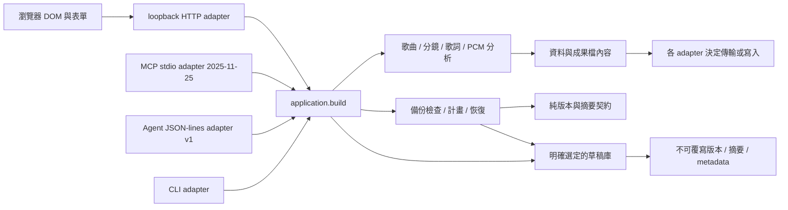

# 分層與版本契約

## v0.17 歌詞起稿與播放位置分層

musiclab/lyrics_seed.py純資料層只產生／核對未校時文字與來源行號，明確CRLF／LF／CR分行與Unicode空白契約；有界64 KiB／1000行，拒絕未知欄位與矛盾來源，沒有I/O／時間猜測。application組裝相同Result；HTTP／CLI／JSON-lines／MCP分別處理傳輸及明確輸出，MCP新增lyrics_seed發現與呼叫，預設六工具／啟庫十一工具。

web/lyrics-seed.js核對真正domain結果與JSON檔語義，純seedDraft保留其他panels／目前時長，將原文JSON與留白cue放入既有draft3。純preview重用replacement-preview的lyrics scope，生成另核對music來源，外部檔只核對目標；proposal用當前草稿合併，來源或目標編修拒絕，舊token／晚錯誤不復活。draft-undo擴展lyrics scope，核對實際after才還原，不覆蓋後續校時／歌詞。

web/cue-stamp.js只從傳入播放位置／音檔時長提出start／end／move，重用lyric-time毫秒契約，沒有DOM／媒體／猜時間。move保留長度，越界整份拒絕；playableCues只供播放顯示，跳過未完成行，不放寬完整匯出驗證。app負責原生播放器、輸入、預覽、明確套用與焦點，不呼叫模型。音檔參照不進起稿或草稿；分別標記及部分播放均為人工輔助，不證明實聽或ASR。

產品0.17.0／lyrics seed1獨立管理，其他protocol與schema保持。分層資料與保護測試、真正adapter／瀏覽器操作見QA-v0.17.0.md，現有層的v0.16說明以下保留。

## v0.16 替換預覽分層

web/replacement-preview.js只處理begin／check／accept／proposal／cancel，不讀檔／HTTP／DOM。scope為music或storyboard，null代表完整草稿；內容指紋重用draft-undo，忽略tab／saved_at。完整替換另保存原生File身份（兩個音檔控制項）；相同名稱與metadata的新File仍拒絕，句子／接受profile等編修也核對。File不structuredClone／JSON，不離開此頁；payload與proposal分別複製。

planning-import與draft-library可注入純preview，傳輸latest token先核對，再用同一讀取前snapshot核對目標；目標改動不讓舊成功／錯誤進預覽，顯示保留內容提醒。DOM層三個獨立preview共用同一capture，跨入口明確取消其他暫態；套用先proposal再渲染及record既有undo。scope需求合併當前其他panels；整份載入清除音檔是既有明示契約，選檔後新增媒體在proposal核對中阻止被清除。

現代／legacy檔案都先預覽，legacy轉換只形成待確認v3 payload；未知版本拒絕。正常預覽的檔名／標題純文字，textarea展示待載入內容，有界高度。產品0.16.0；持久草稿／Agent／seed／library／backup契約皆不變。

## 執行路徑

`musiclab/application.py` 統一操作、資料物件與結果 metadata。領域模組不依賴 HTTP、CLI、Agent 或 DOM；它們不決定 Repo 權限、平台投稿、模型供應商或對外發送。CLI 將創作結果交給共用輸出層；HTTP 只接受明確選定的音檔／備份位元組。未啟用草稿庫時 Agent 不寫檔；啟動時注入所選草稿庫後，draft_save 與 draft_backup_restore 只經該保存層寫入新版本。

`web/editor-state.js` 提供可獨立測試的最新任務判定、歌詞播放區間、歌詞檔讀取控制、鏡頭概要與草稿契約。歌詞讀取以 token 判定最後選擇，原文與格式一起提交；失敗與過期任務不替換內容。`web/app.js` 負責 DOM、事件、音檔生命週期及 HTTP；時間／規格的正式檢查仍由共用 Python 邏輯處理。

鏡頭收合與定位屬於 UI 顯示狀態，不寫入草稿、不改變領域需求，也不使已驗證成果失效。表單欄位保持在 DOM，匯出及草稿保存都收集所有鏡頭。新增／刪除時保留其餘鏡頭的展開狀態，重新載入草稿則採預設顯示。

`scripts/agent_launch.py` 依目前 Python 與此 checkout 產生 launch descriptor／Codex TOML，不保存機器路徑到 Git，不執行模型或安裝 host。設定解析、子程序 transport 驗證、真正 Agent host 工具呼叫是不同驗收層級。

`web/planning-import.js` 是需求與工作台狀態的轉換層，不計算音樂時間或判斷連戲。它檢查 UI 可表達的欄位／容量，轉換穩定母題 ID，並提供正反 DTO 轉換；`app.js` 將候選送入現有 HTTP → application.build 檢查，再展示預覽。載入／撤回僅套用選定 panel；完整草稿載入仍有獨立的全表單還原與音檔重選語義。讀取／驗證用 latest token，過期任務不替換預覽。領域驗證仍唯一由 Python 決定。

## 分別管理的版本

- 產品版本：`musiclab.__version__` 與 `projects.json.version`。目前 v0.16.0。
- Agent 協定：`protocol_version: 1`，每個 request 有 id、operation、payload；每行一個 JSON。
- MCP 協定：`2025-11-25`，JSON-RPC 握手／工具列表／呼叫，與自訂 Agent v1 分別管理。拒絕未知版本，不宣稱支援 2026 協定或任一 host。
- 草稿格式：`format: zoe-music-lab-draft`、`schema_version: 3`。保存編修欄位、需求清單及原始文字數值，允許尚未填完的草稿；不包含音檔、驗證成果或授權設定。
- 保存紀錄格式：`library_schema_version: 1`，含版本 ID、保存名稱／時間、摘要、位元組數、草稿版本與建立時的產品版本。未知紀錄版本拒絕；不靜默遷移磁碟內容。
- 備份格式：`format: zoe-music-lab-backup`、`backup_schema_version: 1`。ZIP manifest 索引每版兩個原始檔的大小／SHA-256；同時核對保存紀錄 1、草稿 3，未知 schema 拒絕。備份 schema 與原始碼封裝 manifest 的 schema 是不同契約。

草稿 v3 沿用 v2 的穩定母題 ID，新增 music-language 與 avoid／deliverables 字串陣列；多行項目仍是同一陣列項目。v1／v2 僅檢查並顯示摘要，需明確按鈕轉成 v3 才載入；舊版新增欄位沿用已知舊 UI 的固定語言／需求預設，v1 單母題轉穩定 ID，v2 對應保留。不覆寫原檔；撤回保存按下轉換時的表單。未知 Agent／草稿版本拒絕執行或替換。輸入資料是素材，不擴大工具權限；未完成草稿需重建成果才恢復下載。

歌詞輸出新增 timing 來源說明，保留既有 duration_estimated 的總時長語義與 needs_review。provided／last_cue_end／last_start_plus_three 區分總時長來源；逐句缺失結束與尾句推得另外記錄。這是 additive result data，不更動 Agent v1 或 MCP 協定。

## Git 與可逆迭代

每輪從已驗證版建立 `codex/iteration-vX.Y.Z`，先留下 `restore-*` tag。分層變更與對應測試放在該輪分支，以 private PR 保留差異與驗證紀錄，包內驗收通過後再合併至 `main`。

需要還原時，以 release／restore tag 開新分支或新目錄，不使用破壞歷史的 reset 或強推。若需回寫 main，使用 revert commit 和可審閱 PR。應用程式不自動遷移或覆寫舊輸出，草稿導入另提供表單撤回。

每輪更新 CHANGELOG、HANDOFF 與驗證證據；封裝只使用指定 Git commit，不收錄未追蹤檔、音檔、outputs、秘密或其他專案。

## v0.7 的契約與提示層

- tool_contracts.py：可序列化的輸入／成功成果 schema，供 MCP、JSON-lines discovery 與 HTTP capabilities 共用；不依賴 schema engine，不處理 I/O 或領域計算。
- application.py：拒絕互斥歌詞來源同時提供，所有 adapter 都得到同樣錯誤；audio.py 在開檔前驗證 profile 和正整數接受條件，排除布林值，正規化整數數值。
- planning-import.js：requirementIssue 產生清單問題位置，planningBrief 與介面共用這個判定。
- app.js／HTML／CSS：在對應項目旁顯示提示、aria-invalid／aria-describedby 與焦點；空清單定位新增按鈕。標示是暫態 UI，沒有進入草稿，回讀／撤回重畫時清除，再建立時重驗。

產品 0.7.0；Agent protocol 1、MCP 2025-11-25 與草稿 schema 3 不變。輸入 schema 的公布是新增 discovery metadata；領域錯誤與 malformed MCP envelope 分開，無來源被靜默忽略的改動已記錄在 CHANGELOG。

## v0.8 的局部還原層

`web/deletion-history.js` 只處理列 ID、相鄰位置、刪除內容、自動副作用的前後值與 bounded 的各工作台紀錄；不依賴 DOM／HTTP／領域計算。`app.js` 的集合 adapter 收集原始字串、分鏡展開狀態，維持頁內 ID 並套用還原、焦點／提示與 dirty 狀態。母題使用草稿中的穩定 ID，其他頁內 ID 與歷史紀錄不進草稿，schema 3 不變。

還原只插回選定列，不以全 panel 快照覆蓋後續編修。分鏡的自動 start／end／duration 副作用按目前值比對撤回，與後來手動修改衝突的值保留，需重新領域驗證。可選較早紀錄、最多 20 筆；到達既有草稿容量則拒絕且保留紀錄。載入取代內容時只清除對應工作台。音檔生命週期不進刪除還原。

`run` 提供請求當下的工作台 revision 判定給歌詞 adapter，匯入／驗證晚回應在替換表格前檢查；不同工作台的修改不使有效回應失效。成果仍由既有 application／domain 計算，未增加依賴或授權。

## v0.9 的保存層

contracts/draft-v3.json 是最新草稿的欄位／列／容量與選項來源。draft_contract.py 做 Python 形狀檢查、canonical UTF-8、瀏覽器 contract asset 及 discovery schema；editor-state.js 使用同一 contract。保存不執行音樂／時間領域驗證，draft_only_not_validated 明確區分草稿形狀與創作成果。

DraftLibrary 只接受啟動時注入的目錄與符合格式的版本 ID，請求不能指定檔案路徑。save 先驗證／檢查大小，再以 RLock 與 Windows msvcrt／POSIX flock 的程序間鎖保護容量、同 ID 檢查及發布；先寫兩個 staged 檔 flush／fsync，再 rename 成版本目錄。例外只清除該次暫存的兩檔與空目錄。崩潰遺留暫存不列為完整版本，不自動清除其他內容；.write-lock 是鎖檔，不是仍有活程序的證據。

同 ID＋相同 canonical 草稿與名稱重用原紀錄，內容不同拒絕，既有位元組保留。read 限量讀取、拒絕連結／越界、核對 SHA-256／位元組／草稿形狀；list 只讀 metadata，讀取時才核對草稿摘要。預設每頁 20、最多 100；庫容量 1000 版。不宣稱斷電或外部惡意修改下的交易／安全保證，POSIX 鎖本輪未在該平台實跑。

web/draft-library.js 是與 DOM 分離的點擊快照、同 ID 重試、latest list/read 與取消控制器。app.js 只負責選單、狀態與預覽／下載／明確套用。未確認結果重試原內容，不更動後續編修；預覽不改表單或音檔。套用沿用整份草稿的撤回界線，捕捉按下套用時的草稿，不是按下預覽時的舊快照。

草稿庫是使用者資料，與原始碼 Release／Git restore tag 分開；不收進 Git／ZIP或可重建產物清理。所有 adapter 預設不提供這三個操作，明確選目錄後才提供；啟動設定產生器只印出可審閱參數，不修改 host 設定或啟動服務。

## v0.10 的可攜備份層

library_contract.py 提供純 JSON／metadata／草稿摘要驗證；draft_library.py 與 draft_backup.py 共用同一套 revision contract。後者負責受限 ZIP、manifest、整份預覽及恢復計畫，不依賴 HTTP、CLI、DOM 或模型。application 提供同源 inspect／restore Result；ZIP 匯出是 binary＋摘要，由 CLI／HTTP adapter 決定傳輸，不將數十 MiB binary 放入 Agent stdout。

讀入來源先取得有界的不可變 bytes，再核對中央目錄、所有檔名／型態／壓縮、每檔與整體容量、schema、原始大小／SHA-256、草稿形狀。只接受 manifest.json 與固定 ID 下的 record.json／draft.json；不 extractall，不讀取 ZIP 指示的磁碟路徑。限制為 32 MiB ZIP／64 MiB 展開／512 KiB manifest／1000 版，中央目錄先限數量與 1 MiB，未知 ZIP 格式／重複檔案／連結／加密／壓縮／schema 拒絕。無效 DEFLATE 也轉為可回應的資料錯誤。

恢復先核對預覽的 SHA-256，再檢查整批 ID 衝突與容量；取得既有 RLock／程序間鎖後重查，逐版經不可覆寫的 _publish 發布。完整的 record／draft 原始 bytes 相同才重用，原 ID／名稱／時間不重新產生。已知錯誤在寫入前拒絕；若磁碟錯誤發生在後面的版本，先前發布的完整版本保留，同一 ZIP 可重試補完。這不是多目錄交易、外部修改或斷電安全承諾。

backup_files.py 是 CLI 目的地 adapter：同目錄 staged 檔 flush／fsync，再 os.link 作排他發布，避免 POSIX rename 覆蓋競爭目的檔；最後只刪本次 stage。拒絕已存在目的與保存版本子目錄；不提供 overwrite。需要支援 hard link 的檔案系統，本輪只在 Windows 本機驗證。

HTTP 備份下載先 POST prepare 檢查完整庫與摘要，再由原生 attachment GET 下載，使用 hidden iframe 避免錯誤頁替換目前編修。backup_downloads.py 最多暫存兩份 ZIP、每份 32 MiB、60 秒有效；後續 prepare／take／正常 server_close 清除過期或自有檔，沒有定時器或背景程序。take 在回應前即移除檔案與空自有目錄，例外內容不遞迴刪除。強制終止仍可能留下尚未取走的暫存檔，不宣稱 crash cleanup。

web/backup-transfer.js 管理 latest preview／取消、固定 File 與預覽 SHA、恢復中的操作界線、未知失敗同 artifact 重試及已知錯誤重選。app.js 只顯示預覽／狀態並明確觸發恢復；不呼叫草稿載入或清除音檔／表單／歷史。恢復後重新讀庫清單；來源和目錄只能由 adapter 明確注入。ZIP hash 用於完整性與避免恢復錯檔，不是署名或著作權簽章。

## v0.11：時間領域、離線呈現與可撤回校時

musiclab/lyric_timing.py 只處理有限十進位、毫秒 half-away-from-zero 正規化與整數精度；lyrics.py 處理來源解析、排序後編修及完整 cue／duration 驗證。application 統一選來源、可選 shift_seconds／time_changes／text_changes 及 needs_review，CLI 不另重複編修。HTTP／JSON-lines／MCP 使用相同 payload 與結果，discovery schema 為 additive，預設四工具、明確啟庫九工具。

musiclab/assets/lyric-time.js 是原生瀏覽器／Node 共用的純時間模組，正規化的 corpus 與 Python 相符；musiclab/lyric_preview.py 負責離線 HTML、安全資料嵌入與同一 JS 原文嵌入。模板只替換一次，使用者文字中的模板符號不被當成程式。重建 timing 避免保留過期的 inferred-end 或 applied-shift 註記；表格結束與實際總長是否提供仍分開。

web/lyrics-timing.js 管理 sorted original ID、預覽競態、完整回應核對、候選及一次撤回；app.js 負責 HTTP／DOM／音檔及 dirty 標記。預覽不寫入；套用只改 start／end，撤回要求所有句子與套用後的時間相符，保留後來的文字與列順序。回應 token 或原始時間指紋不符即捨棄。普通歌詞驗證也先排序原始列，再用對應 ID 重畫結果，避免資料排序後 ID 錯配。

產品 0.11.0；Agent 1、MCP 2025-11-25、draft 3、library 1、backup 1 不變。整批校時控制／候選／一次撤回是暫態，不是草稿欄位。沒有模型、網路、依賴或 host 設定改動。

## v0.12 音檔來源與呈現分層

musiclab/audio_source.py 管理自有副本的生命週期與 fmt 預檢。來源開一次，每塊 1 MiB 同時寫副本／SHA，超過 1 MiB spool 到暫存，所有出口關閉；同份副本交由 audio.py／wave 量測，沒有臨時路徑進報告。fmt 核對 RIFF 長度、format tag 1／整數位深／rate／channel、block align 與 byte rate；wave 保留資料／frame 檢查，不宣稱完整 RIFF conformance 或外部同時改寫的原子快照。多聲道沒有位置解讀，需人工確認。

source_evidence 是 additive 音訊結果資料，包含 bytes／analysis_source=copied_bytes／wave_format_tag／block_align／average_bytes_per_second／declared_riff_bytes。application 不另重新量測或雜湊；CLI／HTTP／JSON-lines／MCP 共用。Markdown 的接受條件與 JSON 同源。

web/audio-review.js 不接 DOM，驗證來源／規格一致性／有限值與狀態，轉成顯示模型；inspect 透過注入的 selected／isCurrent／request／onResult 管理非同步。File 物件身份、條件及 revision 都仍相同才接收，包含錯誤；same-name 換檔也不冒用。app.js 接 HTTP／DOM／dirty，呈現來源、條件、量測與可收合範圍；dirty 將現有摘要標舊並停用下載。表格可局部捲動且鍵盤聚焦，來源 summary 可鍵盤展開。正式規格由 Python 判定，JS 核對回傳及選擇對應。

產品 0.12.0，transport／草稿／保存／備份 schema 不變；沒有新工具、來源權限、草稿欄位、模型／網路呼叫或依賴。

## v0.13 設計回應與共用操作

web/planning-review.js 純buildReview核對modern歌曲／分鏡顯示所需資料、有限值／時間範圍、母題／shot引用、提醒metadata與成果檔；inspect複製需求並注入request／isCurrent／onResult，只有當前回應可產生模型與提交，另核對來源title。不重算Python領域時間或給創作評分，也不解析／執行自由文字。

app.js共用run管理busy／當前panel與revision、目前錯誤及finally恢復；四工作台舊錯誤不顯示。歌曲／分鏡事件必須通過inspect才render／setFiles。DOM用textContent呈現自由文字，validated能量用於width／ARIA meter；markDirty將現有設計標舊、保留內容、停用成果下載。收合狀態僅視圖，不進草稿或改領域資料。

成果面板在寬度1151px以上維持sticky，但max-height為100dvh減48px並局部overflow，tabindex允許鍵盤捲動；窄視窗保持static。此規則讓短桌面下載控制可達，不新增持久服務或狀態。產品0.13.0；Agent1／MCP2025-11-25／draft3／library1／backup1及領域／成果schema／工具數量保持。

## v0.14 的歌曲時間接續與撤回

musiclab/storyboard_seed.py 只接受現代歌曲 brief／fps／bars_per_shot，重用 music_plan_bundle 的驗證與段落計畫，再按整小節分鏡；不中途跨段落，不推測畫面。單鏡不足一影格／超1000鏡先拒絕。時間毫秒與 Python storyboard 同一 round 影格語義；固定速度／無弱起的假設與原始段落任務保留在 source。application 回傳兩檔與 needs_review=true，四 adapter 共用，獨立 seed schema 1。

web/storyboard-seed.js 是純呈現／DTO 與非同步控制層，不另提供歌曲領域生成。核對回應版本／狀態、有限時間、小節、來源段落、影格、JSON實檔與meta；起稿檔中的 creative 欄位沒有被捏造。latest token＋music／storyboard／設定指紋先排除過期成功／錯誤，再驗證和預覽。proposal 再次核對來源與目標；以最新其他 panel 合成只改分鏡標題／時長／FPS／shots 的 schema3 草稿，空白創作內容由使用者填寫。預覽／設定／收合不進草稿。

web/draft-undo.js 是純快照與核對層，record 複製 before／實際 after；限定載入只核對該 panel，完整草稿核對全部 panels。鍵序不影響指紋、陣列順序與原始空白有意義；後續改動拒絕整份撤回且保留 record。app.js 確認 proposal 後才渲染，成功後 clear；保留其他 panel 與音檔的局部語義。全表單載入／撤回仍清除音檔，需重選。

版本0.14.0；預設五工具／啟庫十工具。Agent1、MCP2025-11-25、draft3、library1、backup1不變；seed1為新增中間格式，不冒充 mv-brief 或靜默遷移。未知版本拒絕，不改 auth／路徑選擇／權限。每輪Git還原點與封裝保護原始碼，使用者草稿／素材另存。

## v0.15 起稿檔回讀

timing_slots是生成／檢查共用的確定性演算法，seed_files只負責成果文字。validate_seed核對完整固定形狀、版本／狀態／時間假設與數字型別，按來源BPM／拍數／小節重新核對精確毫秒及同一Python round影格；不製造假的歌曲brief來繞過驗證，不從JSON選路徑、不重寫原檔。unknown keys含使用者增寫visual等也拒絕，避免無聲丟失創作；seed1維持未完成時間稿。

application storyboard_seed生成／檢查兩種互斥輸入，原四transport共用；discovery oneOf與nested exact schema可直接分辨來源。CLI --brief或--seed，匯入不接受生成設定覆蓋。未知版本拒絕、不自動遷移，結果仍兩檔／needs_review=true，工具數五／十保持。

web/storyboard-seed.js共享latest task與snapshot，但file模式只核對目標storyboard；music模式仍核對music／storyboard／生成設定。file read大小／suffix／BOM／JSON與純形狀先檢查，再由application判定精確時間；回應須與選檔資料語義相同。proposal再核對目標，其他panel用當下最新資料合成。app run的optional scope讓錯誤與修改保護跟隨實際目標；tab切換仍受busy約束。checked file成果inputIndependent經setFiles／切換頁面保留，音樂修改不把原檔檢查當成生成需求；修改仍使原音樂摘要stale與revision遞增。該旗標是transient顯示語義，不進draft3。

資料來源不是作者、實際音樂時間或成片證據；匯入原檔保留，瀏覽器JSON數字與HTML form CRLF可能重排，但值保留。產品0.15.0與seed1／Agent1／MCP2025-11-25／draft3／library1／backup1分開。
