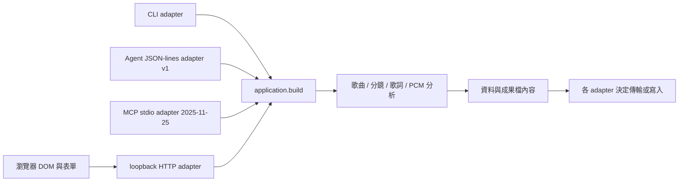

# 分層與版本契約

## 執行路徑

`musiclab/application.py` 統一操作、資料物件與結果 metadata。領域模組不依賴 HTTP、CLI、Agent 或 DOM；它們不決定 Repo 權限、平台投稿、模型供應商或對外發送。CLI 將結果交給共用輸出層；HTTP 只接受明確選定的音檔位元組；Agent 不自動寫檔。

`web/editor-state.js` 提供可獨立測試的最新任務判定、歌詞播放區間、歌詞檔讀取控制、鏡頭概要與草稿契約。歌詞讀取以 token 判定最後選擇，原文與格式一起提交；失敗與過期任務不替換內容。`web/app.js` 負責 DOM、事件、音檔生命週期及 HTTP；時間／規格的正式檢查仍由共用 Python 邏輯處理。

鏡頭收合與定位屬於 UI 顯示狀態，不寫入草稿、不改變領域需求，也不使已驗證成果失效。表單欄位保持在 DOM，匯出及草稿保存都收集所有鏡頭。新增／刪除時保留其餘鏡頭的展開狀態，重新載入草稿則採預設顯示。

`scripts/agent_launch.py` 依目前 Python 與此 checkout 產生 launch descriptor／Codex TOML，不保存機器路徑到 Git，不執行模型或安裝 host。設定解析、子程序 transport 驗證、真正 Agent host 工具呼叫是不同驗收層級。

`web/planning-import.js` 是需求與工作台狀態的轉換層，不計算音樂時間或判斷連戲。它檢查 UI 可表達的欄位／容量，轉換穩定母題 ID，並提供正反 DTO 轉換；`app.js` 將候選送入現有 HTTP → application.build 檢查，再展示預覽。載入／撤回僅套用選定 panel；完整草稿載入仍有獨立的全表單還原與音檔重選語義。讀取／驗證用 latest token，過期任務不替換預覽。領域驗證仍唯一由 Python 決定。

## 分別管理的版本

- 產品版本：`musiclab.__version__` 與 `projects.json.version`。目前 v0.6.0。
- Agent 協定：`protocol_version: 1`，每個 request 有 id、operation、payload；每行一個 JSON。
- MCP 協定：`2025-11-25`，JSON-RPC 握手／工具列表／呼叫，與自訂 Agent v1 分別管理。拒絕未知版本，不宣稱支援 2026 協定或任一 host。
- 草稿格式：`format: zoe-music-lab-draft`、`schema_version: 3`。保存編修欄位、需求清單及原始文字數值，允許尚未填完的草稿；不包含音檔、驗證成果或授權設定。

草稿 v3 沿用 v2 的穩定母題 ID，新增 music-language 與 avoid／deliverables 字串陣列；多行項目仍是同一陣列項目。v1／v2 僅檢查並顯示摘要，需明確按鈕轉成 v3 才載入；舊版新增欄位沿用已知舊 UI 的固定語言／需求預設，v1 單母題轉穩定 ID，v2 對應保留。不覆寫原檔；撤回保存按下轉換時的表單。未知 Agent／草稿版本拒絕執行或替換。輸入資料是素材，不擴大工具權限；未完成草稿需重建成果才恢復下載。

歌詞輸出新增 timing 來源說明，保留既有 duration_estimated 的總時長語義與 needs_review。provided／last_cue_end／last_start_plus_three 區分總時長來源；逐句缺失結束與尾句推得另外記錄。這是 additive result data，不更動 Agent v1 或 MCP 協定。

## Git 與可逆迭代

每輪從已驗證版建立 `codex/iteration-vX.Y.Z`，先留下 `restore-*` tag。分層變更與對應測試放在該輪分支，以 private PR 保留差異與驗證紀錄，包內驗收通過後再合併至 `main`。

需要還原時，以 release／restore tag 開新分支或新目錄，不使用破壞歷史的 reset 或強推。若需回寫 main，使用 revert commit 和可審閱 PR。應用程式不自動遷移或覆寫舊輸出，草稿導入另提供表單撤回。

每輪更新 CHANGELOG、HANDOFF 與驗證證據；封裝只使用指定 Git commit，不收錄未追蹤檔、音檔、outputs、秘密或其他專案。
