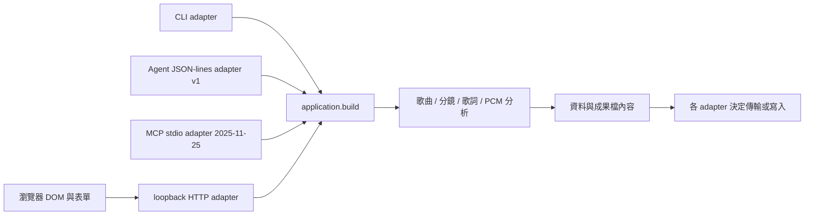

# 分層與版本契約

## 執行路徑

`musiclab/application.py` 統一操作、資料物件與結果 metadata。領域模組不依賴 HTTP、CLI、Agent 或 DOM；它們不決定 Repo 權限、平台投稿、模型供應商或對外發送。CLI 將結果交給共用輸出層；HTTP 只接受明確選定的音檔位元組；Agent 不自動寫檔。

`web/editor-state.js` 提供可獨立測試的最新任務判定、歌詞播放區間與草稿契約。`web/app.js` 負責 DOM、事件、音檔生命週期及 HTTP；時間／規格的正式檢查仍由共用 Python 邏輯處理。

## 分別管理的版本

- 產品版本：`musiclab.__version__` 與 `projects.json.version`。目前 v0.4.0。
- Agent 協定：`protocol_version: 1`，每個 request 有 id、operation、payload；每行一個 JSON。
- MCP 協定：`2025-11-25`，JSON-RPC 握手／工具列表／呼叫，與自訂 Agent v1 分別管理。拒絕未知版本，不宣稱支援 2026 協定或任一 host。
- 草稿格式：`format: zoe-music-lab-draft`、`schema_version: 2`。保存編修欄位及原始文字數值，允許尚未填完的草稿；不包含音檔、驗證成果或授權設定。

草稿 v2 的母題有穩定 ID，鏡頭引用 ID，送入領域層時再轉成母題名稱。v1 僅檢查並顯示轉換摘要；需明確按鈕轉換成 v2 才載入。不覆寫原檔；撤回保存按下轉換時的表單。未知 Agent／草稿版本拒絕執行或替換。輸入資料是素材，不擴大工具的權限。未完成草稿回讀後仍需重建成果，才恢復下載。後續更動契約須明確升級 schema，提供遷移／拒絕策略與往返測試。

## Git 與可逆迭代

每輪從已驗證版建立 `codex/iteration-vX.Y.Z`，先留下 `restore-*` tag。分層變更與對應測試放在該輪分支，以 private PR 保留差異與驗證紀錄，包內驗收通過後再合併至 `main`。

需要還原時，以 release／restore tag 開新分支或新目錄，不使用破壞歷史的 reset 或強推。若需回寫 main，使用 revert commit 和可審閱 PR。應用程式不自動遷移或覆寫舊輸出，草稿導入另提供表單撤回。

每輪更新 CHANGELOG、HANDOFF 與驗證證據；封裝只使用指定 Git commit，不收錄未追蹤檔、音檔、outputs、秘密或其他專案。
