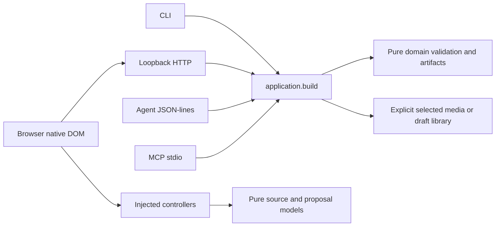

# 目前分層架構

四個專案共用純領域模型與應用層，各adapter處理傳輸或明確選定的filesystem I/O。Python標準函式庫、瀏覽器原生API；沒有產品模型、外網、登入或金鑰能力。

## 責任與版本

| 層 | 責任 | 主要入口 |
| --- | --- | --- |
| 純domain | 原值、時間、影格、Unicode與來源核對，派生資料與文字成果 | `musiclab/` 各領域模組 |
| 應用 | 驗證操作／payload，組合領域結果，不猜路徑 | `musiclab/application.py` |
| 傳輸 | bounded strict JSON、stdio／RPC／HTTP framing及明確來源選擇 | `music_lab.py`、`music_lab_agent.py`、`music_lab_mcp.py`、`music_lab_server.py` |
| Browser純層 | 隔離source、request／reply／proposal、有限metadata DTO | `web/` 純模組與shared assets |
| 注入controller | latest／scope／revision／完整來源、read／write前後與actual-after核對 | 各`*-controller.js`及注入factory |
| DOM | literal文字、事件、原生File／Blob、有限render與manual焦點 | 各`*-dom.js`及`web/app.js` |
| 明確filesystem | 來源副本、排他輸出、不可覆寫版本、備份及release audit | `musiclab/` I/O adapters、`scripts/` |

完整Python測試的纯分配模型依实測更新成本提示，再由原兩worker／120秒launcher核對獨立discovery與完整ID／EOF；成本不授予跳過案例、增加期限或程序權限。驗證與診斷分開，見[來源與測試分配契約](RELEASE-GIT-CAPTURE.md)。

產品版本與交付支援表唯一執行期來源是 [delivery-versions.json](../musiclab/assets/delivery-versions.json)。Agent1、draft3、MCP2025-11-25與各獨立domain schemas不是產品minor版本；未知版本拒絕，不默認遷移。完整input/output schemas由discovery取得。目前22基本／明確選庫29操作，沒有跨schema隱藏寫入。

## 來源、非同步與保存

外部UTF-8／JSON與可信生成成果分開檢查。回應同時核對完整需求、domain與成果；來源、revision或原生File身份變更，晚成功／錯誤不覆盖後續編修。Apply只改選定scope；限定undo核對實際after，不以舊snapshot覆蓋新內容。預覽、焦點、待辦、搜尋、history與閱讀片段不進draft或Agent wire。

音檔的雜湊和量測從同一自有副本取得；不重新打開來源混用，不承諾外部同時改寫的原子快照。RMS／LUFS、sample／true peak及資料連續／實際音畫同步分開。輸入媒體保留，不進Git或原始碼ZIP。

草稿保存只在啟動時明確選庫後啟用，版本不可覆寫。恢復不能藉JSON換路徑；使用者草稿與媒體不是可由Git重建的產物，另行備份。下載click／response不是已保存接受，beforeunload不是自動保存。

## 容量與所有權

傳輸行2MiB／strict JSON64層，純完整文字各有domain上限，UI預覽与搜尋／報告有限；完整檢查後才選取或分段。原文核對只在有效source下讀本次明確File，最多兩個未完成read工作。差異閱讀在明確動作期間暫時編碼完整目前原文，最多16KiB頁與512已讀位置，finally清除暫存，不重新讀選定File。詳細來源及呈現規則見[差異閱讀](TEXT-VERIFICATION-PAGE.md)。

自有object URL、timer、staging和程序有數量／期限限制，取消只處理自身工作；不列舉或終止無關程序。每輪CLI audit保護最新三封裝，只有strict超七天、完整manifest／ZIP与exact tag/archive可重建才可清理；unknown／partial與草稿保留。不以單一PID、catalog或綠燈冒充完成／所有權。

摘要建構子由共用digests在首次實際計算時載入原標準函式庫；能力清單／無摘要的形狀檢查不預載provider，原native物件、串流、參數與拒絕保持。見[摘要載入](DIGEST-LOADING.md)。

維護程序核對由純maintenance_runs／同份有界record bytes與SHA／原native-CIM adapter／CLI分層。`--runs-only` 可補查1–32份明確紀錄，完整封裝盘點與程序報告分開，真正清除仍完整重查；來源與聚合依[指定程序契約](RUN-AUDIT.md)。

原始碼封裝先以純release_capture／release_git_fs取得有限固定Git tree與收束原child／兩reader，再以純release_zip／release_zip_fs容量gate讀ZIP。producer與maintenance共用，完整blob／CRC／ledger維持後續層；manifest2 raw profile與legacy1原bytes保持。見[來源契約](RELEASE-ARCHIVE.md)、[ZIP容量](RELEASE-ZIP-BUDGET.md)與[Git串流](RELEASE-GIT-CAPTURE.md)。

測試排程由純test_schedule驗證完整唯一ID及近似positive integer成本，將昂貴方法分配後恢復每組discovery原順序。launcher與parent獨立discovery、完整coverage與原handle EOF核對保持；仍兩worker／120秒，class fixtures各程序自行建立／收束，成本提示不保證速度或全域RAM。細節見[Git串流與測試交接](RELEASE-GIT-CAPTURE.md)。

## 目前指南與歷史

歌詞時間的純 `lyric-time` 將原值空白與數值空白分開；工作台、注入時長／校時 controller、匯入與固定獨立預覽共用，Python／application／四 adapter 接受規則保持。BOM 不當成空白或有效數字，無效來源與後續編修保留。見[時間空白契約](LYRICS-WHITESPACE.md)。

[README](../README.md)、[START-HERE](START-HERE.md)、[AGENT](AGENT.md)與四Skill維持當前可用工作流程。每輪更新置於CHANGELOG、HANDOFF與各QA／契約文件，入口不再疊加歷史QA摘要；七份v154原入口原文在相同目錄的HISTORY檔中保留，來源／byte SHA與回復方式見[文件分層契約](DOC-ENTRYPOINTS.md)。

開發依[AGENTS](../AGENTS.md)的安全邊界，每輪restore tag、codex分支、相稱驗證、exact-source封裝、SHA、PR及遠端位元組核對。法律／發起／平台原紀錄保持，以实际外部結果記錄，不能由檔案或雜湊推定創始身份。先前架構原文見[截至v154歷史](ARCHITECTURE-HISTORY-through-v0.154.0.md)。

校時撤回先核對目前非負時間的來源，再按原數值比較，拒絕整份覆蓋並保留重試；驗證不改寫來源。見[校時撤回契約](LYRICS-TIMING-UNDO.md)。

整批校時的注入controller核對隔離before、寫入器回值及同份實際post；只有原列／文字／宣告與完整目標時間原字串吻合才接受。失敗保留仍存在的紀錄及實際部分內容；reset／cancel意圖與寫入期間重入另行核對。DOM寫入責任保持。見[寫入接受契約](LYRICS-TIMING-ACCEPTANCE.md)。

新增歌詞先由既有純lyrics-timing沿共享LyricTime產生完整毫秒候選，再交給原DOM adapter分配列ID與寫入；候選拒絕不改表格或dirty／焦點。見[新增句契約](CUE-ADD-MILLISECONDS.md)。

波形定位候選與原生寫入分開；寫入後核對當前音檔與實際位置，再交付同一快照的view。見[實際定位契約](WAVE-SEEK-ACCEPTANCE.md)。

分鏡總長的空白分類沿共享planning-values，與Python application及原生時間診斷同來源；候選／controller／DOM沿既有分層，原值不修剪。見[原值分類契約](STORYBOARD-DURATION-VALUES.md)。

分鏡總長撤回由純controller核對pending身份／原时间來源、注入寫入器與實際post快照，再發布同一已核對view；DOM及app保持既有限定寫入。拒絕不清除仍存在的紀錄、不自動回滾／重試。見[撤回接受契約](STORYBOARD-DURATION-UNDO.md)。

指定提交封裝的filesystem adapter在驗ZIP／Git raw blobs後、一次性checkout內準備Python位元碼快取，再呼叫原launcher；準備不改原源檔／ZIP或兩worker／120秒，失敗仍不建成功manifest。快取隨原temp context回收；其準備不冒充正式測試接受。

失敗驗收由純有界 startup 解析／原 handle 收集與 EOF 診斷／native typed record 觀察分層；缺少身份不補造，集中驗證不取代完整接受。Node 封裝測試明確兩 file workers，原期限保持。見[失敗證據契約](PYTHON-TEST-FAILURE.md)。
