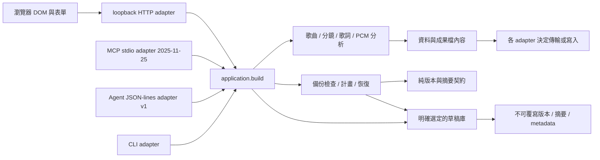

# 分層與版本契約

v0.51 SRT 純解析／原文核對：原各行空白與Unicode保留，物理多行明確 / 合句、原排版保留原檔／空白cue用JSON；Python／JS integer clock與單次文首BOM，application共用各adapter。lyrics-import對LRC／SRT沿共用timed-source guard核對原cues／time／inference與文字exports再preview／Apply；LRC原解析保持。產品51／來源38–51，wire／schema／12／17tools維持。見[契約](LYRICS-SRT.md)。下方保留歷史迭代。

v0.50 LRC 原文保留：獨立 Python／JS 只解析相鄰行首時間、獨立 offset 與單次文首 BOM；literal remainder 保留。瀏覽器以原文核對 cues／time／inference 與 LRC／SRT 輸出，拒絕自洽但錯來源回覆，再 preview／Apply。多標籤歧義以版本1 JSON保存；原檔保持，wire／schema／12／17tools保持，明確來源38–50。見[契約](LYRICS-LRC.md)。下方保留歷史迭代。

v0.49搜尋上一批：controller私有最多512對cursor與command generation，單batch／context保持；返回回讀原位置及序號，前進仍可全文接續。DOM範圍／邊界焦點、來源／query失效及retry分層；wire／schemas與12／17tools保持，明確來源38–49。見[導航契約](DELIVERY-SEARCH-NAVIGATION.md)。下方保留歷史迭代。

v0.48：內部plain bundle的snapshot／精確current移到[delivery-source純層](DELIVERY-SOURCE.md)，複製容器但不序列化全文。delivery-import區分metadata view與明確full status，DOM只訂閱onView並用refreshView；單份preview cache保持原文與完整換行計數，read/search原單buffer保持。source mutation／media／scope／revision／result／busy完整保護，12／17 tools與wire schemas保持。

## v0.44 原文分段閱讀

text-window1獨立，完整來源核對後讀明確UTF-8邊界，單段4–16KiB、非零位置pin前次ZIP SHA，未指定分段的原契約保持。Browser唯讀reader有界buffer／頁面／history、current source重查；全文下載、Apply／Undo與12／17工具保持，來源明確38–44。見[使用與分層](DELIVERY-TEXT.md)。以下早期章節保留迭代來源。

## v0.43 指定 ZIP 原文

完整核對來源後才能選取明確原檔名，pure selection1／application／CLI／Agent／MCP共用；Browser pending current source唯讀下載沿native bytes。512 KiB選定JSON上限、8 MiB完整來源與原文保持；來源明確38–43，12／17工具與Agent1／draft3及既有交付schemas保持。見[目前契約與使用](DELIVERY-SELECTION.md)。以下早期版本段落保留迭代來源。

## v0.42 原文下載與有界成果預覽

text-download純形狀／Unicode／UTF-8 bytes與注入select-send controller→text-download-dom bounded Blob URL／anchor／timer→app current canonical source。五文字入口共用，不經HTTP form或preview textarea；error不能新增pending，sent仍需明確確認。成果預覽重用delivery-review.excerpt32768units，不拆surrogate、不改來源。URL最多2個、1秒／pagehide／dispose清理自身；binary staging與相容API cap保持。Agent／CLI／MCP無權限或schema新增，明確來源38–42。見[契約](TEXT-DOWNLOAD.md)。

## v0.41 可保存比較證據與文字輸出邊界

delivery_report pure metadata驗證／JSON與Markdown→application從真ZIP＋baseline派生→CLI／JSON-lines／MCP；browser同契約由Python fixture核對完整bytes，controller current target→DOM固定格式→HTTP export encoded字串嚴格decode→原UTF8 download。避免HTML form LF→CRLF改寫；legacy route保持，沒有路徑或寫檔新增。filesystem text_outputs default exclusive create修正preflight race，common重匯出既有API，多檔無原子交易假設。launcher選檔獨立，只列印設定。report1獨立、12／17保持，來源版本明確38–41；見[完整契約](DELIVERY-REPORT.md)。

## v0.40 精確文字比較與有界預覽

delivery_review pure validation／exact-name-byte比較與SHA→application→CLI／JSON-lines／MCP；HTTP binary inspection沿既有入口。browser delivery-review.js同契約，以真Python fixture核對；controller局部候選在非同步比較後查最新token／scope／revision／result epoch／media才發布。DOM只顯示兩份原文、缺檔、換行計數與有界摘錄，原wire／files保持。container width640px才並排，側欄上下；比較不合併或改表單。comparison1獨立、12／17 tools保持，明確producer／inspector／browser支持38／39／40，未知拒絕。見[契約](DELIVERY-COMPARISON.md)。

## v0.39 文字交付回讀與限定撤回

純delivery_inspect限制bytes／中央目錄後讀原文字，重用原版本delivery_package producer精確重建核對，不解壓、不執行HTML。application供CLI／固定啟動來源Agent／MCP與binary HTTP；Agent預設metadata、明確小型files JSON≤512KiB。browser有界原清單probe＋完整回覆／來源／SHA核對controller→DOM；app只接bundle／revision／media。原label與display note分開，撤回只保存必要舊bundle並以結果epoch防止覆蓋後續成果。12／17 tools、inspection1／package1／Agent1／draft3獨立；known工具38／39明確枚舉，未來升版同步producer／inspector／browser與測試。見[契約](DELIVERY-INSPECTION.md)。

## v0.38 文字交付與有界下載

純delivery_package來源及確定性ZIP／manifest→application→CLI delivery_files、HTTP有界BackupDownloads實例、Agent／MCP。browser純model／注入controller→DOM adapter；完整檔案來源、schema與逐檔SHA、scope／revision核對，過期回覆取消自身slot。CLI排他發布，HTTP每類2slot／60秒／take一次、server_close清除自身檔；既有backup adapter defaults保持。交付schema1獨立，Agent1／draft3保持，11／16工具。見[分層](DELIVERY-PACKAGE.md)。

## v0.34 原時間診斷與共用總長檢查

storyboard_timing.py為純部分時鐘診斷，重用有限十進位與storyboard_frames的秒數容差／最近半幀取偶映射；storyboard_timing_review.py負責精確最小原時間source、獨立report1及JSON／Markdown，application供四adapter。完整creative planner維持既有創作／連戲及時間接受；103跨語言／完整clock接受樣本防止兩層規則分歧。

前端storyboard-timing.js重用planning-values、storyboard-frames、共享readiness-state／readiness-report，純來源快照含穩定暫態列ID。app只捕捉raw欄位、定位／busy／revision／HTTP，兩種待辦的aria標示獨立；report來源／data／JSON／Markdown及版本完整核對後才更新成果。storyboard-duration重用同一純時間診斷，全形原鏡尾明確採用／限定撤回，不修改原鏡頭。基本10／明確啟庫15工具，Agent1／draft3與舊report1保持，新時間report1獨立；ID及診斷不進draft。見[時間契約](STORYBOARD-TIMING-REVIEW.md)；下方工具數為各歷史版本。

## v0.32 分鏡原欄位報告與共享核對

storyboard_review.py純shape／必填／方向／母題引用及原列related_row；確定性JSON／Markdown由application服務四adapter。CLI同一明確來源入口供music-review／storyboard-review，modern草稿完整驗後只選命令panel；tool_contracts沿draft3原字串形狀，raw未知方向可診斷，無路徑權限。report1／產品0.32與各protocol／schema分開，9／14工具。

storyboard-readiness沿既有inspect重算report；readiness-report無DOM／I/O，歌曲與分鏡共用envelope、metadata、完整source／data、嚴格JSON、Markdown核對及隔離clone。domain wrapper管理各report／字串，app管理capture／revision／late／busy、定位與安全成果替換；核對後才隱藏舊設計。原鏡號／ID／字串、其他panel／媒體／保存checkpoint保持，暫態不進draft3。

1000鏡／30母題／8MiB純source、2MiB傳輸／1MiBCLI草稿、全部count／200明細／20DOM。filled是欄位與引用語義；完整time／frame／continuity仍由原domain接受，不因報告零而放寬。見STORYBOARD-REVIEW.md。

## v0.31 歌曲診斷跨工具報告

music_review.py依既有draft3契約讀原panel形狀，純必填／範圍／原列診斷及確定性report／Markdown；application供HTTP／CLI／JSON-lines／MCP同一結果。tool_contracts描述原字串與留白、精確panel，與完整music schema分開。report1／產品0.31／Agent1／MCP2025-11-25／draft3獨立，8／13工具；不增加依賴、模型或路徑權限。

music-readiness重用純診斷重算完整report／source／JSON／Markdown並核對protocol／schema；app明確report I/O、原始capture／revision／late guard、busy、安全呈現與成果替換，核對完成後才提交DOM。即時檢查與report I/O分開，其他panel／媒體／另存狀態保持，原始ID／快照不進report或draft。40段／100清單／200明細／20UI；純8MiB、傳輸2MiB／modern草稿1MiB，零待辦不是完整接受。見MUSIC-REVIEW.md。

## v0.30 歌曲診斷與共享快照

planning-values 從本專案既有 planning-source 提取純文字空白／有限十進位規則，planning-source／需求清單／歌曲及分鏡待辦重用。music-readiness 驗原始歌曲形狀與純欄位診斷，最多40段／100清單／8MiB、200明細／前20UI。readiness-state 注入 capture／source／inspect／onState 由兩種創作待辦共用；一次捕捉、固定來源鍵序、inspector副本隔離、定位前重查，無DOM／I/O。

app 讀原字串和穩定列ID、安全文字／aria-invalid、原位置聚焦／busy；歌曲快照包含完整原歌詞，即使同文字列移動也停舊定位。其他panel／媒體獨立、載入清暫態。既有planning-review／application／domain負責完整總長／來源核對，欄位零不能代替完整接受；schema／protocol及七／十二tools保持，沒有暫態wire／draft欄位、operation／依賴／模型新增。見 MUSIC-READINESS.md。

## v0.29 歌曲段落順序

music-arrangement純鄰近move／restore與唯一ID／最多40列形狀檢查；注入capture／apply／onState controller只保存一份順序紀錄，刷新及撤回前重查。DOM保留整列原始字串、選取、焦點與busy，結構變更停舊撤回；後續欄位編修保留，其他panel／媒體獨立。完整歌曲／起稿與需求來源核對沿原application/domain及planning層；暫態不進draft3／wire。產品0.29、各schema／protocol及七／十二tools保持，無operation／依賴／模型新增。見MUSIC-ARRANGEMENT.md。

## v0.28 分鏡創作待辦

storyboard-readiness依draft3欄位形成純必填／引用模型，注入capture／onState controller保存固定鍵順序原始分鏡快照，定位前重查；DOM只標示、原位置聚焦與busy。全部1000鏡／200明細／前20UI，其他panel獨立，載入清暫態。待辦補齊後沿原完整application／domain時間、影格、連戲及sourceChecked；無新schema／operation，report不進草稿／wire。見STORYBOARD-READINESS.md。

## v0.27 分鏡總長接續

storyboard-duration純snapshot／proposal／compare／注入controller重用storyboard-frames。app捕捉原始時間／列ID／FPS及宣告，顯示兩者並只寫總長；新增／刪除不改宣告。單一顯示快照與採用前重查、實際after限定撤回、載入清除與busy控制分開。創作完整驗證仍由既有application／domain負責，各protocol／schema及七／十二tools保持。暫態不進draft3／wire，沒有I/O／網路／媒體處理。

## v0.26 需求與主要 JSON 核對

planning-source 純 layer、planning-review checkedResult／checkedBrief 與 app adapter 分層。建立及需求回讀共用本次來源核對；晚回應先拒絕，暫態 sourceChecked 不進持續草稿／wire。Python design 只修正清理後標題；JSON 嚴格且有界，CSV／Markdown沒有瀏覽器逐字重算。詳見 PLANNING-SOURCE.md。

## v0.25 未完成表格的唯讀診斷

lyrics_review.py只處理原始表格、純時間診斷、原列號、有限明細和文字成果；重用lyric_timing，排序只用於檢查，不改來源。lyrics-review.js純重算與reply核對、注入controller和app DOM分層。capture snapshot／latest token／source match拒絕晚回應；app用安全文字與aria-invalid定位，編修後舊報告過期並停用定位。來源空白不猜測，局部時間計數不是全表通過，正式匯出仍由lyrics完整驗證。

application新增lyrics_review，CLI／HTTP／JSON-lines／MCP共用；schema1獨立與產品0.25分離，其他protocol／schema保持。七基本tools、啟庫十二tools；新tool唯讀且不開世界／路徑。報告／來源位置不進draft3。transport2MiB、欄位budget2MiB、10000列、前200明細／全部count與前20DOM分層。見LYRICS-REVIEW.md。

## v0.24 媒體觀測與作品宣告

lyrics-media.js 共用純 compare／mediaTime 與注入 controller，來源 URL／revision／before-after／撤回只存在本頁。metadata 只在同來源且原本空白、未編修時接續；已有宣告保持。app 與獨立 HTML adapter 管理 DOM／播放器，明確採用或撤回只寫時長，不裁切 cue。HTTP allowlist 和實際 defer script 順序回歸核對。

獨立 Apply 不直接使用 player.duration；以明確欄位或既有 package 重新驗證，歷史 review_notes 保持。domain／application／CLI／HTTP／JSON-lines／MCP 無新 request／operation／持久 schema。產品0.24.0；Agent1／MCP2025-11-25／draft3 及既有各版本、六／十一工具不變。詳見 LYRICS-MEDIA-DURATION.md。

## v0.23 影格映射與完成分鏡覆蓋

musiclab/storyboard_frames.py 純最近影格映射／覆蓋檢查／descriptor，沒有 I/O 或來源修正。creative.py 完成原秒數驗證後，以同一函式計算每鏡影格，再核對由 0 至宣告總長的連續排他區間；序列化前拒絕矛盾。storyboard_seed.py 重用映射，保持 seed1 既有結果與未完成語義。秒數 1 ms 邊界加入 1e-12 浮點餘量，避免二進位表示誤差拒絕剛好 1 ms；不是擴大影格容差。

web/storyboard-frames.js 純映射／完成報告驗證，不另生成分鏡。planning-review 委派後交出可呈現 model；storyboard-seed 也核對精確映射，不能接受半幀兩側的另一個整數。app 只以 textContent 呈現總影格／各鏡範圍；原 revision／File／晚到保護保持。server allowlist 與 script 順序明確載入共用模組。

產品 0.23.0、storyboard_frames schema1 與 discovery descriptor；Agent1／MCP2025-11-25／draft3／library1／backup1／兩seed1／lyrics_package1／audio_loudness1及六／十一工具保持。未新增持久草稿欄位或自動遷移。見 FRAME-TIMELINE.md。

## v0.22 響度與有界區塊副本

loudness.py純K-weighting／400ms串流幀能量／兩道gate與獨立量測schema1，無I/O；loudness_blocks.py擁有64KiB後轉暫存檔的8-byte能量ledger，兩次串流門檻計算且成功／失敗均close。audio.py在audio_source同一副本的一次PCM掃描整合，既有stats／技術接受／退出碼保持，未知聲道／範圍外rate保留PCM且響度不可測。不可測不是零或品質判斷。

audio-review.js純schema／數值／來源幀／nearest-sample schedule／counts／gate一致性核對，legacy明示未提供，未知measurement schema拒絕；app只做DOM顯示與既有File／profile／revision晚到保護。產品0.22.0、audio_loudness schema1；Agent1／MCP2025-11-25／draft3／library1／backup1／兩seed1／lyrics_package1、六／十一工具保持。完整方法與校對限度見LOUDNESS.md。

## v0.20 外部 JSON 與領域契約分層

musiclab/json_document.py只做有界UTF-8／JSON decode，沒有domain、路徑、I/O、schema遷移或寫入。拒絕全深度重複鍵、跳脫同名、NaN／Infinity／1e999溢位、無效Unicode與64層以外；iterator frame traversal避免按值數量建立額外待走訪清單。common.read_json只讀上限加1byte，application.load_request、library_contract.strict_json與lyrics_package.decode_document委派同層，各自保留來源容量與BOM規則。

json-document.js共用scan／parse／native byte decode，讀取大小與File.size核對、TextDecoder fatal UTF-8、只移除明確允許的一個BOM。planning-import／storyboard-seed／app草稿handler讀取arrayBuffer，先核對latest／target再decode、再領域驗證／HTTP；取消、預覽、proposal與undo仍分層，沒有寬鬆text fallback。

lyrics-package.js委派parseDocument至共用模組；workbench script先載入json-document，離線HTML嵌入同一份。一般TXT／LRC／SRT不當JSON解析；字串與歌詞中重複文字保留。可信程式生成的JSON成果仍使用既有JSON.parse，與外部輸入分開。domain object檢查不被parser取代。

產品0.20.0，discovery增加json_document encoding／max_depth／duplicate／nonfinite行為；不是新持久schema。Agent1／MCP2025-11-25／draft3／兩seed1／lyrics_package1／library1／backup1與六／十一工具保持。

## v0.19 完整歌詞包與來源保留

musiclab/lyrics_package.py處理完整JSON decode／validate／explicit legacy／files／needs_review，不讀路徑／媒體／DOM。root八欄、timing三欄與選定shift、有限數字與毫秒、2MiB／10000cue／20個說明；重複欄位含跳脫同名、NaN／Infinity／溢位、矛盾來源或未知版本拒絕。lyrics.py一般字幕解析與package_files共用舊時間規則，application選擇互斥cues／content／package模式，transport只處理有界資料與明確輸出。

musiclab/assets/lyrics-package.js共享嚴格JSON掃描與驗證、legacy轉換、revise／buildRequest／notice；工作台與獨立HTML嵌入同一份模組。未改cue時保留來源；確認總長保留曾推得句尾，人工編修重新驗證並附review_notes。沒有把資料驗證視為實聽／辨識。Python與JS跨語言Unicode空白、毫秒、非有限數字、欄位及大小契約均測試。

lyrics-import只組裝／核對request與review／draft提案；既有讀取前snapshot／最新序列／target guard保持。完整包不使用表單title取代來源；provided總長衝突拒絕、空白才填，estimated不填。legacy先預覽再明確轉換，canonical來源存在draft3既有lyrics-source，不改草稿schema。app只管理DOM、明確套用與原有限定undo／download。

產品0.19.0、lyrics_package schema1；Agent1／MCP2025-11-25／draft3／lyrics seed1／storyboard seed1／library1／backup1、六／十一工具不變。以下v0.18的完整JSON回讀限制由本輪修正；歷史分層仍可追蹤。

## v0.18 歌詞檔案到限定替換

web/lyrics-import.js負責suffix／嚴格UTF-8傳輸、選檔前target snapshot與最新序列、既有lyrics／lyrics_seed request、回應meta／data／JSON成果核對、六句review及draft3提案；不寫DOM或模型。原生arrayBuffer在讀取前捕捉欄位，讀取及HTTP後都先核對target，取消／新選檔讓舊成功與錯誤失效。TXT移除一個BOM後64KiB，二個BOM的第二個保留為原文字元；未知格式／schema／UTF-8拒絕。

replacement-preview共用scope lyrics；app只顯示readonly原文與安全textContent、明確apply／cancel，使用applyPlanningPanel與實際after draft-undo。apply保留duration／audio／其他panels，清除被替換歌詞刪除紀錄；preview未改原文／cue或成果。seedDraft沿用既有lyrics_seed1／draft3 .json，帶時間JSON沿用目前title／duration驗證；無新protocol／持久欄位／HTTP operation。editor-state舊createLyricsFileImport內部adapter移除，26新controller／真DOM handler測試取代五舊測試並增補。產品0.18.0，其他版本與六／十一工具不變。

## v0.17 歌詞起稿與播放位置分層

musiclab/lyrics_seed.py純資料層只產生／核對未校時文字與來源行號，明確CRLF／LF／CR分行與Unicode空白契約；有界64 KiB／1000行，拒絕未知欄位與矛盾來源，沒有I/O／時間猜測。application組裝相同Result；HTTP／CLI／JSON-lines／MCP分別處理傳輸及明確輸出，MCP新增lyrics_seed發現與呼叫，預設六工具／啟庫十一工具。

web/lyrics-seed.js核對真正domain結果與JSON檔語義，純seedDraft保留其他panels／目前時長，將原文JSON與留白cue放入既有draft3。純preview重用replacement-preview的lyrics scope，生成另核對music來源，外部檔只核對目標；proposal用當前草稿合併，來源或目標編修拒絕，舊token／晚錯誤不復活。draft-undo擴展lyrics scope，核對實際after才還原，不覆蓋後續校時／歌詞。

web/cue-stamp.js只從傳入播放位置／音檔時長提出start／end／move，重用lyric-time毫秒契約，沒有DOM／媒體／猜時間。move保留長度，越界整份拒絕；playableCues只供播放顯示，跳過未完成行，不放寬完整匯出驗證。app負責原生播放器、輸入、預覽、明確套用與焦點，不呼叫模型。音檔參照不進起稿或草稿；分別標記及部分播放均為人工輔助，不證明實聽或ASR。

產品0.17.0／lyrics seed1獨立管理，其他protocol與schema保持。分層資料與保護測試、真正adapter／瀏覽器操作見QA-v0.17.0.md，現有層的v0.16說明以下保留。

## v0.16 替換預覽分層

web/replacement-preview.js只處理begin／check／accept／proposal／cancel，不讀檔／HTTP／DOM。scope為music或storyboard，null代表完整草稿；內容指紋重用draft-undo，忽略tab／saved_at。完整替換另保存原生File身份（兩個音檔控制項）；相同名稱與metadata的新File仍拒絕，句子／接受profile等編修也核對。File不structuredClone／JSON，不離開此頁；payload與proposal分別複製。

planning-import與draft-library可注入純preview，傳輸latest token先核對，再用同一讀取前snapshot核對目標；目標改動不讓舊成功／錯誤進預覽，顯示保留內容提醒。DOM層三個獨立preview共用同一capture，跨入口明確取消其他暫態；套用先proposal再渲染及record既有undo。scope需求合併當前其他panels；整份載入清除音檔是既有明示契約，選檔後新增媒體在proposal核對中阻止被清除。

現代／legacy檔案都先預覽，legacy轉換只形成待確認v3 payload；未知版本拒絕。正常預覽的檔名／標題純文字，textarea展示待載入內容，有界高度。產品0.16.0；持久草稿／Agent／seed／library／backup契約皆不變。

## 執行路徑

`musiclab/application.py` 統一操作、資料物件與結果 metadata。領域模組不依賴 HTTP、CLI、Agent 或 DOM；它們不決定 Repo 權限、平台投稿、模型供應商或對外發送。CLI 將創作結果交給共用輸出層；HTTP 只接受明確選定的音檔／備份位元組。未啟用草稿庫時 Agent 不寫檔；啟動時注入所選草稿庫後，draft_save 與 draft_backup_restore 只經該保存層寫入新版本。

`web/editor-state.js` 提供可獨立測試的最新任務判定、歌詞播放區間、歌詞檔讀取控制、鏡頭概要與草稿契約。歌詞讀取以 token 判定最後選擇，原文與格式一起提交；失敗與過期任務不替換內容。`web/app.js` 負責 DOM、事件、音檔生命週期及 HTTP；時間／規格的正式檢查仍由共用 Python 邏輯處理。

鏡頭收合與定位屬於 UI 顯示狀態，不寫入草稿、不改變領域需求，也不使已驗證成果失效。表單欄位保持在 DOM，匯出及草稿保存都收集所有鏡頭。新增／刪除時保留其餘鏡頭的展開狀態，重新載入草稿則採預設顯示。

`scripts/agent_launch.py` 依目前 Python 與此 checkout 產生 launch descriptor／Codex TOML，不保存機器路徑到 Git，不執行模型或安裝 host。設定解析、子程序 transport 驗證、真正 Agent host 工具呼叫是不同驗收層級。

`web/planning-import.js` 是需求與工作台狀態的轉換層，不計算音樂時間或判斷連戲。它檢查 UI 可表達的欄位／容量，轉換穩定母題 ID，並提供正反 DTO 轉換；`app.js` 將候選送入現有 HTTP → application.build 檢查，再展示預覽。載入／撤回僅套用選定 panel；完整草稿載入仍有獨立的全表單還原與音檔重選語義。讀取／驗證用 latest token，過期任務不替換預覽。領域驗證仍唯一由 Python 決定。

## 分別管理的版本

- 產品版本：`musiclab.__version__` 與 `projects.json.version`。目前 v0.23.0。
- Agent 協定：`protocol_version: 1`，每個 request 有 id、operation、payload；每行一個 JSON。
- MCP 協定：`2025-11-25`，JSON-RPC 握手／工具列表／呼叫，與自訂 Agent v1 分別管理。拒絕未知版本，不宣稱支援 2026 協定或任一 host。
- 草稿格式：`format: zoe-music-lab-draft`、`schema_version: 3`。保存編修欄位、需求清單及原始文字數值，允許尚未填完的草稿；不包含音檔、驗證成果或授權設定。
- 保存紀錄格式：`library_schema_version: 1`，含版本 ID、保存名稱／時間、摘要、位元組數、草稿版本與建立時的產品版本。未知紀錄版本拒絕；不靜默遷移磁碟內容。
- 備份格式：`format: zoe-music-lab-backup`、`backup_schema_version: 1`。ZIP manifest 索引每版兩個原始檔的大小／SHA-256；同時核對保存紀錄 1、草稿 3，未知 schema 拒絕。備份 schema 與原始碼封裝 manifest 的 schema 是不同契約。

草稿 v3 沿用 v2 的穩定母題 ID，新增 music-language 與 avoid／deliverables 字串陣列；多行項目仍是同一陣列項目。v1／v2 僅檢查並顯示摘要，需明確按鈕轉成 v3 才載入；舊版新增欄位沿用已知舊 UI 的固定語言／需求預設，v1 單母題轉穩定 ID，v2 對應保留。不覆寫原檔；撤回保存按下轉換時的表單。未知 Agent／草稿版本拒絕執行或替換。輸入資料是素材，不擴大工具權限；未完成草稿需重建成果才恢復下載。

歌詞輸出新增 timing 來源說明，保留既有 duration_estimated 的總時長語義與 needs_review。provided／last_cue_end／last_start_plus_three 區分總時長來源；逐句缺失結束與尾句推得另外記錄。這是 additive result data，不更動 Agent v1 或 MCP 協定。

## Git 與可逆迭代

每輪從已驗證版建立 `codex/iteration-vX.Y.Z`，先留下 `restore-*` tag。分層變更與對應測試放在該輪分支，以 private PR 保留差異與驗證紀錄，包內驗收通過後再合併至 `main`。

需要還原時，以 release／restore tag 開新分支或新目錄，不使用破壞歷史的 reset 或強推。若需回寫 main，使用 revert commit 和可審閱 PR。應用程式不自動遷移或覆寫舊輸出，草稿導入另提供表單撤回。

每輪更新 CHANGELOG、HANDOFF 與驗證證據；封裝只使用指定 Git commit，不收錄未追蹤檔、音檔、outputs、秘密或其他專案。

## v0.7 的契約與提示層

- tool_contracts.py：可序列化的輸入／成功成果 schema，供 MCP、JSON-lines discovery 與 HTTP capabilities 共用；不依賴 schema engine，不處理 I/O 或領域計算。
- application.py：拒絕互斥歌詞來源同時提供，所有 adapter 都得到同樣錯誤；audio.py 在開檔前驗證 profile 和正整數接受條件，排除布林值，正規化整數數值。
- planning-import.js：requirementIssue 產生清單問題位置，planningBrief 與介面共用這個判定。
- app.js／HTML／CSS：在對應項目旁顯示提示、aria-invalid／aria-describedby 與焦點；空清單定位新增按鈕。標示是暫態 UI，沒有進入草稿，回讀／撤回重畫時清除，再建立時重驗。

產品 0.7.0；Agent protocol 1、MCP 2025-11-25 與草稿 schema 3 不變。輸入 schema 的公布是新增 discovery metadata；領域錯誤與 malformed MCP envelope 分開，無來源被靜默忽略的改動已記錄在 CHANGELOG。

## v0.8 的局部還原層

`web/deletion-history.js` 只處理列 ID、相鄰位置、刪除內容、自動副作用的前後值與 bounded 的各工作台紀錄；不依賴 DOM／HTTP／領域計算。`app.js` 的集合 adapter 收集原始字串、分鏡展開狀態，維持頁內 ID 並套用還原、焦點／提示與 dirty 狀態。母題使用草稿中的穩定 ID，其他頁內 ID 與歷史紀錄不進草稿，schema 3 不變。

還原只插回選定列，不以全 panel 快照覆蓋後續編修。分鏡的自動 start／end／duration 副作用按目前值比對撤回，與後來手動修改衝突的值保留，需重新領域驗證。可選較早紀錄、最多 20 筆；到達既有草稿容量則拒絕且保留紀錄。載入取代內容時只清除對應工作台。音檔生命週期不進刪除還原。

`run` 提供請求當下的工作台 revision 判定給歌詞 adapter，匯入／驗證晚回應在替換表格前檢查；不同工作台的修改不使有效回應失效。成果仍由既有 application／domain 計算，未增加依賴或授權。

## v0.9 的保存層

contracts/draft-v3.json 是最新草稿的欄位／列／容量與選項來源。draft_contract.py 做 Python 形狀檢查、canonical UTF-8、瀏覽器 contract asset 及 discovery schema；editor-state.js 使用同一 contract。保存不執行音樂／時間領域驗證，draft_only_not_validated 明確區分草稿形狀與創作成果。

DraftLibrary 只接受啟動時注入的目錄與符合格式的版本 ID，請求不能指定檔案路徑。save 先驗證／檢查大小，再以 RLock 與 Windows msvcrt／POSIX flock 的程序間鎖保護容量、同 ID 檢查及發布；先寫兩個 staged 檔 flush／fsync，再 rename 成版本目錄。例外只清除該次暫存的兩檔與空目錄。崩潰遺留暫存不列為完整版本，不自動清除其他內容；.write-lock 是鎖檔，不是仍有活程序的證據。

同 ID＋相同 canonical 草稿與名稱重用原紀錄，內容不同拒絕，既有位元組保留。read 限量讀取、拒絕連結／越界、核對 SHA-256／位元組／草稿形狀；list 只讀 metadata，讀取時才核對草稿摘要。預設每頁 20、最多 100；庫容量 1000 版。不宣稱斷電或外部惡意修改下的交易／安全保證，POSIX 鎖本輪未在該平台實跑。

web/draft-library.js 是與 DOM 分離的點擊快照、同 ID 重試、latest list/read 與取消控制器。app.js 只負責選單、狀態與預覽／下載／明確套用。未確認結果重試原內容，不更動後續編修；預覽不改表單或音檔。套用沿用整份草稿的撤回界線，捕捉按下套用時的草稿，不是按下預覽時的舊快照。

草稿庫是使用者資料，與原始碼 Release／Git restore tag 分開；不收進 Git／ZIP或可重建產物清理。所有 adapter 預設不提供這三個操作，明確選目錄後才提供；啟動設定產生器只印出可審閱參數，不修改 host 設定或啟動服務。

## v0.10 的可攜備份層

library_contract.py 提供純 JSON／metadata／草稿摘要驗證；draft_library.py 與 draft_backup.py 共用同一套 revision contract。後者負責受限 ZIP、manifest、整份預覽及恢復計畫，不依賴 HTTP、CLI、DOM 或模型。application 提供同源 inspect／restore Result；ZIP 匯出是 binary＋摘要，由 CLI／HTTP adapter 決定傳輸，不將數十 MiB binary 放入 Agent stdout。

讀入來源先取得有界的不可變 bytes，再核對中央目錄、所有檔名／型態／壓縮、每檔與整體容量、schema、原始大小／SHA-256、草稿形狀。只接受 manifest.json 與固定 ID 下的 record.json／draft.json；不 extractall，不讀取 ZIP 指示的磁碟路徑。限制為 32 MiB ZIP／64 MiB 展開／512 KiB manifest／1000 版，中央目錄先限數量與 1 MiB，未知 ZIP 格式／重複檔案／連結／加密／壓縮／schema 拒絕。無效 DEFLATE 也轉為可回應的資料錯誤。

恢復先核對預覽的 SHA-256，再檢查整批 ID 衝突與容量；取得既有 RLock／程序間鎖後重查，逐版經不可覆寫的 _publish 發布。完整的 record／draft 原始 bytes 相同才重用，原 ID／名稱／時間不重新產生。已知錯誤在寫入前拒絕；若磁碟錯誤發生在後面的版本，先前發布的完整版本保留，同一 ZIP 可重試補完。這不是多目錄交易、外部修改或斷電安全承諾。

backup_files.py 是 CLI 目的地 adapter：同目錄 staged 檔 flush／fsync，再 os.link 作排他發布，避免 POSIX rename 覆蓋競爭目的檔；最後只刪本次 stage。拒絕已存在目的與保存版本子目錄；不提供 overwrite。需要支援 hard link 的檔案系統，本輪只在 Windows 本機驗證。

HTTP 備份下載先 POST prepare 檢查完整庫與摘要，再由原生 attachment GET 下載，使用 hidden iframe 避免錯誤頁替換目前編修。backup_downloads.py 最多暫存兩份 ZIP、每份 32 MiB、60 秒有效；後續 prepare／take／正常 server_close 清除過期或自有檔，沒有定時器或背景程序。take 在回應前即移除檔案與空自有目錄，例外內容不遞迴刪除。強制終止仍可能留下尚未取走的暫存檔，不宣稱 crash cleanup。

web/backup-transfer.js 管理 latest preview／取消、固定 File 與預覽 SHA、恢復中的操作界線、未知失敗同 artifact 重試及已知錯誤重選。app.js 只顯示預覽／狀態並明確觸發恢復；不呼叫草稿載入或清除音檔／表單／歷史。恢復後重新讀庫清單；來源和目錄只能由 adapter 明確注入。ZIP hash 用於完整性與避免恢復錯檔，不是署名或著作權簽章。

## v0.11：時間領域、離線呈現與可撤回校時

musiclab/lyric_timing.py 只處理有限十進位、毫秒 half-away-from-zero 正規化與整數精度；lyrics.py 處理來源解析、排序後編修及完整 cue／duration 驗證。application 統一選來源、可選 shift_seconds／time_changes／text_changes 及 needs_review，CLI 不另重複編修。HTTP／JSON-lines／MCP 使用相同 payload 與結果，discovery schema 為 additive，預設四工具、明確啟庫九工具。

musiclab/assets/lyric-time.js 是原生瀏覽器／Node 共用的純時間模組，正規化的 corpus 與 Python 相符；musiclab/lyric_preview.py 負責離線 HTML、安全資料嵌入與同一 JS 原文嵌入。模板只替換一次，使用者文字中的模板符號不被當成程式。重建 timing 避免保留過期的 inferred-end 或 applied-shift 註記；表格結束與實際總長是否提供仍分開。

web/lyrics-timing.js 管理 sorted original ID、預覽競態、完整回應核對、候選及一次撤回；app.js 負責 HTTP／DOM／音檔及 dirty 標記。預覽不寫入；套用只改 start／end，撤回要求所有句子與套用後的時間相符，保留後來的文字與列順序。回應 token 或原始時間指紋不符即捨棄。普通歌詞驗證也先排序原始列，再用對應 ID 重畫結果，避免資料排序後 ID 錯配。

產品 0.11.0；Agent 1、MCP 2025-11-25、draft 3、library 1、backup 1 不變。整批校時控制／候選／一次撤回是暫態，不是草稿欄位。沒有模型、網路、依賴或 host 設定改動。

## v0.12 音檔來源與呈現分層

musiclab/audio_source.py 管理自有副本的生命週期與 fmt 預檢。來源開一次，每塊 1 MiB 同時寫副本／SHA，超過 1 MiB spool 到暫存，所有出口關閉；同份副本交由 audio.py／wave 量測，沒有臨時路徑進報告。fmt 核對 RIFF 長度、format tag 1／整數位深／rate／channel、block align 與 byte rate；wave 保留資料／frame 檢查，不宣稱完整 RIFF conformance 或外部同時改寫的原子快照。多聲道沒有位置解讀，需人工確認。

source_evidence 是 additive 音訊結果資料，包含 bytes／analysis_source=copied_bytes／wave_format_tag／block_align／average_bytes_per_second／declared_riff_bytes。application 不另重新量測或雜湊；CLI／HTTP／JSON-lines／MCP 共用。Markdown 的接受條件與 JSON 同源。

web/audio-review.js 不接 DOM，驗證來源／規格一致性／有限值與狀態，轉成顯示模型；inspect 透過注入的 selected／isCurrent／request／onResult 管理非同步。File 物件身份、條件及 revision 都仍相同才接收，包含錯誤；same-name 換檔也不冒用。app.js 接 HTTP／DOM／dirty，呈現來源、條件、量測與可收合範圍；dirty 將現有摘要標舊並停用下載。表格可局部捲動且鍵盤聚焦，來源 summary 可鍵盤展開。正式規格由 Python 判定，JS 核對回傳及選擇對應。

產品 0.12.0，transport／草稿／保存／備份 schema 不變；沒有新工具、來源權限、草稿欄位、模型／網路呼叫或依賴。

## v0.13 設計回應與共用操作

web/planning-review.js 純buildReview核對modern歌曲／分鏡顯示所需資料、有限值／時間範圍、母題／shot引用、提醒metadata與成果檔；inspect複製需求並注入request／isCurrent／onResult，只有當前回應可產生模型與提交，另核對來源title。不重算Python領域時間或給創作評分，也不解析／執行自由文字。

app.js共用run管理busy／當前panel與revision、目前錯誤及finally恢復；四工作台舊錯誤不顯示。歌曲／分鏡事件必須通過inspect才render／setFiles。DOM用textContent呈現自由文字，validated能量用於width／ARIA meter；markDirty將現有設計標舊、保留內容、停用成果下載。收合狀態僅視圖，不進草稿或改領域資料。

成果面板在寬度1151px以上維持sticky，但max-height為100dvh減48px並局部overflow，tabindex允許鍵盤捲動；窄視窗保持static。此規則讓短桌面下載控制可達，不新增持久服務或狀態。產品0.13.0；Agent1／MCP2025-11-25／draft3／library1／backup1及領域／成果schema／工具數量保持。

## v0.14 的歌曲時間接續與撤回

musiclab/storyboard_seed.py 只接受現代歌曲 brief／fps／bars_per_shot，重用 music_plan_bundle 的驗證與段落計畫，再按整小節分鏡；不中途跨段落，不推測畫面。單鏡不足一影格／超1000鏡先拒絕。時間毫秒與 Python storyboard 同一 round 影格語義；固定速度／無弱起的假設與原始段落任務保留在 source。application 回傳兩檔與 needs_review=true，四 adapter 共用，獨立 seed schema 1。

web/storyboard-seed.js 是純呈現／DTO 與非同步控制層，不另提供歌曲領域生成。核對回應版本／狀態、有限時間、小節、來源段落、影格、JSON實檔與meta；起稿檔中的 creative 欄位沒有被捏造。latest token＋music／storyboard／設定指紋先排除過期成功／錯誤，再驗證和預覽。proposal 再次核對來源與目標；以最新其他 panel 合成只改分鏡標題／時長／FPS／shots 的 schema3 草稿，空白創作內容由使用者填寫。預覽／設定／收合不進草稿。

web/draft-undo.js 是純快照與核對層，record 複製 before／實際 after；限定載入只核對該 panel，完整草稿核對全部 panels。鍵序不影響指紋、陣列順序與原始空白有意義；後續改動拒絕整份撤回且保留 record。app.js 確認 proposal 後才渲染，成功後 clear；保留其他 panel 與音檔的局部語義。全表單載入／撤回仍清除音檔，需重選。

版本0.14.0；預設五工具／啟庫十工具。Agent1、MCP2025-11-25、draft3、library1、backup1不變；seed1為新增中間格式，不冒充 mv-brief 或靜默遷移。未知版本拒絕，不改 auth／路徑選擇／權限。每輪Git還原點與封裝保護原始碼，使用者草稿／素材另存。

## v0.15 起稿檔回讀

timing_slots是生成／檢查共用的確定性演算法，seed_files只負責成果文字。validate_seed核對完整固定形狀、版本／狀態／時間假設與數字型別，按來源BPM／拍數／小節重新核對精確毫秒及同一Python round影格；不製造假的歌曲brief來繞過驗證，不從JSON選路徑、不重寫原檔。unknown keys含使用者增寫visual等也拒絕，避免無聲丟失創作；seed1維持未完成時間稿。

application storyboard_seed生成／檢查兩種互斥輸入，原四transport共用；discovery oneOf與nested exact schema可直接分辨來源。CLI --brief或--seed，匯入不接受生成設定覆蓋。未知版本拒絕、不自動遷移，結果仍兩檔／needs_review=true，工具數五／十保持。

web/storyboard-seed.js共享latest task與snapshot，但file模式只核對目標storyboard；music模式仍核對music／storyboard／生成設定。file read大小／suffix／BOM／JSON與純形狀先檢查，再由application判定精確時間；回應須與選檔資料語義相同。proposal再核對目標，其他panel用當下最新資料合成。app run的optional scope讓錯誤與修改保護跟隨實際目標；tab切換仍受busy約束。checked file成果inputIndependent經setFiles／切換頁面保留，音樂修改不把原檔檢查當成生成需求；修改仍使原音樂摘要stale與revision遞增。該旗標是transient顯示語義，不進draft3。

資料來源不是作者、實際音樂時間或成片證據；匯入原檔保留，瀏覽器JSON數字與HTML form CRLF可能重排，但值保留。產品0.15.0與seed1／Agent1／MCP2025-11-25／draft3／library1／backup1分開。

## v0.21：草稿保留狀態與頁面生命週期

draft-retention.js 的 createCheckpoint 為純狀態層，重用 MusicLibrary.fingerprint 的 panel 字面比較。原始初始內容可重建；file／library／download 各保留最近一次確認的完整 panel fingerprints，來源最多三筆。每筆皆為獨立字串快照，不保留可變草稿參照、File、路徑或 binary。只有整份內容匹配同一筆，才能解除另存提醒；不同來源混合不冒充完整已存版本。欄位空白、列順序及空列有意義，saved_at／tab／tool_version 不作編修判定。unknown kind／panel 拒絕。

createGuard 注入 capture／capturePanel、events 與 onState；dirty 時才加 beforeunload，回到可重建／已確認內容時移除。markDirty 只讀被改工作台，減少逐字輸入的 DOM 擷取；完整替換與來源確認後重查全部，離頁也重讀全草稿。擷取失敗保留提示。狀態不進 draft3、Agent 或草稿庫。app.js 的 capturePanel 與 captureDraft 共用同一欄位擷取，renderRetention 只改文字、data-dirty及確認控制。

保存層和程序間鎖保持。draft-library controller 成功 callback 額外傳 structuredClone 的 click-time draft；retention 只記該快照，然後重查當前內容，changed 舊提示保持。未知失敗／重試／放棄不確認任何內容。下載先驗證草稿與1MiB，再記 submitted snapshot；使用者核對本機檔後明確確認。確認舊下載不抹去另一個已確認 library snapshot，晚到修改仍有提醒。

驗證的現代檔案／庫版本在完整明確載入後留比較點，預覽與取消不留；legacy 轉換不是已存在的v3保存。undo回到已確認內容可清除提醒，回到未保存內容則保持。initialize 在fetch前建立初始點，範例回應只有當前仍為初始內容才載入，否則保留編修；是否已另存不作覆寫許可。

草稿／保存版本／成果 export 三表單共用同源 hidden iframe，不卸載 editor；原API attachment／CSP／權限保持。這是草稿內容提醒，不是自動保存、磁碟監控、domain validation、媒體保存或崩潰恢復。beforeunload 受 browser trusted activation／裝置生命週期限制，UI狀態與明確另存仍為必要操作。

## v0.35 迭代維護層

maintenance.py純身份／版本／保留／token政策，不做I/O；run_identity.py以Windows唯讀單handle取得同一PID的creation／image／exit並finally關閉；maintenance_fs.py取得明確root內的ZIP／Git事實、journal／精確清除與重建；iteration_audit.py只處理CLI及新receipt。沒有向創作application／HTTP／Agent增加磁碟或程序權限，run／audit／recovery各schema1、產品0.35與draft3分開。

清除前重查來源tag／archive bytes／age／最新三版與有記錄的活動／未知程序，journal先保存；還原整批先準備再以xb發布。外部並行改寫與中途I/O仍可能有部分結果，journal保留供核對，不宣稱跨檔原子交易；同主機程序記錄不是身份驗證憑證。詳見[維護契約](ITERATION-MAINTENANCE.md)。

## v0.36 成果導覽

delivery-navigation.js純DTO／注入controller只讀檔名與scope／busy／dirty／message／error，明確show／back前重查，保留暫態scope；DOM adapter才更新literal文字、聚焦／auto捲動與空成果build fallback。app從現有bundle／busy組DTO，在既有狀態轉換同步；不自動把非同步成功轉為導覽，不寫草稿／成果／Agent wire。HTTP只有固定JS assets，產品0.36與既有protocol／schema分別管理。詳見[契約](DELIVERY-NAVIGATION.md)。

## v0.37 接受條件草稿

獨立schema1原值／精確整數模型→application互斥與來源bundle→CLI／HTTP／JSON-lines／MCP adapter；browser純模型／注入controller／DOM分離。原profile與draft3保持，自訂條件獨立保存及離頁checkpoint。read／apply核對token、target原文和原生media身份；audio-review沿revision保護，實際接受值／source／data／JSON一致才提交。沒有新tool或路徑權限，見[契約](AUDIO-ACCEPTANCE.md)。

## v0.45

v0.45維護新增process_probe純probe1解碼與process_probe_windows限定PID本機adapter，原生run_identity只在unavailable路由補查；maintenance純政策保留CIM ±9 ticks不確定範圍，不把近似identity當精確ownership。filesystem/CLI沿既有完整稽核/preview token/journal，不進Agent/HTTP。見[契約](PROCESS-PROBE.md)。

## v0.46 原文搜尋與定位

完整核對 ZIP 後，text-search1 精確比對原文並回傳有限筆 UTF-8 命中位置；非零接續需前次 ZIP SHA。瀏覽器在「分段閱讀完整原文」輸入搜尋字，按尋找或 Enter，再選擇命中位置直接跳到原文；可搜尋 ZIP 或目前保留成果。每批20筆，原文、表單與媒體保留，來源變更清除舊結果。12／17工具、Agent1／draft3及既有交付 schemas 保持；交付來源明確38–46，未知拒絕。見[搜尋契約](DELIVERY-SEARCH.md)。以下較早章節保留歷史迭代。

## v0.47 命中前後文

搜尋清單改以原文鄰近文字辨認重複句，選擇後顯示唯讀片段並定位原文。context1每側最多64 UTF-8 bytes、不拆字元，單項最多1152 bytes；清單標示換行／控制符號、整理側邊連續空格及120字元摘錄，原文DTO與片段仍保留原值。Agent／MCP明確include_context=true、CLI --match-context才提供；預設位置回覆與12／17工具保持，source SHA與current source失效保護沿既有搜尋。產品47、來源明確38–47，未知拒絕。見[前後文契約](DELIVERY-CONTEXT.md)。下方保留較早迭代。

## v0.52 歌詞建立與回讀來源

校時建立從本次送出的 cues／總長或完整 package 派生期望，核對完整回應、時間來源／歷史說明、嚴格JSON及字面LRC／SRT後才替換表格與成果。純 lyrics-result 共用建立及所有帶時間匯入；錯來源／損壞／不完整保留原編修、上一份成果及待套用校時。raw JSON也核對原句，seed保持。HTML只核對存在與字串、不完整語義驗證；wire／schemas／12／17 tools不變。產品0.52／交付來源38–52，原schema與Agent操作保持；不是模型或實聽驗證。

## v0.53 匯出格式檢查分層

純 Python／原生 JS export-review1與 integer-ms export-source1 SHA → 共用 application → CLI／Agent／MCP／HTTP；browser 注入 controller → current capture／完整回應核對 → DOM。新 operation 唯讀13／18；Agent1／draft3保持，row ID只在頁面，report不帶完整cues。LRC共享既有grammar，不修改解析語義；SRT ASCII空白／tab精確規則。全部10000句計數／前200明細／畫面前20，有界報告。wire package句號與當前表格句號分開，stable IDs定位；編修／late／cancel保留原資料。legal4與private保持，FreeTWAI未提交。見docs/LYRICS-EXPORT-REVIEW.md。

## v0.54 完整歌詞與精簡報告分層

純 export-review 驗證一次並複製完整來源 → 精簡 report + opt-in JSON → application → CLI／Agent／MCP／HTTP。JS純 files／完整 inspect → injected controller current capture／scope → DOM；完整附檔精確鍵、strict JSON、2MiB及語義值核對，report維持256KiB。default兩檔保持；browser明確三檔／建包六檔，row IDs仍只在頁面。來源排版bytes非保存承諾；無新路徑／寫檔權限／模型／依賴。窄螢幕提醒換行限寬，table自己捲動。產品54／來源38–54、13／18工具及Agent1／draft3／review1／source1保持，legal4／private／平台not_submitted保持。見docs/LYRICS-EXPORT-BUNDLE.md。

## v0.55 完整歌詞預覽核對

Python fixed assets/lyric-preview.html + 同一套 timing／strict JSON／package／media模組 → render_preview／公開固定template1 script → application既有HTTP／CLI／Agent／MCP。JS lyrics-preview純有界來源與整份HTML核對 → lyrics-result共用guard → injected import／app current revision → DOM與成果提交。範本與模組不取使用者路徑；回傳HTML不執行。完整來源2MiB、encoded JSON12MiB、HTML16MiB、contract256KiB；未知schema拒絕，物件key排序與數字拼法不作來源證明。固定HTML外框逐字比較；只接受本安裝的共用範本與模組，非通用HTML安全或作者／版權證明。产品55／明確交付來源38–55、13／18tools、Agent1／draft3／review1／source1保持。見[契約](LYRICS-PREVIEW.md)。下方較早HTML僅存在的描述保留歷史，以此輪為準。

## v0.56 獨立預覽格式保留

既有shared export-review同步analyzeSource／public analyze → async完整report來源SHA（原wire）或offline controller有界view → literal DOM presenter／revision定位 →固定preview範本。Controller只保留counts／前20issues／固定notes／stale及revision，沒有歌詞全文／media／DOM／網路；current edit／delete／add／stamp／duration及media adoption／undo均invalidate，成功Apply才accept按已排序rows定位。DOM只文字與焦點，舊callback帶revision拒絕。同步提示不依賴WebCrypto，完整Agent report仍沿原SHA功能。Python固定producer嵌入LRC grammar／export rules／controller／presenter，template1 whole-envelope核對包含這些程式。產品56／來源明確38–56、13／18、Agent1／draft3／review1／source1／template1保持；HTTP與授權邊界無diff。詳見[契約](LYRICS-OFFLINE-EXPORT.md)。

## v0.57 獨立歌詞下載分層

純lyrics-download.select驗證完整package／明確三格式後回傳固定name+content；不取DOM／media或保存狀態。共享text-download模型嚴格準備UTF8 bytes，text-download-dom新增createController factory沿同internal sendPrepared，既有form bind也沿該factory。預覽select先驗格式、執行既有Apply，再取完整目前data；adapter只建Blob與暫存anchor，兩pending上限／排程或離頁回收，失敗不留ownedURL。onSent是已提交click+schedule，與實際saved file區分；成功Apply已提交的編修不因下載失敗撤回。Python固定producer另嵌入formatter與web兩共享原生模組，無外部script URL；whole-envelope template1檢查包含新內容。產品57／來源明確38–57、13／18、Agent1／draft3／review1／source1／template1保持。見[契約](LYRICS-DOWNLOAD.md)。

## v0.58 完整來源Unicode邊界

json_document.utf8_bytes與json-document.assertUnicode共享既有嚴格Unicode規則，Python decoder亦沿同helper而不重複編碼；native parser保留既有private呼叫。完整lyrics_package／lyrics-package在schema與時間檢查後，逐一核對title／cues.text／review_notes，再容量與隔離回傳。valid原字元不正規化或替換；非法UTF16/Unicode不能以JSON escape繞過package驗證。revise／legacy／download／offline診斷／application／固定preview共用domain；原生runtime右值validate失敗不提交data或render／transport，修好可retry。Agent raw JSON早拒絕invalid_request原行為保持，連續good/bad/good不影響後續。產品58／來源38–58、13／18、Agent1／draft3／review1／source1／template1保持。見[契約](LYRICS-UNICODE.md)。

## v0.59 固定交付版本契約

`musiclab/assets/delivery-versions.json` 是產品版本與交付來源版本的唯一執行期資料源；`delivery_versions.py`／`delivery-versions.js` 純驗證後隔離保存，未知schema／缺失／錯序／重複／非標準版本即拒絕。Python package與inspection、browser package/import/report、application Agent／MCP metadata共用；schema和protocol不由產品版本推導。固定GET契約script沿既有本機Host／Origin門檻，無任意路徑或寫入。更新產品只改registry current及明確supported項，projects.json發布metadata需一致；歷史支援不靠range推測。測試保留獨立歷史oracle；封裝必須交叉核對registry／metadata／discovery。見[契約](DELIVERY-VERSIONS.md)。
