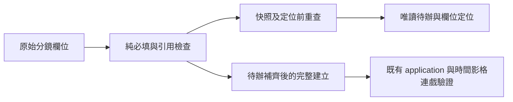

# 分鏡創作待辦（v0.28.0）

新增鏡頭或接續歌曲時間起稿時，創作欄位仍需人工編寫。按「檢查創作待辦」列出留白欄位、未完成或重複的母題名稱、失效引用及不支援的畫面方向；點選待辦會展開原鏡頭並聚焦欄位。按「檢查並建立分鏡包」也會先檢查待辦及定位第一項，避免需求轉換先停在泛用母題錯誤。

## 使用與限制

待辦只讀取目前分鏡，不修改原始文字、秒數、FPS、母題 ID、其他工作台或音檔。變化理由可留白，由既有連戲檢查列為創作提醒。「單鏡待辦已補齊」是局部必填欄位與引用進度；全局片名、時長或母題待辦仍可存在。待辦為零不證明時間、數字範圍、影格、連戲、音畫同步或實際畫面品質。完整建立仍由原 application／domain 驗證，非法 FPS、總長不足及影格重疊照常拒絕。

Unicode 空白沿 Python 文字 strip 規則檢查，不去除或修剪表單內容。母題名稱比較只在模型內形成暫態索引，使用 Map，名稱 __proto__ 仍為普通資料；同名母題不合併，不重編 ID，不代替使用者選擇引用。

全部1000鏡與30個母題可計數，來源 JSON 最多8 MiB、嚴格 Unicode／形狀；待辦明細最多200項，畫面列前20項並明示截斷。修正後重新檢查；沒有暗中補寫或把時間起稿當成已完成分鏡。

## 分層與狀態

web/storyboard-readiness.js 為純來源形狀／必填與引用模型，以及注入 capture／onState 的控制層。來源依既有 draft3 欄位契約建立固定鍵順序的快照，物件鍵排列不影響判定，原字串與列順序保留。app 負責 aria-invalid、原位置定位、處理中停用及完整建立前檢查。controller 不讀 DOM、檔案、HTTP 或媒體，不呼叫模型。

修改分鏡後，舊待辦明示過期、移除欄位標示並停用舊位置按鈕。定位前再次捕捉完整分鏡快照；時間、FPS、創作、母題或列順序／數量不同時拒絕舊定位。恢復完全相同內容可重新定位；載入原創範例、完整草稿或限定分鏡需求／起稿（含撤回載入）清除暫態。其他工作台、收合與定位不使分鏡待辦失效。待辦及焦點不進 draft3、成果或 Agent wire。

產品0.28；Agent1／MCP2025-11-25／draft3與領域 schema 保持，七預設／啟庫十二工具。Agent 的 storyboard_seed1 先檢查／預覽再明確套用，留白欄位可在工作台接續待辦；CLI／Agent 的完整分鏡需求仍需完整建立驗證。本輪沒有新增 operation、安裝、模型、路徑權限或持久草稿欄位。
